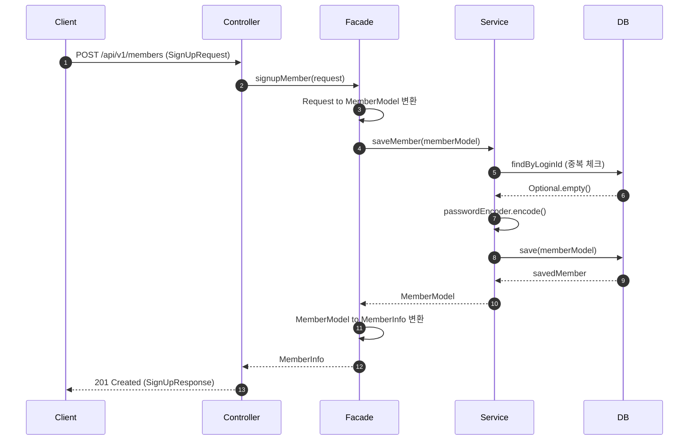
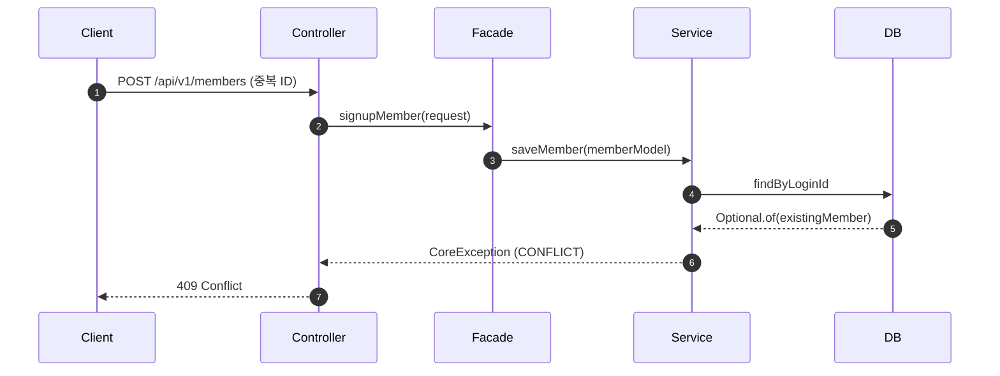
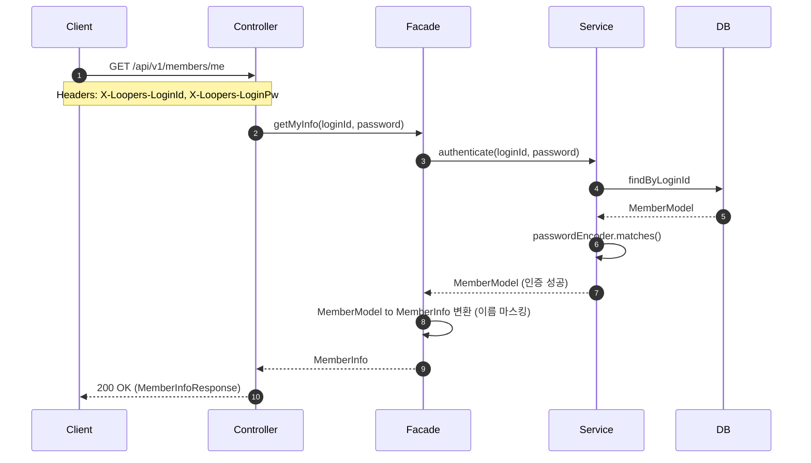
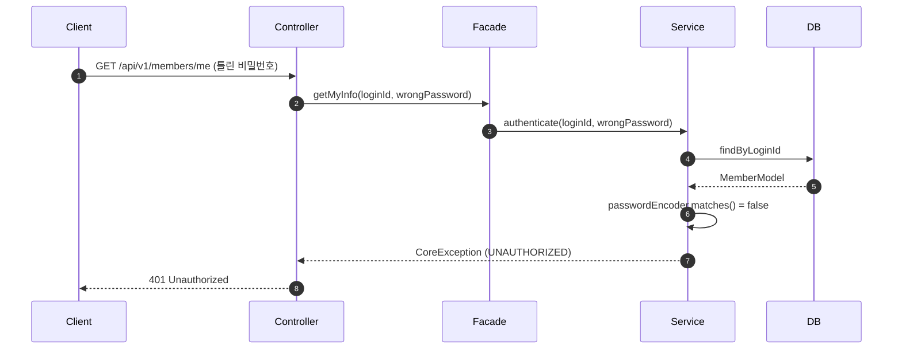
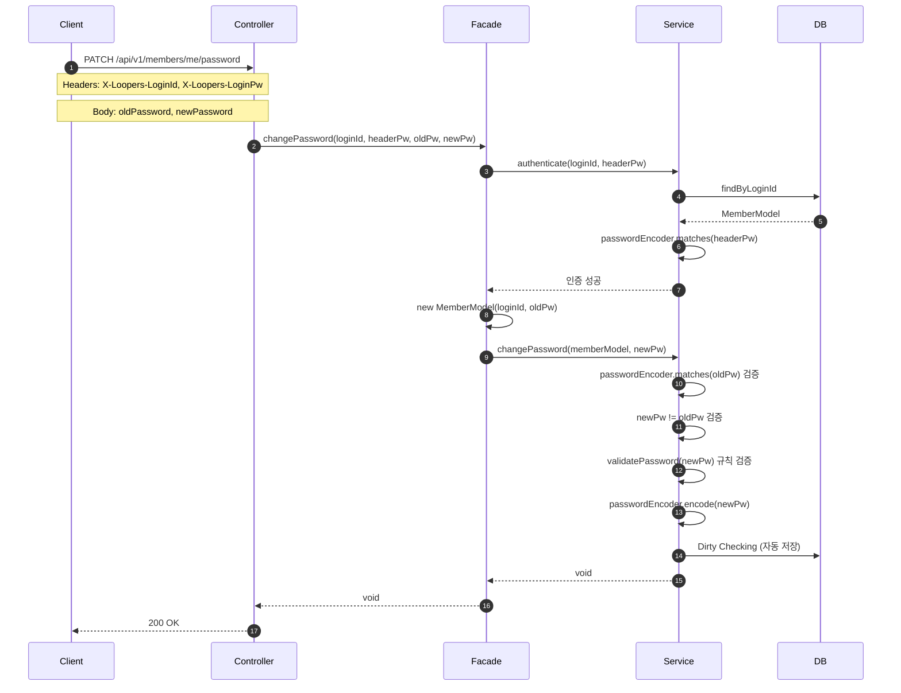
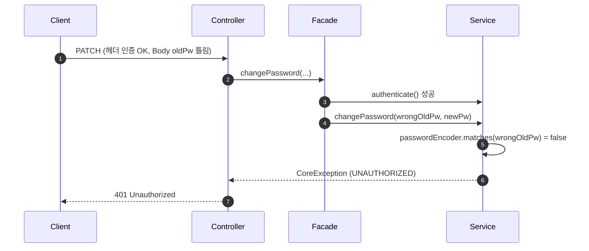
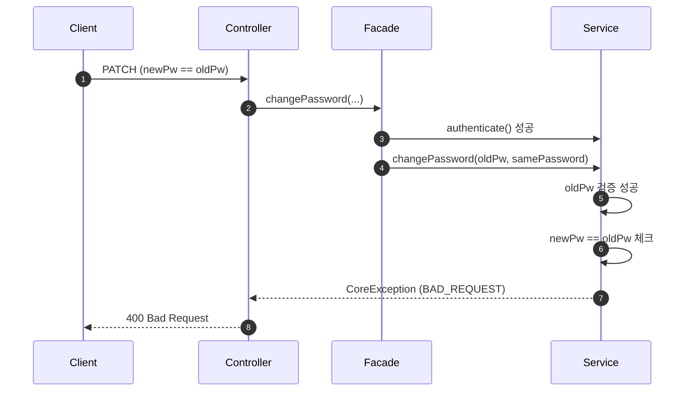

# Flow Diagrams

## 1. 회원가입 (POST /api/v1/members)

### 예외 흐름

---

## 2. 내 정보 조회 (GET /api/v1/members/me)

### 예외 흐름 - 인증 실패

---

## 3. 비밀번호 변경 (PATCH /api/v1/members/me/password)

### 예외 흐름 - Body의 기존 비밀번호 불일치

### 예외 흐름 - 새 비밀번호가 기존과 동일

