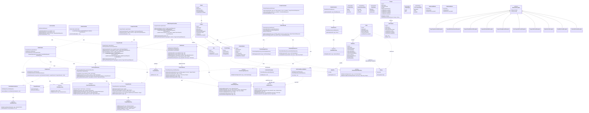
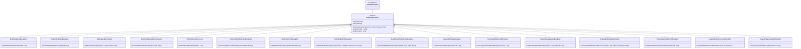

# 클래스 다이어그램 (Class Diagram)

## 1️⃣ 전체 아키텍처 개요

### 레이어 구조
```
┌─────────────────────────────────────────┐
│         Presentation Layer              │
│            (Controller)                 │
└─────────────────────────────────────────┘
                  ↓
┌─────────────────────────────────────────┐
│         Application Layer               │
│    (Facade - 도메인 서비스 조율)           │
└─────────────────────────────────────────┘
                  ↓
┌─────────────────────────────────────────┐
│         Domain Layer                    │
│       (Service, Entity)                 │
└─────────────────────────────────────────┘
                 　↑
┌─────────────────────────────────────────┐
│         Infrastructure Layer            │
│           (Repository)                  │
└─────────────────────────────────────────┘


상세
Presentation Layer
├── ProductController
├── LikeController
├── OrderController
├── CouponController          ← 대고객 쿠폰 API
└── AdminCouponController     ← 어드민 쿠폰 API

Application Layer
├── ProductFacade
├── OrderFacade               ← 주문 유스케이스 조율 (쿠폰 검증 포함)
└── CouponFacade              ← 쿠폰 발급/조회 유스케이스 조율

Domain Layer
├── Brand, Product, ProductOption, Like
├── Order, OrderItem, Stock
├── Coupon, UserCoupon                ← 쿠폰 템플릿 / 발급 쿠폰
├── OrderService
├── StockDeductionService
├── CouponService                     ← 쿠폰 템플릿 도메인 서비스
├── UserCouponService                 ← 발급 쿠폰 도메인 서비스
└── VO (Money, Quantity, Snapshot)

Infrastructure Layer
├── ProductRepository
├── LikeRepository
├── OrderRepository
├── StockRepository
├── CouponRepository          ← 쿠폰 템플릿 Repository
└── UserCouponRepository      ← 발급 쿠폰 Repository
```
---

## 2️⃣ 전체 클래스 다이어그램


```mermaid
classDiagram
    %% ============================================
    %% Presentation Layer (Controllers)
    %% ============================================
    class BrandController {
        -BrandService brandService
        +getBrand(brandId: Long) BrandResponse
    }

    class ProductController {
        -ProductFacade productFacade
        +getProducts(brandId: Long, sort: String, page: int, size: int, headers) Page~ProductListResponse~
        +getProductDetail(productId: Long, headers) ProductDetailResponse
        -extractUserId(headers) Long
    }

    class LikeController {
        -LikeService likeService
        +createLike(productId: Long, headers) void
        +deleteLike(productId: Long, headers) void
        +getMyLikes(headers, page:int, size:int) Page~MyLikeResponse~
        -extractUserId(headers) Long
    }

    class OrderController {
        -OrderFacade orderFacade
        +createOrder(request: CreateOrderRequest, headers) OrderResponse
        -extractUserId(headers) Long
    }

    class CouponController {
        -CouponFacade couponFacade
        +issueCoupon(couponId: Long, headers) UserCouponResponse
        +getMyLikes(headers, page:int, size:int) Page~UserCouponResponse~
        -extractUserId(headers) Long
    }

    class AdminCouponController {
        -CouponFacade couponFacade
        +getCoupons(page:int, size:int) Page~CouponResponse~
        +getCoupon(couponId: Long) CouponResponse
        +createCoupon(request: CreateCouponRequest) CouponResponse
        +updateCoupon(couponId: Long, request: UpdateCouponRequest) CouponResponse
        +deleteCoupon(couponId: Long) void
        +getCouponIssues(couponId: Long, page:int, size:int) Page~UserCouponResponse~
    }

    %% ============================================
    %% Application Layer (Facades)
    %% ============================================
    class ProductFacade {
        -ProductService productService
        -ProductOptionService productOptionService
        -ProductImageService productImageService
        -LikeService likeService
        +getProducts(brandId: Long, sort: String, page:int, size:int, userId: Long) Page~ProductListResponse~
        +getProductDetail(productId: Long, userId: Long) ProductDetailResponse
    }

    class OrderFacade {
        -ProductService productService
        -OrderService orderService
        -UserCouponService userCouponService
        +createOrder(userId: Long, request: CreateOrderRequest) OrderResponse
    }

    class CouponFacade {
        -CouponService couponService
        -UserCouponService userCouponService
        +issueCoupon(userId: Long, couponId: Long) UserCouponResponse
        +getMyLikes(userId: Long, page:int, size:int) Page~UserCouponResponse~
        +getCoupons(page:int, size:int) Page~CouponResponse~
        +getCoupon(couponId: Long) CouponResponse
        +createCoupon(request: CreateCouponRequest) CouponResponse
        +updateCoupon(couponId: Long, request: UpdateCouponRequest) CouponResponse
        +deleteCoupon(couponId: Long) void
        +getCouponIssues(couponId: Long, page:int, size:int) Page~UserCouponResponse~
    }

    %% ============================================
    %% Domain Layer (Services)
    %% ============================================
    class BrandService {
        -BrandRepository brandRepository
        +getBrand(brandId: Long) Brand
    }

    class ProductService {
        -ProductRepository productRepository
        +findActiveProducts(brandId: Long, sort: String, page:int, size:int) Page~Product~
        +findActiveProduct(productId: Long) Product
        +findLikeCounts(productIds: List~Long~) Map~Long, Integer~
        +getLikeCount(productId: Long) Integer
        +validateProductActive(productId: Long) void
    }

    class ProductOptionService {
        -ProductOptionRepository productOptionRepository
        +findOptions(productId: Long) List~ProductOption~
        +calculateMinPrices(productIds: List~Long~) Map~Long, Integer~
    }

    class ProductImageService {
        -ProductImageRepository productImageRepository
        +findImages(productId: Long) List~ProductImage~
    }

    class LikeService {
        -LikeRepository likeRepository
        -ProductService productService
        -EventPublisher eventPublisher
        +createLike(userId: Long, productId: Long) void
        +deleteLike(userId: Long, productId: Long) void
        +findMyLikes(userId: Long, page:int, size:int) Page~MyLikeResponse~
        +checkLikedByUser(userId: Long, productId: Long) boolean
        +findLikedProductIds(userId: Long, productIds: List~Long~) Set~Long~
    }

    class OrderService {
        -OrderRepository orderRepository
        -StockDeductionService stockDeductionService
        +createOrder(userId: Long, items: List~OrderItemCommand~, couponDiscount: CouponDiscount) Order
    }

    class StockDeductionService {
        -StockRepository stockRepository
        +reserveAll(items: List~OrderItemCommand~) void
    }

    class CouponService {
        -CouponRepository couponRepository
        +getCoupon(couponId: Long) Coupon
        +getActiveCoupons(page:int, size:int) Page~Coupon~
        +createCoupon(command: CreateCouponCommand) Coupon
        +updateCoupon(couponId: Long, command: UpdateCouponCommand) Coupon
        +deleteCoupon(couponId: Long) void
    }

    class UserCouponService {
        -UserCouponRepository userCouponRepository
        -CouponService couponService
        +issue(userId: Long, couponId: Long) UserCoupon
        +getMyLikes(userId: Long, page:int, size:int) Page~UserCoupon~
        +validateAndUse(userId: Long, userCouponId: Long, orderAmount: Money) CouponDiscount
        +getIssuesByCoupon(couponId: Long, page:int, size:int) Page~UserCoupon~
    }

    %% ============================================
    %% Domain Layer (Entities / Enums)
    %% ============================================
    class Brand {
        -Long id
        -String name
        -String description
        -String logoImageUrl
        -LocalDateTime createdAt
    }

    class Product {
        -Long id
        -Long brandId
        -String name
        -String description
        -String thumbnailImageUrl
        -ProductStatus status
        -int likeCount
        -LocalDateTime createdAt
    }

    class ProductStatus {
        <<enumeration>>
        DRAFT
        ACTIVE
        INACTIVE
    }

    class ProductOption {
        -Long id
        -Long productId
        -String name
        -int price
        -int stockQuantity
        -ProductOptionStatus status
        -LocalDateTime createdAt
    }

    class ProductOptionStatus {
        <<enumeration>>
        ON_SALE
        SOLD_OUT
        STOPPED
    }

    class ProductImage {
        -Long id
        -Long productId
        -String imageUrl
        -int displayOrder
    }

    class Like {
        -Long id
        -Long userId
        -Long productId
        -LocalDateTime createdAt
        %% Unique(userId, productId)
    }

    class Order {
        -Long id
        -Long userId
        -OrderStatus status
        -Money totalAmount
        -Long userCouponId
        -LocalDateTime createdAt
    }

    class OrderStatus {
        <<enumeration>>
        CREATED
        CONFIRMED
        CANCELLED
    }

    class OrderItem {
        -Long id
        -Long orderId
        -String productName
        -String brandName
        -String optionName
        -String optionAttributes
        -String thumbnailImageUrl
        -Money orderPrice
        -Money discountAmount
        -Money finalPrice
        -Quantity quantity
    }

    class Coupon {
        -Long id
        -String name
        -CouponType type
        -int value
        -Integer minOrderAmount
        -LocalDateTime expiredAt
        -LocalDateTime createdAt
        -LocalDateTime updatedAt
        -LocalDateTime deletedAt
        +isExpired() boolean
        +calculateDiscount(orderAmount: Money) Money
    }

    class CouponType {
        <<enumeration>>
        FIXED
        RATE
    }

    class UserCoupon {
        -Long id
        -Long userId
        -Long couponId
        -UserCouponStatus status
        -LocalDateTime usedAt
        -LocalDateTime createdAt
        -LocalDateTime updatedAt
        +use() void
        +expire() void
        %% Unique(userId, couponId)
    }

    class UserCouponStatus {
        <<enumeration>>
        AVAILABLE
        USED
        EXPIRED
    }

    class CouponDiscount {
        -Long userCouponId
        -Money discountAmount
        %% 쿠폰 미적용 시 discountAmount = 0
    }

    class Money {
        -long value
        +Money(value: long)
        %% value >= 0 (음수 방지)
    }

    class Quantity {
        -int value
        +Quantity(value: int)
        %% 주문 수량: value >= 1 / 재고 수량: value >= 0
    }

    %% ============================================
    %% Infrastructure Layer (Repositories)
    %% ============================================
    class BrandRepository {
        <<interface>>
        +findById(brandId: Long) Optional~Brand~
    }

    class ProductRepository {
        <<interface>>
        +findActiveById(productId: Long) Optional~Product~
        +findAllActive(brandId: Long, sort: String, page:int, size:int) Page~Product~
        +findLikeCountsByIds(productIds: List~Long~) Map~Long, Integer~
        +findLikeCountById(productId: Long) Integer
        +incrementLikeCount(productId: Long) void
        +decrementLikeCount(productId: Long) void
    }

    class ProductOptionRepository {
        <<interface>>
        +findByProductId(productId: Long) List~ProductOption~
        +findMinPricesByProductIds(productIds: List~Long~) Map~Long, Integer~
    }

    class ProductImageRepository {
        <<interface>>
        +findByProductId(productId: Long) List~ProductImage~
    }

    class LikeRepository {
        <<interface>>
        +save(like: Like) Like
        +findByUserIdAndProductId(userId: Long, productId: Long) Optional~Like~
        +deleteById(likeId: Long) void
        +findLikedProductIds(userId: Long, productIds: List~Long~) Set~Long~
        +findByUserId(userId: Long, page:int, size:int) Page~Like~
    }

    class OrderRepository {
        <<interface>>
        +save(order: Order) Order
        +findById(orderId: Long) Optional~Order~
    }

    class StockRepository {
        <<interface>>
        +findByProductOptionId(optionId: Long) Optional~Stock~
        +reserve(optionId: Long, quantity: int) void
    }

    class CouponRepository {
        <<interface>>
        +findById(couponId: Long) Optional~Coupon~
        +findActiveById(couponId: Long) Optional~Coupon~
        +findAllActive(page:int, size:int) Page~Coupon~
        +save(coupon: Coupon) Coupon
    }

    class UserCouponRepository {
        <<interface>>
        +save(userCoupon: UserCoupon) UserCoupon
        +findById(userCouponId: Long) Optional~UserCoupon~
        +findByUserIdAndCouponId(userId: Long, couponId: Long) Optional~UserCoupon~
        +findByUserId(userId: Long, page:int, size:int) Page~UserCoupon~
        +findByCouponId(couponId: Long, page:int, size:int) Page~UserCoupon~
    }

    %% ============================================
    %% Async / Batch (Eventual Consistency)
    %% ============================================
    class EventPublisher {
        <<interface>>
        +publish(event) void
    }

    class LikeCreatedEvent {
        -Long userId
        -Long productId
        -LocalDateTime occurredAt
    }

    class LikeDeletedEvent {
        -Long userId
        -Long productId
        -LocalDateTime occurredAt
    }

    class LikeCountConsumer {
        -ProductRepository productRepository
        +handle(event) void
    }

    class LikeCountReconcileBatch {
        -LikeRepository likeRepository
        -ProductRepository productRepository
        +reconcile() void
    }

    %% ============================================
    %% Exceptions (minimal)
    %% ============================================
    class BusinessException {
        <<abstract>>
        -String errorCode
        -String message
    }

    class ProductNotFoundException
    class BrandNotFoundException
    class DuplicateLikeException
    class CouponNotFoundException
    class UserCouponNotFoundException
    class CouponAlreadyIssuedException
    class CouponNotAvailableException
    class CouponOwnerMismatchException
    class CouponMinOrderAmountException
    class CouponTypeImmutableException

    BusinessException <|-- ProductNotFoundException
    BusinessException <|-- BrandNotFoundException
    BusinessException <|-- DuplicateLikeException
    BusinessException <|-- CouponNotFoundException
    BusinessException <|-- UserCouponNotFoundException
    BusinessException <|-- CouponAlreadyIssuedException
    BusinessException <|-- CouponNotAvailableException
    BusinessException <|-- CouponOwnerMismatchException
    BusinessException <|-- CouponMinOrderAmountException
    BusinessException <|-- CouponTypeImmutableException

    %% ============================================
    %% Relationships
    %% ============================================
    BrandController ..> BrandService : uses
    ProductController ..> ProductFacade : uses
    LikeController ..> LikeService : uses
    OrderController ..> OrderFacade : uses
    CouponController ..> CouponFacade : uses
    AdminCouponController ..> CouponFacade : uses

    ProductFacade ..> ProductService : uses
    ProductFacade ..> ProductOptionService : uses
    ProductFacade ..> ProductImageService : uses
    ProductFacade ..> LikeService : uses

    OrderFacade ..> ProductService : uses
    OrderFacade ..> OrderService : uses
    OrderFacade ..> UserCouponService : uses

    CouponFacade ..> CouponService : uses
    CouponFacade ..> UserCouponService : uses

    BrandService ..> BrandRepository : uses
    ProductService ..> ProductRepository : uses
    ProductOptionService ..> ProductOptionRepository : uses
    ProductImageService ..> ProductImageRepository : uses
    LikeService ..> LikeRepository : uses
    LikeService ..> ProductService : validates ACTIVE
    LikeService ..> EventPublisher : publishes
    OrderService ..> OrderRepository : uses
    OrderService ..> StockDeductionService : uses
    StockDeductionService ..> StockRepository : uses
    CouponService ..> CouponRepository : uses
    UserCouponService ..> UserCouponRepository : uses
    UserCouponService ..> CouponService : uses

    ProductOption ..> Money : price
    ProductOption ..> Quantity : stockQuantity
    OrderItem ..> Money : orderPrice / discountAmount / finalPrice
    OrderItem ..> Quantity : quantity
    Order ..> Money : totalAmount
    UserCouponService ..> CouponDiscount : returns
    OrderFacade ..> CouponDiscount : receives

    LikeCountConsumer ..> ProductRepository : updates like_count
    LikeCountReconcileBatch ..> LikeRepository : reads likes
    LikeCountReconcileBatch ..> ProductRepository : fixes like_count

    Brand "1" --> "N" Product : has
    Product "1" --> "N" ProductOption : has
    Product "1" --> "N" ProductImage : has
    Product "1" --> "N" Like : receives
    Coupon "1" --> "N" UserCoupon : issued as
    Order "1" --> "N" OrderItem : contains
```

---

## 3️⃣ 레이어별 상세 설계

### Presentation Layer (Controller)

#### BrandController

**책임:**
- HTTP 요청 처리
- Path Variable 추출
- 응답 DTO 변환
- HTTP 상태 코드 반환

**예외 처리:**
- BrandNotFoundException → 404 Not Found

---

#### ProductController

**책임:**
- HTTP 요청 처리
- Query Parameter, Path Variable, Header 추출
- 인증 정보 추출 (userId)
- Facade 호출
- 응답 DTO 반환

---

#### OrderController

**책임:**
- 주문 생성 요청 처리
- 인증 정보 추출 (userId)
- `CreateOrderRequest`에서 `userCouponId` 포함 여부 처리 (nullable)
- OrderFacade 호출 후 응답 DTO 반환

---

#### CouponController / AdminCouponController

**책임:**
- `CouponController`: 대고객 쿠폰 발급, 내 쿠폰 목록 조회 요청 처리
- `AdminCouponController`: 쿠폰 템플릿 CRUD, 발급 내역 조회 요청 처리
- LDAP 인증 여부는 인터셉터/필터 레벨에서 처리

**예외 처리:**
- CouponNotFoundException → 404 Not Found
- CouponAlreadyIssuedException → 400 Bad Request
- CouponTypeImmutableException → 400 Bad Request

---

### Application Layer (Facade)

#### ProductFacade

**책임:**
- 여러 도메인 서비스 조율 (orchestration)
- 병렬 처리 가능한 작업 조율
- 데이터 조합 및 응답 DTO 구성
- 로그인 여부에 따른 분기 처리
- 비즈니스 규칙 검증 (옵션 존재 여부)

**예외 처리:**
- ProductNotFoundException (ProductService에서 전파)
- ProductOptionNotFoundException (옵션이 없을 때)

---

#### OrderFacade

**책임:** "주문 생성" 유스케이스를 끝까지 완주시키기

**하는 일:**
- 로그인 인증으로 userId 확보
- 요청에서 optionIds 및 userCouponId 추출
- ProductService로 옵션/상품/브랜드 조회
- `userCouponId`가 있을 경우 `UserCouponService.validateAndUse()` 호출
    - 쿠폰 소유자 검증, 상태 검증, 만료 검증, 최소 주문 금액 검증
    - 검증 통과 시 `CouponDiscount` 반환 (discountAmount 포함)
- OrderService 호출 시 `CouponDiscount`를 함께 전달
- 결과를 응답 DTO로 매핑

---

#### CouponFacade

**책임:** 쿠폰 발급/조회/관리 유스케이스 조율

**하는 일:**
- 대고객: 쿠폰 발급 요청 → `CouponService` + `UserCouponService` 조율
- 대고객: 내 쿠폰 목록 조회 → `UserCouponService` 호출
- 어드민: 쿠폰 템플릿 CRUD → `CouponService` 호출
- 어드민: 발급 내역 조회 → `UserCouponService` 호출

---

### Domain Layer (Services)

#### BrandService

**책임:**
- 브랜드 도메인 비즈니스 로직
- 브랜드 조회

**예외:**
- BrandNotFoundException

---

#### ProductService

**책임:**
- 상품 도메인 비즈니스 로직
- 상품 조회 (목록, 상세)

**예외:**
- ProductNotFoundException

---

#### ProductOptionService

**책임:**
- 상품 옵션 도메인 비즈니스 로직
- 옵션 조회
- 최저가 계산 (집계 쿼리)
- 가격/재고 검증

**예외:**
- BusinessRuleViolationException (가격 음수, 재고 음수 등)

---

#### ProductImageService

**책임:**
- 상품 이미지 도메인 비즈니스 로직
- 이미지 조회
- 이미지 리소스 존재 검증

**예외:**
- ImageNotFoundException

---

#### LikeService

**책임:**
- 좋아요 도메인 비즈니스 로직
- 좋아요 수 조회 (단일, 배치)
- 좋아요 여부 확인 (단일, 배치)
- 좋아요 등록/취소

**예외:**
- DuplicateLikeException

---

#### OrderService

**책임:** Order Aggregate 생성/상태 전이 같은 도메인 규칙

**하는 일:**
- OrderModel 생성 (status=CREATED)
- OrderItemModel 생성 — `orderPrice`, `discountAmount`, `finalPrice` 포함
- StockDeductionService.reserveAll() 호출
- 저장

---

#### StockDeductionService

**책임:** "여러 Stock에 걸친 원자적 예약/확정/해제" (크로스 엔티티 규칙)

---

#### CouponService

**책임:** 쿠폰 템플릿 도메인 비즈니스 로직

**하는 일:**
- 쿠폰 템플릿 조회 (삭제 여부 포함)
- 쿠폰 등록 시 유효성 검증 (`type`, `value`, `expiredAt`)
- 수정 시 불변 필드(`type`, `value`) 변경 시도 감지
- Soft delete 처리

**예외:**
- CouponNotFoundException
- CouponTypeImmutableException

---

#### UserCouponService

**책임:** 발급 쿠폰 도메인 비즈니스 로직

**하는 일:**
- 쿠폰 발급: 중복 여부 확인 → `UserCoupon` 생성 (status=AVAILABLE)
- 주문 연동: `validateAndUse()` — 소유자/상태/만료/최소금액 검증 후 `USED` 처리, `CouponDiscount` 반환
- 내 쿠폰 목록 조회
- 어드민 발급 내역 조회

**예외:**
- UserCouponNotFoundException
- CouponAlreadyIssuedException
- CouponNotAvailableException
- CouponOwnerMismatchException
- CouponMinOrderAmountException

---

### Domain Layer (Entities)

#### Brand / Product / ProductOption / ProductImage / Like

*(기존과 동일)*

---

#### Order

**설계 포인트:**
- `userCouponId`는 nullable (쿠폰 미적용 주문 허용)
- `totalAmount`는 쿠폰 적용 후 최종 결제 금액

---

#### OrderItem

**설계 포인트:**
- 주문 시점 상품 정보 스냅샷 보존
- `orderPrice`: 쿠폰 적용 전 원가
- `discountAmount`: 쿠폰 할인 금액 (미적용 시 0)
- `finalPrice`: 최종 결제 금액 (`orderPrice - discountAmount`)

---

#### Coupon

**설계 포인트:**
- `type`, `value`는 등록 후 불변
- `isExpired()`: `expiredAt`이 현재 시각 이전이면 true
- `calculateDiscount(orderAmount)`: `FIXED`는 `orderAmount - value` (최솟값 0), `RATE`는 `floor(orderAmount × (1 - value / 100))`
- Soft delete: `deletedAt != null`이면 발급 불가

---

#### UserCoupon

**설계 포인트:**
- `Unique(userId, couponId)` — 동일 사용자 중복 발급 방지
- `use()`: status → USED, usedAt = 현재 시각
- `expire()`: status → EXPIRED
- 상태 전이는 도메인 메서드를 통해서만 가능

---

#### CouponDiscount (VO)

**설계 포인트:**
- `UserCouponService.validateAndUse()` 반환값
- `userCouponId` + `discountAmount`를 묶어 `OrderFacade` → `OrderService`로 전달
- 쿠폰 미적용 시 `discountAmount = 0`

---

#### Money / Quantity (VO)

*(기존과 동일)*

---

## 4️⃣ 예외 계층 구조


```mermaid
classDiagram
    class RuntimeException {
        <<Java Built-in>>
    }

    class BusinessException {
        <<abstract>>
        -String errorCode
        -String message
        +BusinessException(errorCode: String, message: String)
        +getErrorCode() String
        +getMessage() String
    }

    %% ---- Catalog (Brand/Product/Like) ----
    class BrandNotFoundException {
        +BrandNotFoundException(brandId: Long)
    }

    class ProductNotFoundException {
        +ProductNotFoundException(productId: Long)
    }

    class DuplicateLikeException {
        +DuplicateLikeException(userId: Long, productId: Long)
    }

    class BusinessRuleViolationException {
        +BusinessRuleViolationException(message: String)
    }

    %% ---- Order/Stock ----
    class OrderNotFoundException {
        +OrderNotFoundException(orderId: Long)
    }

    class ProductOptionNotFoundException {
        +ProductOptionNotFoundException(productOptionId: Long)
    }

    class InsufficientStockException {
        +InsufficientStockException(productOptionId: Long)
    }

    class InvalidOrderStateException {
        +InvalidOrderStateException(orderId: Long, fromStatus: String, action: String)
    }

    class UnauthorizedOrderActionException {
        +UnauthorizedOrderActionException(orderId: Long, action: String)
    }

    %% ---- Coupon ----
    class CouponNotFoundException {
        +CouponNotFoundException(couponId: Long)
    }

    class UserCouponNotFoundException {
        +UserCouponNotFoundException(userCouponId: Long)
    }

    class CouponAlreadyIssuedException {
        +CouponAlreadyIssuedException(userId: Long, couponId: Long)
    }

    class CouponNotAvailableException {
        +CouponNotAvailableException(userCouponId: Long, status: UserCouponStatus)
    }

    class CouponOwnerMismatchException {
        +CouponOwnerMismatchException(userCouponId: Long)
    }

    class CouponMinOrderAmountException {
        +CouponMinOrderAmountException(required: int, actual: int)
    }

    class CouponTypeImmutableException {
        +CouponTypeImmutableException(couponId: Long)
    }

    RuntimeException <|-- BusinessException
    BusinessException <|-- BrandNotFoundException
    BusinessException <|-- ProductNotFoundException
    BusinessException <|-- DuplicateLikeException
    BusinessException <|-- BusinessRuleViolationException
    BusinessException <|-- OrderNotFoundException
    BusinessException <|-- ProductOptionNotFoundException
    BusinessException <|-- InsufficientStockException
    BusinessException <|-- InvalidOrderStateException
    BusinessException <|-- UnauthorizedOrderActionException
    BusinessException <|-- CouponNotFoundException
    BusinessException <|-- UserCouponNotFoundException
    BusinessException <|-- CouponAlreadyIssuedException
    BusinessException <|-- CouponNotAvailableException
    BusinessException <|-- CouponOwnerMismatchException
    BusinessException <|-- CouponMinOrderAmountException
    BusinessException <|-- CouponTypeImmutableException
```

### 예외 클래스 상세

#### BrandNotFoundException / ProductNotFoundException / DuplicateLikeException / ProductOptionNotFoundException / BusinessRuleViolationException / ImageNotFoundException

*(기존과 동일)*

---

#### CouponNotFoundException

**발생 시점:** 쿠폰 템플릿이 존재하지 않거나 Soft delete된 경우  
**HTTP 상태:** 404 Not Found  
**복구 전략:** 사용자에게 쿠폰이 존재하지 않음을 알림

---

#### UserCouponNotFoundException

**발생 시점:** 발급 쿠폰 ID로 조회 시 존재하지 않는 경우  
**HTTP 상태:** 404 Not Found  
**복구 전략:** 사용자에게 발급 쿠폰이 존재하지 않음을 알림

---

#### CouponAlreadyIssuedException

**발생 시점:** 동일 사용자가 동일 쿠폰을 중복 발급 시도할 때  
**HTTP 상태:** 400 Bad Request  
**복구 전략:** 사용자에게 이미 발급된 쿠폰임을 안내

---

#### CouponNotAvailableException

**발생 시점:** 주문 시 `USED` 또는 `EXPIRED` 상태의 쿠폰을 사용 시도할 때  
**HTTP 상태:** 400 Bad Request  
**복구 전략:** 사용자에게 사용 불가 상태의 쿠폰임을 안내

---

#### CouponOwnerMismatchException

**발생 시점:** 주문 시 타 유저 소유의 쿠폰을 사용 시도할 때  
**HTTP 상태:** 400 Bad Request  
**복구 전략:** 사용자에게 본인 소유 쿠폰이 아님을 안내

---

#### CouponMinOrderAmountException

**발생 시점:** 주문 금액이 쿠폰의 최소 주문 금액 조건에 미충족할 때  
**HTTP 상태:** 400 Bad Request  
**복구 전략:** 사용자에게 최소 주문 금액 조건을 안내

---

#### CouponTypeImmutableException

**발생 시점:** 쿠폰 템플릿 수정 시 `type` 또는 `value` 변경을 시도할 때  
**HTTP 상태:** 400 Bad Request  
**복구 전략:** 운영자에게 해당 필드는 수정 불가임을 안내

---

## 5️⃣ 설계 원칙 및 고려사항

### 1. 레이어 분리 원칙

#### Controller 책임
- HTTP 프로토콜 처리에만 집중
- 비즈니스 로직 없음
- 인증 정보 추출 (userId)
- 예외를 HTTP 상태 코드로 변환

#### Facade 책임
- 여러 도메인 서비스 조율
- 복잡한 흐름 관리
- 데이터 조합
- **비즈니스 규칙은 Service에 위임**

#### Service 책임
- 도메인별 비즈니스 로직
- 단일 도메인에 집중
- 트랜잭션 경계
- Entity 검증 및 생성

#### Repository 책임
- 데이터 접근만
- 쿼리 최적화
- 영속성 관리

---

### 2. Facade 사용 기준

**Facade가 필요한 경우:**
- 여러 도메인 서비스 협력이 필요한 경우
- 복잡한 데이터 조합이 필요한 경우
- 조건부 처리(로그인 여부, 쿠폰 적용 여부 등)가 필요한 경우

**Facade가 불필요한 경우:**
- 단일 도메인만 다루는 경우 (예: 브랜드 조회)
- Controller → Service 직접 호출로 충분한 경우

---

### 3. 예외 처리 전략

#### 예외 계층 구조
```
RuntimeException
  └─ BusinessException (추상)
      ├─ BrandNotFoundException (404)
      ├─ ProductNotFoundException (404)
      ├─ ProductOptionNotFoundException (500) ← 치명적
      ├─ ImageNotFoundException (404/500)
      ├─ BusinessRuleViolationException (500) ← 치명적
      ├─ DuplicateLikeException (409)
      ├─ CouponNotFoundException (404)
      ├─ UserCouponNotFoundException (404)
      ├─ CouponAlreadyIssuedException (400)
      ├─ CouponNotAvailableException (400)
      ├─ CouponOwnerMismatchException (400)
      ├─ CouponMinOrderAmountException (400)
      └─ CouponTypeImmutableException (400)
```

#### 치명적 vs 일반 예외

| 예외 | 치명도 | HTTP | 복구 전략 |
|------|--------|------|----------|
| BrandNotFoundException | 일반 | 404 | 사용자 안내 |
| ProductNotFoundException | 일반 | 404 | 사용자 안내 |
| **ProductOptionNotFoundException** | **치명적** | **500** | **시스템 알림, 데이터 복구** |
| **ImageNotFoundException** | 치명적 | 404 | 기본 이미지 대체, 알림 |
| **BusinessRuleViolationException** | **치명적** | **500** | **시스템 알림, 데이터 검증** |
| DuplicateLikeException | 일반 | 409 | 사용자 안내 |
| CouponNotFoundException | 일반 | 404 | 사용자 안내 |
| UserCouponNotFoundException | 일반 | 404 | 사용자 안내 |
| CouponAlreadyIssuedException | 일반 | 400 | 사용자 안내 |
| CouponNotAvailableException | 일반 | 400 | 사용자 안내 |
| CouponOwnerMismatchException | 일반 | 400 | 사용자 안내 |
| CouponMinOrderAmountException | 일반 | 400 | 사용자 안내 |
| CouponTypeImmutableException | 일반 | 400 | 운영자 안내 |

---

### 4. FK 제약 없는 설계

*(기존과 동일)*

---

### 5. 성능 고려사항

*(기존과 동일)*

---

**문서 끝**