# 클래스 다이어그램 (Class Diagram)

## 1️⃣ 전체 아키텍처 개요

### 레이어 구조
```
┌─────────────────────────────────────────┐
│         Presentation Layer              │
│  (Controller)                           │
└─────────────────────────────────────────┘
                  ↓
┌─────────────────────────────────────────┐
│         Application Layer               │
│  (Facade - 도메인 서비스 조율)          │
└─────────────────────────────────────────┘
                  ↓
┌─────────────────────────────────────────┐
│         Domain Layer                    │
│  (Service, Entity)                      │
└─────────────────────────────────────────┘
                 　↑
┌─────────────────────────────────────────┐
│         Infrastructure Layer            │
│  (Repository)                           │
└─────────────────────────────────────────┘


상세
Presentation Layer
├── ProductController
├── LikeController
└── OrderController

Application Layer
├── ProductFacade
└── OrderFacade   ← 주문 유스케이스 조율

Domain Layer
├── Brand, Product, ProductOption, Like
├── Order, OrderItem, Stock
├── OrderService
├── StockDeductionService
└── VO (Money, Quantity, Snapshot)

Infrastructure Layer
├── ProductRepository
├── LikeRepository
├── OrderRepository
└── StockRepository
```
---

## 2️⃣ 전체 클래스 다이어그램


---

## 3️⃣ 레이어별 상세 설계

### Presentation Layer (Controller)

#### BrandController

**책임:**
- HTTP 요청 처리
- Path Variable 추출
- 응답 DTO 변환
- HTTP 상태 코드 반환

**예외 처리:**
- BrandNotFoundException → 404 Not Found

---

#### ProductController

**책임:**
- HTTP 요청 처리
- Query Parameter, Path Variable, Header 추출
- 인증 정보 추출 (userId)
- Facade 호출
- 응답 DTO 반환

---

### Application Layer (Facade)

#### ProductFacade

**책임:**
- 여러 도메인 서비스 조율 (orchestration)
- 병렬 처리 가능한 작업 조율
- 데이터 조합 및 응답 DTO 구성
- 로그인 여부에 따른 분기 처리
- 비즈니스 규칙 검증 (옵션 존재 여부)

**예외 처리:**
- ProductNotFoundException (ProductService에서 전파)
- ProductOptionNotFoundException (옵션이 없을 때)


#### OrderFacade

**책임:** “주문 생성” 유스케이스를 끝까지 완주시키기

**하는 일:**
- 로그인 인증으로 memberId 확보
- 요청에서 optionIds 추출
- ProductService로 옵션/상품/브랜드 조회
- ProductSnapshot 만들어서 OrderItem 재료 준비
- OrderService 호출해서 “예약 주문 생성” 실행
- 결과를 응답 DTO로 매핑

---

### Domain Layer (Services)

#### BrandService

**책임:**
- 브랜드 도메인 비즈니스 로직
- 브랜드 조회

**예외:**
- BrandNotFoundException

---

#### ProductService

**책임:**
- 상품 도메인 비즈니스 로직
- 상품 조회 (목록, 상세)

**예외:**
- ProductNotFoundException

---

#### ProductOptionService

**책임:**
- 상품 옵션 도메인 비즈니스 로직
- 옵션 조회
- 최저가 계산 (집계 쿼리)
- 가격/재고 검증

**예외:**
- BusinessRuleViolationException (가격 음수, 재고 음수 등)

---

#### ProductImageService

**책임:**
- 상품 이미지 도메인 비즈니스 로직
- 이미지 조회
- 이미지 리소스 존재 검증

**예외:**
- ImageNotFoundException

---

#### LikeService

**책임:**
- 좋아요 도메인 비즈니스 로직
- 좋아요 수 조회 (단일, 배치)
- 좋아요 여부 확인 (단일, 배치)
- 좋아요 등록/취소

**예외:**
- DuplicateLikeException

#### OrderService

**책임:** Order Aggregate 생성/상태 전이 같은 도메인 규칙

**하는 일:**
- OrderModel 생성 (status=CREATED)

- OrderItemModel 생성

- StockDeductionService.reserveAll() 호출

- 저장

#### StockDeductionService

**책임:** “여러 Stock에 걸친 원자적 예약/확정/해제” (크로스 엔티티 규칙)


---

### Domain Layer (Entities)

#### Brand

**설계 포인트:**
- 불변 객체 지향 (Setter 없음)
- 생성자를 통한 필수 값 주입
- JPA 기본 생성자는 protected

---

#### Product

**설계 포인트:**
- brandId는 Long 타입 (FK 제약 없음)
- 생성자에서 비즈니스 규칙 검증
- 도메인 무결성은 애플리케이션 레벨에서 관리

---

#### ProductOption

**설계 포인트:**
- 가격, 재고 검증 로직 포함
- `isAvailable()` 비즈니스 메서드
- Unique 제약: 같은 상품 내 옵션명 중복 불가

---

#### ProductImage

**설계 포인트:**
- displayOrder로 이미지 순서 관리
- 실제 이미지 파일은 S3/CDN에 저장, URL만 DB에 보관

---

#### Like

**설계 포인트:**
- Unique 제약: 사용자당 상품 1개만 좋아요 가능
- 중복 좋아요는 DB 레벨에서 방지
- v1에서는 userId를 임시 식별자로 사용

---

#### Money (VO)
- value: long
- 생성 규칙: value >= 0 (음수 방지)
- 사용처: ProductOption.price, Order.totalAmount, OrderItem.optionPrice

#### Quantity (VO)
- value: int
- 생성 규칙: 주문 수량 value >= 1 / 재고 수량 value >= 0
- 사용처: ProductOption.stockQuantity, OrderItem.quantity

---

## 4️⃣ 예외 계층 구조

```mermaid
classDiagram
    class RuntimeException {
        <<Java Built-in>>
    }

    class BusinessException {
        <<abstract>>
        -String errorCode
        -String message
        +BusinessException(errorCode: String, message: String)
        +getErrorCode() String
        +getMessage() String
    }

    %% ---- Catalog (Brand/Product/Like) ----
    class BrandNotFoundException {
        +BrandNotFoundException(brandId: Long)
    }

    class ProductNotFoundException {
        +ProductNotFoundException(productId: Long)
    }

    class DuplicateLikeException {
        +DuplicateLikeException(userId: Long, productId: Long)
    }

    class BusinessRuleViolationException {
        +BusinessRuleViolationException(message: String)
    }

    %% ---- Order/Stock (예약/확정/취소 정책 반영) ----
    class OrderNotFoundException {
        +OrderNotFoundException(orderId: Long)
    }

    class ProductOptionNotFoundException {
        +ProductOptionNotFoundException(productOptionId: Long)
    }

    class InsufficientStockException {
        +InsufficientStockException(productOptionId: Long)
    }

    class InvalidOrderStateException {
        +InvalidOrderStateException(orderId: Long, fromStatus: String, action: String)
    }

    class UnauthorizedOrderActionException {
        +UnauthorizedOrderActionException(orderId: Long, action: String)
    }

    RuntimeException <|-- BusinessException
    BusinessException <|-- BrandNotFoundException
    BusinessException <|-- ProductNotFoundException
    BusinessException <|-- DuplicateLikeException
    BusinessException <|-- BusinessRuleViolationException
    BusinessException <|-- OrderNotFoundException
    BusinessException <|-- ProductOptionNotFoundException
    BusinessException <|-- InsufficientStockException
    BusinessException <|-- InvalidOrderStateException
    BusinessException <|-- UnauthorizedOrderActionException
```



### 예외 클래스 상세


#### BrandNotFoundException

**발생 시점:** 브랜드 조회 시 존재하지 않을 때  
**HTTP 상태:** 404 Not Found  
**복구 전략:** 사용자에게 브랜드가 존재하지 않음을 알림

---

#### ProductNotFoundException

**발생 시점:**
- 상품 조회 시 존재하지 않을 때
- 타이밍 이슈로 조회 중 삭제되었을 때 (동시성)

**HTTP 상태:** 404 Not Found  
**복구 전략:** 사용자에게 상품이 존재하지 않음을 알림

---

#### ProductOptionNotFoundException

**발생 시점:** 상품은 존재하는데 옵션이 하나도 없을 때 (데이터 무결성 위반)  
**HTTP 상태:** 500 Internal Server Error  
**복구 전략:**
- 시스템 관리자에게 알림
- 데이터 정합성 복구 필요
- 사용자에게는 일시적 오류 안내

---

#### ImageNotFoundException

**발생 시점:** 이미지 URL은 DB에 있지만 실제 리소스(S3, CDN)가 없을 때  
**HTTP 상태:** 404 Not Found (또는 500으로 설정 가능)  
**복구 전략:**
- 기본 이미지로 대체
- 시스템 관리자에게 알림 (이미지 리소스 복구 필요)

---

#### BusinessRuleViolationException

**발생 시점:**
- 가격이 음수일 때
- 재고가 음수일 때
- 기타 비즈니스 규칙 위반

**HTTP 상태:** 500 Internal Server Error  
**복구 전략:**
- 시스템 관리자에게 알림
- 데이터 검증 강화
- 사용자에게는 일시적 오류 안내

---

#### DuplicateLikeException

**발생 시점:** 이미 좋아요를 누른 상품에 다시 좋아요 시도  
**HTTP 상태:** 409 Conflict  
**복구 전략:** 사용자에게 이미 좋아요했음을 안내

---

## 5️⃣ 설계 원칙 및 고려사항

### 1. 레이어 분리 원칙

#### Controller 책임
- HTTP 프로토콜 처리에만 집중
- 비즈니스 로직 없음
- 인증 정보 추출 (userId)
- 예외를 HTTP 상태 코드로 변환

#### Facade 책임
- 여러 도메인 서비스 조율
- 복잡한 흐름 관리
- 데이터 조합
- **비즈니스 규칙은 Service에 위임**

#### Service 책임
- 도메인별 비즈니스 로직
- 단일 도메인에 집중
- 트랜잭션 경계
- Entity 검증 및 생성

#### Repository 책임
- 데이터 접근만
- 쿼리 최적화
- 영속성 관리

---

### 2. Facade 사용 기준

**Facade가 필요한 경우:**
- 여러 도메인 서비스 협력이 필요한 경우
- 복잡한 데이터 조합이 필요한 경우
- 조건부 처리(로그인 여부 등)가 필요한 경우

**Facade가 불필요한 경우:**
- 단일 도메인만 다루는 경우 (예: 브랜드 조회)
- Controller → Service 직접 호출로 충분한 경우

---

### 3. 예외 처리 전략

#### 예외 계층 구조
```
RuntimeException
  └─ BusinessException (추상)
      ├─ BrandNotFoundException (404)
      ├─ ProductNotFoundException (404)
      ├─ ProductOptionNotFoundException (500) ← 치명적
      ├─ ImageNotFoundException (404/500)
      ├─ BusinessRuleViolationException (500) ← 치명적
      └─ DuplicateLikeException (409)
```

#### 치명적 vs 일반 예외

| 예외 | 치명도 | HTTP | 복구 전략 |
|------|--------|------|----------|
| BrandNotFoundException | 일반 | 404 | 사용자 안내 |
| ProductNotFoundException | 일반 | 404 | 사용자 안내 |
| **ProductOptionNotFoundException** | **치명적** | **500** | **시스템 알림, 데이터 복구** |
| **ImageNotFoundException** | 치명적 | 404 | 기본 이미지 대체, 알림 |
| **BusinessRuleViolationException** | **치명적** | **500** | **시스템 알림, 데이터 검증** |
| DuplicateLikeException | 일반 | 409 | 사용자 안내 |

---

### 4. FK 제약 없는 설계

**이유:**
- 애플리케이션 레벨에서 참조 무결성 관리
- DB 레벨 제약으로 인한 성능 오버헤드 제거
- 향후 샤딩, 마이크로서비스 전환 시 유연성 확보

**트레이드오프:**
- 데이터 정합성은 애플리케이션 책임
- 고아 레코드(orphan records) 발생 가능성
- 정기적인 데이터 정합성 체크 필요

**보완 전략:**
- Service 레벨에서 참조 검증
- 배치 작업을 통한 정합성 체크
- 모니터링 및 알림

---

### 5. 성능 고려사항

#### N+1 문제 방지
- Fetch Join 활용
- 배치 조회 메서드 제공 (예: `calculateMinPrices(List<Long>)`)
- Repository에서 IN 절 쿼리 사용

#### 병렬 처리
- Facade에서 독립적인 조회는 병렬 실행 가능
- CompletableFuture 또는 @Async 활용 고려

#### 캐싱
- 자주 조회되는 브랜드 정보 캐싱
- 상품 최저가 계산 결과 캐싱 (Redis)
- 좋아요 수 캐싱 (Eventual Consistency 허용)

---

**문서 끝**