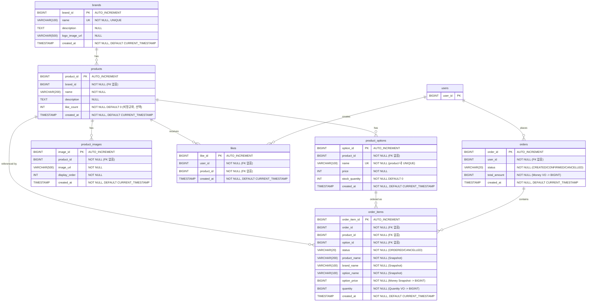

### ERD                                                                                                                                   │

```mermaid
erDiagram
brands ||--o{ products : "has"
products ||--o{ product_options : "has"
products ||--o{ product_images : "has"
products ||--o{ likes : "receives"
products ||--o{ order_items : "referenced by"
product_options ||--o{ order_items : "ordered as"
orders ||--o{ order_items : "contains"
users ||--o{ likes : "creates"
users ||--o{ orders : "places"

    brands {
        BIGINT brand_id PK "AUTO_INCREMENT"
        VARCHAR(100) name UK "NOT NULL, UNIQUE"
        TEXT description "NULL"
        VARCHAR(500) logo_image_url "NULL"
        TIMESTAMP created_at "NOT NULL, DEFAULT CURRENT_TIMESTAMP"
    }

    products {
        BIGINT product_id PK "AUTO_INCREMENT"
        BIGINT brand_id "NOT NULL (FK 없음)"
        VARCHAR(200) name "NOT NULL"
        TEXT description "NULL"
        INT like_count "NOT NULL DEFAULT 0 (비정규화, 선택)"
        TIMESTAMP created_at "NOT NULL, DEFAULT CURRENT_TIMESTAMP"
    }

    product_options {
        BIGINT option_id PK "AUTO_INCREMENT"
        BIGINT product_id "NOT NULL (FK 없음)"
        VARCHAR(100) name UK "NOT NULL (product 내 UNIQUE)"
        INT price "NOT NULL"
        INT stock_quantity "NOT NULL DEFAULT 0"
        TIMESTAMP created_at "NOT NULL, DEFAULT CURRENT_TIMESTAMP"
    }

    product_images {
        BIGINT image_id PK "AUTO_INCREMENT"
        BIGINT product_id "NOT NULL (FK 없음)"
        VARCHAR(500) image_url "NOT NULL"
        INT display_order "NOT NULL"
        TIMESTAMP created_at "NOT NULL, DEFAULT CURRENT_TIMESTAMP"
    }

    likes {
        BIGINT like_id PK "AUTO_INCREMENT"
        BIGINT user_id "NOT NULL (FK 없음)"
        BIGINT product_id "NOT NULL (FK 없음)"
        TIMESTAMP created_at "NOT NULL, DEFAULT CURRENT_TIMESTAMP"
    }

    orders {
        BIGINT order_id PK "AUTO_INCREMENT"
        BIGINT user_id "NOT NULL (FK 없음)"
        VARCHAR(20) status "NOT NULL (CREATED/CONFIRMED/CANCELLED)"
        BIGINT total_amount "NOT NULL (Money VO -> BIGINT)"
        TIMESTAMP created_at "NOT NULL, DEFAULT CURRENT_TIMESTAMP"
    }

    order_items {
        BIGINT order_item_id PK "AUTO_INCREMENT"
        BIGINT order_id "NOT NULL (FK 없음)"
        BIGINT product_id "NOT NULL (FK 없음)"
        BIGINT option_id "NOT NULL (FK 없음)"
        VARCHAR(20) status "NOT NULL (ORDERED/CANCELLED)"

        VARCHAR(200) product_name "NOT NULL (Snapshot)"
        VARCHAR(100) brand_name "NOT NULL (Snapshot)"
        VARCHAR(100) option_name "NOT NULL (Snapshot)"
        BIGINT option_price "NOT NULL (Money Snapshot -> BIGINT)"
        BIGINT quantity "NOT NULL (Quantity VO -> BIGINT)"

        TIMESTAMP created_at "NOT NULL, DEFAULT CURRENT_TIMESTAMP"
    }

    users {
        BIGINT user_id PK
    }
```