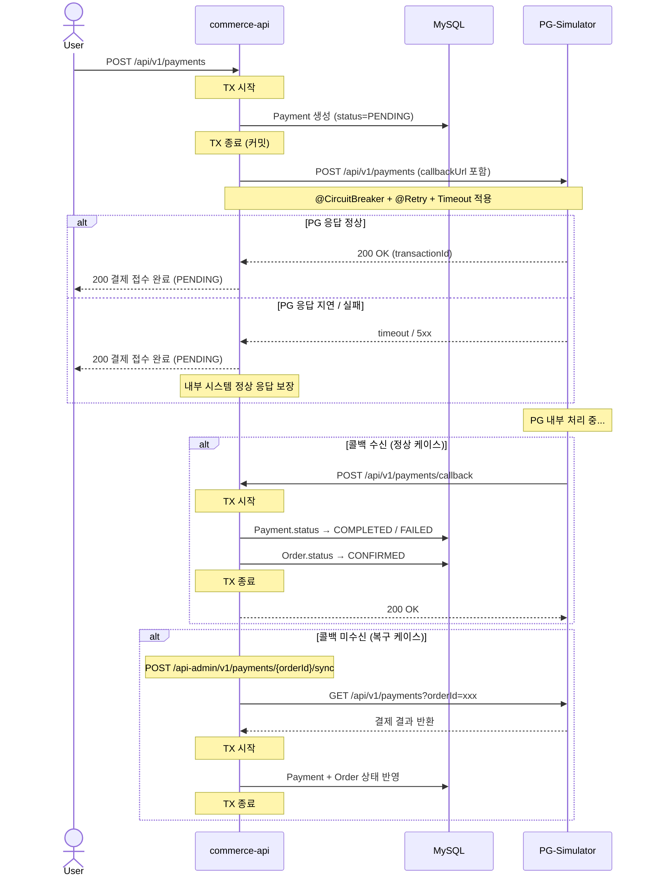
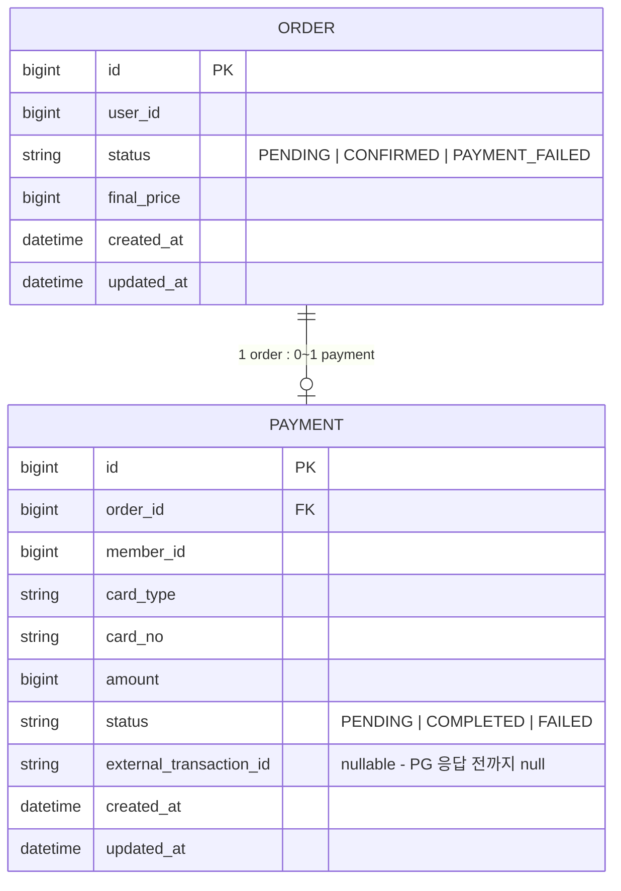

# 결제 PG 연동 설계 문서 (volume-6)

## 1. 문제 상황

### 사용자 관점
결제 버튼을 눌렀을 때 PG 응답이 지연되거나 유실되면, 돈이 나갔는지 안 나갔는지 알 수 없는 상황이 발생할 수 있다.

### 비즈니스 관점
PG 응답 지연 → 스레드 점유 → 커넥션 고갈 → 서비스 다운. PG는 외부 시스템이며 통제 밖이다. 내 시스템의 가용성이 외부에 종속되지 않아야 한다.

### 시스템 관점
현재 `@Transactional` 안에서 PG 호출이 일어나고 있다:
- DB 커넥션을 외부 호출 시간만큼 점유
- 외부 성공 + 내부 롤백 → 돈은 빠졌는데 주문은 실패하는 정합성 문제

---

## 2. 확정된 설계

### 기술 선택
| 항목 | 선택 | 이유 |
|------|------|------|
| HTTP 클라이언트 | FeignClient (`spring-cloud-starter-openfeign`) | Spring Cloud BOM 포함, Resilience4j 연동 용이 |
| 서킷브레이커 | Resilience4j `@CircuitBreaker(name="pgCircuit")` | 이미 `application.yml`에 설정됨 |
| 재시도 | Resilience4j `@Retry(name="pgRetry")` | 이미 `application.yml`에 설정됨 |
| PG 장애 시 응답 | PENDING 그대로 반환 (A안) | 내부 시스템 보호, sync API로 사후 복구 |

### PaymentStatus 변경
```
PENDING   → 결제 요청 접수, PG 결과 미수신
COMPLETED → PG 결제 성공 확인
FAILED    → PG 결제 실패 확인
```

---

## 3. PG-Simulator API 스펙

Base URL: `{{pg-simulator}}`
인증 헤더: `X-USER-ID: 135135` (고정값)

### 결제 요청
```
POST /api/v1/payments
Content-Type: application/json

{
  "orderId": "1351039135",
  "cardType": "SAMSUNG",
  "cardNo": "1234-5678-9814-1451",
  "amount": "5000",
  "callbackUrl": "http://localhost:8080/api/v1/payments/callback"
}
```

### 결제 정보 확인 (transactionId 기준)
```
GET /api/v1/payments/{transactionId}
```

### 결제 정보 확인 (orderId 기준)
```
GET /api/v1/payments?orderId={orderId}
```

---

## 4. commerce-api API 목록

| Method | Path | 설명 |
|--------|------|------|
| POST | `/api/v1/payments` | 결제 요청 (사용자) |
| POST | `/api/v1/payments/callback` | PG 콜백 수신 |
| POST | `/api-admin/v1/payments/{orderId}/sync` | 미결 결제건 수동 복구 (어드민) |

---

## 5. 결제 흐름 시퀀스



---

## 6. ERD



---

## 7. 클래스 구조

```
domain/payment/
├── ExternalPaymentClient.java        (interface)
├── ExternalPaymentRequest.java
├── ExternalPaymentResponse.java
├── Payment.java
├── PaymentRepository.java
├── PaymentService.java
└── PaymentStatus.java                (PENDING 추가)

infrastructure/payment/
├── PgSimulatorFeignClient.java       (FeignClient 구현)
├── PgSimulatorConfig.java            (FeignClient 설정 - timeout 등)
├── PaymentJpaRepository.java
└── PaymentRepositoryImpl.java

application/payment/
├── PaymentFacade.java
└── PaymentInfo.java

interfaces/api/payment/
├── PaymentV1ApiSpec.java
├── PaymentV1Controller.java          (POST /api/v1/payments, POST /api/v1/payments/callback)
└── PaymentV1Dto.java

interfaces/api/admin/
├── AdminPaymentApiSpec.java
├── AdminPaymentController.java       (POST /api-admin/v1/payments/{orderId}/sync)
└── AdminPaymentV1Dto.java
```

---

## 8. Resilience4j 설정 (application.yml)

```yaml
resilience4j:
  circuitbreaker:
    instances:
      pgCircuit:
        sliding-window-size: 10
        failure-rate-threshold: 50       # 실패율 50% 초과 시 Open
        wait-duration-in-open-state: 10s
        permitted-number-of-calls-in-half-open-state: 2
        slow-call-duration-threshold: 2s
        slow-call-rate-threshold: 50
  retry:
    instances:
      pgRetry:
        max-attempts: 3
        wait-duration: 1s
        fail-after-max-attempts: true
```

---

## 9. 잠재 리스크

| 리스크 | 설명 | 대응 |
|--------|------|------|
| 중복 결제 | 재시도 시 PG에 동일 결제 두 번 요청 | orderId 기준 idempotency (PG-Simulator가 지원하는지 확인 필요) |
| 콜백 미수신 | 서버 다운 시 콜백 유실 | sync API로 보완 |
| Payment/Order 상태 불일치 | Payment 업데이트 성공 후 Order 업데이트 실패 | 동일 TX에서 처리 |
| 콜백 인증 없음 | 위조 콜백 수신 가능성 | PG-Simulator 환경이므로 스킵, 실 PG 연동 시 서명 검증 필요 |