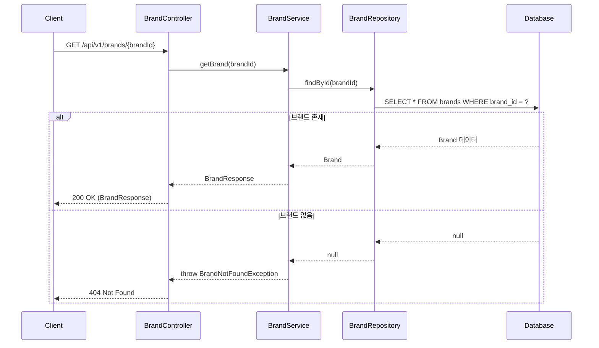
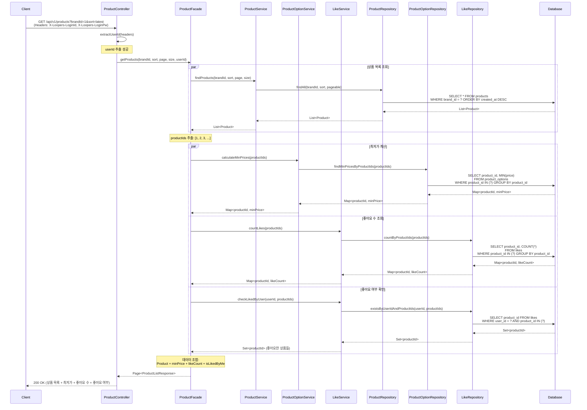
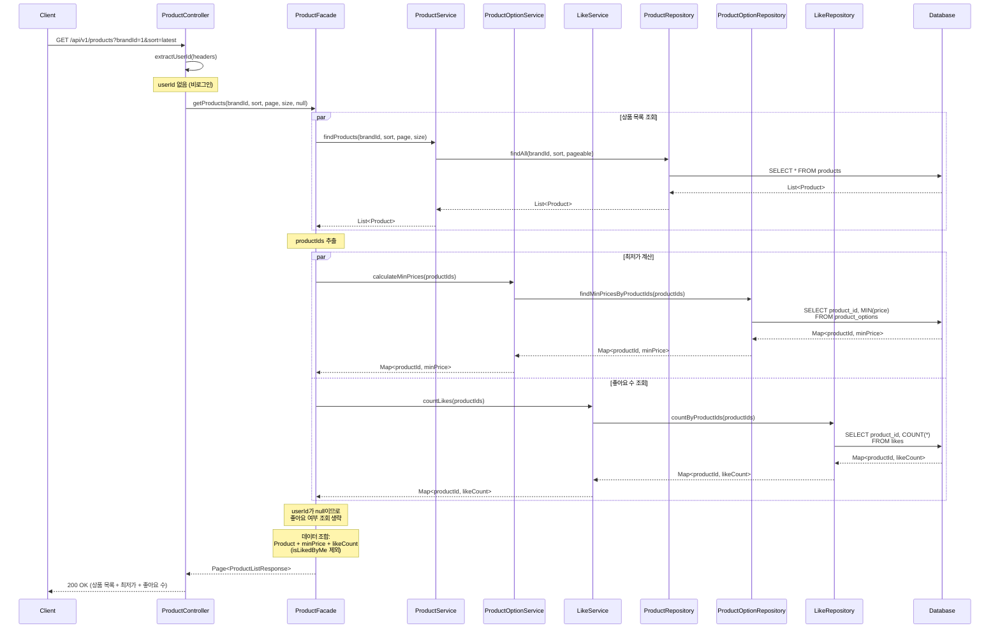
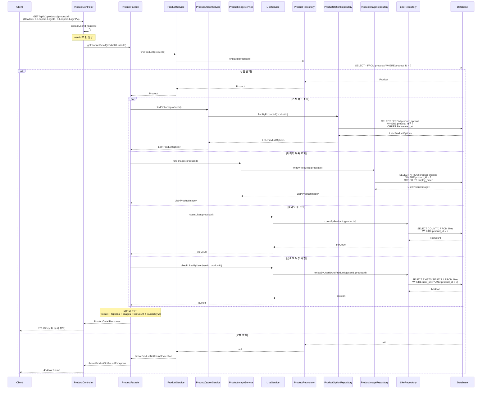
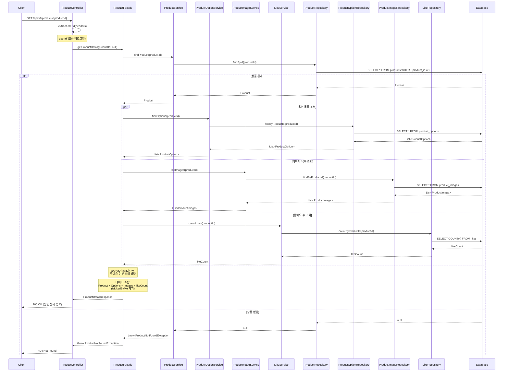

# 시퀀스 다이어그램 (Sequence Diagrams)

## 1️⃣ 브랜드 조회

### 개요
사용자가 특정 브랜드의 상세 정보를 조회하는 시나리오.

### 참여 객체
- **Client**: 사용자 클라이언트 (웹/앱)
- **BrandController**: 브랜드 API 컨트롤러
- **BrandService**: 브랜드 도메인 서비스
- **BrandRepository**: 브랜드 데이터 접근
- **Database**: 데이터베이스

### 주요 흐름
1. 클라이언트가 브랜드 ID로 조회 요청
2. 컨트롤러가 요청을 받아 서비스로 전달
3. 서비스가 리포지토리를 통해 브랜드 조회
4. 브랜드가 존재하면 정보 반환, 없으면 404 에러

### Mermaid 다이어그램



### 설계 포인트
- **단순한 조회 흐름**: 브랜드 조회는 다른 도메인과의 협력이 필요 없는 단순 조회
- **Facade 불필요**: 단일 도메인만 다루므로 Facade 레이어 없이 Controller → Service 직접 호출
- **예외 처리**: 브랜드가 존재하지 않을 경우 404 응답

---

## 2️⃣ 상품 목록 조회

### 개요
사용자가 상품 목록을 조회하는 시나리오. 브랜드 필터링, 정렬, 페이지네이션을 지원하며, 로그인 사용자의 경우 좋아요 여부도 포함.

### 참여 객체
- **Client**: 사용자 클라이언트
- **ProductController**: 상품 API 컨트롤러
- **ProductFacade**: 여러 도메인 서비스 조율
- **ProductService**: 상품 도메인 서비스
- **ProductOptionService**: 상품 옵션 도메인 서비스
- **LikeService**: 좋아요 도메인 서비스
- **각 Repository**: 데이터 접근 계층
- **Database**: 데이터베이스

### 주요 흐름 (로그인 사용자)
1. 클라이언트가 상품 목록 조회 요청 (헤더에 로그인 정보 포함)
2. 컨트롤러가 헤더에서 userId 추출
3. Facade가 여러 서비스를 조율:
    - 상품 목록 조회
    - 각 상품의 최저가 계산
    - 각 상품의 좋아요 수 조회
    - 사용자의 좋아요 여부 확인
4. Facade가 데이터를 조합하여 응답 구성

### Mermaid 다이어그램 (로그인 사용자)



### Mermaid 다이어그램 (비로그인 사용자)



### 설계 포인트

#### 1. Facade의 역할
- **여러 도메인 서비스 조율**: Product, ProductOption, Like 서비스를 조율
- **병렬 처리 가능**: 최저가, 좋아요 수, 좋아요 여부 조회는 독립적이므로 병렬 실행 가능
- **데이터 조합**: 각 서비스에서 받은 데이터를 하나의 응답 DTO로 조합

#### 2. 로그인 여부에 따른 분기
- **Controller에서 userId 추출**: 헤더 존재 여부로 로그인 판단
- **Facade에서 조건부 처리**: userId가 null이면 좋아요 여부 조회 생략
- **응답 DTO 차이**: 로그인 시 `isLikedByMe` 필드 포함, 비로그인 시 제외

#### 3. 성능 최적화
- **배치 조회**: productIds를 일괄 전달하여 N+1 문제 방지
- **병렬 처리**: 최저가, 좋아요 수, 좋아요 여부를 동시에 조회 가능 (par 블록)
- **인덱스 활용**: 각 쿼리는 적절한 인덱스 사용 전제

#### 4. 트랜잭션 경계
- **읽기 전용**: 모든 조회는 읽기 전용 트랜잭션
- **일관성**: 각 조회는 독립적이므로 최종 일관성(Eventual Consistency) 허용

---

## 3️⃣ 상품 상세 조회

### 개요
사용자가 특정 상품의 상세 정보를 조회하는 시나리오. 상품 기본 정보, 옵션 목록, 이미지 목록, 좋아요 수를 포함하며, 로그인 사용자의 경우 좋아요 여부도 포함.

### 참여 객체
- **Client**: 사용자 클라이언트
- **ProductController**: 상품 API 컨트롤러
- **ProductFacade**: 여러 도메인 서비스 조율
- **ProductService**: 상품 도메인 서비스
- **ProductOptionService**: 상품 옵션 도메인 서비스
- **ProductImageService**: 상품 이미지 도메인 서비스
- **LikeService**: 좋아요 도메인 서비스
- **각 Repository**: 데이터 접근 계층
- **Database**: 데이터베이스

### 주요 흐름 (로그인 사용자)
1. 클라이언트가 상품 상세 조회 요청 (헤더에 로그인 정보 포함)
2. 컨트롤러가 헤더에서 userId 추출
3. Facade가 여러 서비스를 조율:
    - 상품 기본 정보 조회
    - 상품 옵션 목록 조회
    - 상품 이미지 목록 조회
    - 좋아요 수 조회
    - 사용자의 좋아요 여부 확인
4. Facade가 데이터를 조합하여 응답 구성

### Mermaid 다이어그램 (로그인 사용자)



### Mermaid 다이어그램 (비로그인 사용자)



### 설계 포인트

#### 1. Facade의 역할
- **다중 도메인 조율**: Product, ProductOption, ProductImage, Like 서비스 조율
- **병렬 처리**: 옵션, 이미지, 좋아요 수, 좋아요 여부 조회는 독립적이므로 병렬 실행 가능
- **예외 처리 위임**: 상품이 없으면 ProductService에서 예외 발생, Facade는 그대로 전파

#### 2. 로그인 여부에 따른 분기
- **Controller에서 userId 추출**: 상품 목록 조회와 동일한 패턴
- **Facade에서 조건부 처리**: userId가 null이면 좋아요 여부 조회 생략
- **응답 일관성**: 로그인 여부에 따라 응답 구조 달라짐

#### 3. 데이터 조회 전략
- **상품 기본 정보 먼저**: 상품이 존재하지 않으면 즉시 404 반환
- **나머지 데이터 병렬**: 상품 존재 확인 후 옵션/이미지/좋아요 정보를 병렬로 조회
- **Fetch Join 고려**: ProductOption, ProductImage는 Fetch Join으로 단일 쿼리 가능 (N+1 방지)

#### 4. 성능 최적화
- **병렬 처리**: par 블록으로 여러 조회를 동시에 수행
- **Fetch Join**: 옵션과 이미지를 상품과 함께 조회하는 것도 가능 (트레이드오프 고려)
- **인덱스**: product_options(product_id), product_images(product_id, display_order)

---

## 📊 전체 설계 요약

### 레이어별 책임

| 레이어 | 책임 |
|--------|------|
| **Controller** | - HTTP 요청/응답 처리<br/>- 인증 정보 추출 (헤더에서 userId)<br/>- 입력 검증<br/>- 예외를 HTTP 상태 코드로 변환 |
| **Facade** | - 여러 도메인 서비스 조율 (orchestration)<br/>- 데이터 조합 및 응답 DTO 구성<br/>- 병렬 처리 최적화<br/>- 로그인 여부에 따른 분기 처리 |
| **Service** | - 도메인별 비즈니스 로직<br/>- 단일 도메인 책임<br/>- 리포지토리 호출 |
| **Repository** | - 데이터 접근<br/>- 쿼리 최적화 (Fetch Join, 배치 조회)<br/>- 영속성 관리 |

### Facade 사용 기준

| 시나리오 | Facade 사용 여부 | 이유 |
|---------|----------------|------|
| **브랜드 조회** | ❌ 불필요 | 단일 도메인만 다룸 |
| **상품 목록 조회** | ✅ 필요 | Product + ProductOption + Like 조율 |
| **상품 상세 조회** | ✅ 필요 | Product + ProductOption + ProductImage + Like 조율 |

### 병렬 처리 가능 구간

**상품 목록 조회:**
```
최저가 계산 ∥ 좋아요 수 조회 ∥ 좋아요 여부 확인
```

**상품 상세 조회:**
```
옵션 조회 ∥ 이미지 조회 ∥ 좋아요 수 조회 ∥ 좋아요 여부 확인
```

### 트랜잭션 전략
- 모든 조회는 **읽기 전용 트랜잭션**
- Facade 레벨에서 `@Transactional(readOnly = true)` 적용
- 각 서비스 메서드도 독립적으로 읽기 전용 트랜잭션 가능

---

**문서 끝**