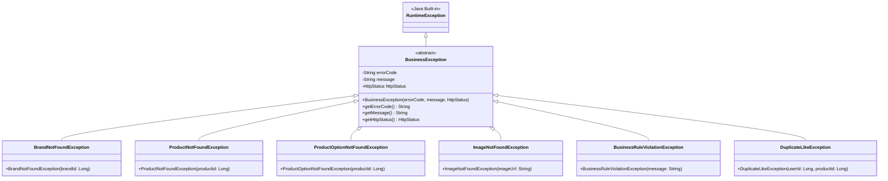

# 클래스 다이어그램 (Class Diagram)

## 1️⃣ 전체 아키텍처 개요

### 레이어 구조
```
┌─────────────────────────────────────────┐
│         Presentation Layer              │
│  (Controller)                           │
└─────────────────────────────────────────┘
                  ↓
┌─────────────────────────────────────────┐
│         Application Layer               │
│  (Facade - 도메인 서비스 조율)          │
└─────────────────────────────────────────┘
                  ↓
┌─────────────────────────────────────────┐
│         Domain Layer                    │
│  (Service, Entity)                      │
└─────────────────────────────────────────┘
                  ↓
┌─────────────────────────────────────────┐
│         Infrastructure Layer            │
│  (Repository)                           │
└─────────────────────────────────────────┘
```

---

## 2️⃣ 전체 클래스 다이어그램

```mermaid
classDiagram
    %% ============================================
    %% Presentation Layer (Controllers)
    %% ============================================
    class BrandController {
        -BrandService brandService
        +getBrand(brandId: Long) ResponseEntity~BrandResponse~
    }
    
    class ProductController {
        -ProductFacade productFacade
        +getProducts(brandId: Long, sort: String, page: int, size: int, headers: HttpHeaders) ResponseEntity~Page~ProductListResponse~~
        +getProductDetail(productId: Long, headers: HttpHeaders) ResponseEntity~ProductDetailResponse~
        -extractUserId(headers: HttpHeaders) Long
    }

    %% ============================================
    %% Application Layer (Facade)
    %% ============================================
    class ProductFacade {
        -ProductService productService
        -ProductOptionService productOptionService
        -ProductImageService productImageService
        -LikeService likeService
        +getProducts(brandId: Long, sort: String, page: Pageable, userId: Long) Page~ProductListResponse~
        +getProductDetail(productId: Long, userId: Long) ProductDetailResponse
        -combineProductListData(products: List~Product~, minPrices: Map, likeCounts: Map, likedProducts: Set) Page~ProductListResponse~
        -combineProductDetailData(product: Product, options: List~ProductOption~, images: List~ProductImage~, likeCount: int, isLiked: boolean) ProductDetailResponse
    }

    %% ============================================
    %% Domain Layer (Services)
    %% ============================================
    class BrandService {
        -BrandRepository brandRepository
        +getBrand(brandId: Long) Brand
    }
    
    class ProductService {
        -ProductRepository productRepository
        +findProducts(brandId: Long, sort: String, pageable: Pageable) Page~Product~
        +findProduct(productId: Long) Product
    }
    
    class ProductOptionService {
        -ProductOptionRepository productOptionRepository
        +findOptions(productId: Long) List~ProductOption~
        +calculateMinPrices(productIds: List~Long~) Map~Long, Integer~
        +validateOptions(options: List~ProductOption~) void
    }
    
    class ProductImageService {
        -ProductImageRepository productImageRepository
        +findImages(productId: Long) List~ProductImage~
        +validateImageExists(imageUrl: String) void
    }
    
    class LikeService {
        -LikeRepository likeRepository
        +countLikes(productId: Long) int
        +countLikes(productIds: List~Long~) Map~Long, Integer~
        +checkLikedByUser(userId: Long, productId: Long) boolean
        +checkLikedByUser(userId: Long, productIds: List~Long~) Set~Long~
        +addLike(userId: Long, productId: Long) void
        +removeLike(userId: Long, productId: Long) void
    }

    %% ============================================
    %% Domain Layer (Entities)
    %% ============================================
    class Brand {
        -Long brandId
        -String name
        -String description
        -String logoImageUrl
        -LocalDateTime createdAt
        +Brand(name: String, description: String, logoImageUrl: String)
    }
    
    class Product {
        -Long productId
        -Long brandId
        -String name
        -String description
        -LocalDateTime createdAt
        +Product(brandId: Long, name: String, description: String)
        +validateBusinessRules() void
    }
    
    class ProductOption {
        -Long optionId
        -Long productId
        -String name
        -Integer price
        -Integer stockQuantity
        -LocalDateTime createdAt
        +ProductOption(productId: Long, name: String, price: Integer, stockQuantity: Integer)
        +isAvailable() boolean
        +validatePrice() void
        +validateStock() void
    }
    
    class ProductImage {
        -Long imageId
        -Long productId
        -String imageUrl
        -Integer displayOrder
        -LocalDateTime createdAt
        +ProductImage(productId: Long, imageUrl: String, displayOrder: Integer)
    }
    
    class Like {
        -Long likeId
        -Long userId
        -Long productId
        -LocalDateTime createdAt
        +Like(userId: Long, productId: Long)
    }

    %% ============================================
    %% Infrastructure Layer (Repositories)
    %% ============================================
    class BrandRepository {
        <<interface>>
        +findById(brandId: Long) Optional~Brand~
    }
    
    class ProductRepository {
        <<interface>>
        +findById(productId: Long) Optional~Product~
        +findAll(brandId: Long, sort: String, pageable: Pageable) Page~Product~
    }
    
    class ProductOptionRepository {
        <<interface>>
        +findByProductId(productId: Long) List~ProductOption~
        +findMinPricesByProductIds(productIds: List~Long~) Map~Long, Integer~
    }
    
    class ProductImageRepository {
        <<interface>>
        +findByProductId(productId: Long) List~ProductImage~
    }
    
    class LikeRepository {
        <<interface>>
        +countByProductId(productId: Long) int
        +countByProductIds(productIds: List~Long~) Map~Long, Integer~
        +existsByUserIdAndProductId(userId: Long, productId: Long) boolean
        +existsByUserIdAndProductIds(userId: Long, productIds: List~Long~) Set~Long~
        +save(like: Like) Like
        +deleteByUserIdAndProductId(userId: Long, productId: Long) void
    }

    %% ============================================
    %% Exception Hierarchy
    %% ============================================
    class BusinessException {
        <<abstract>>
        -String errorCode
        -String message
        +BusinessException(errorCode: String, message: String)
    }
    
    class BrandNotFoundException {
        +BrandNotFoundException(brandId: Long)
    }
    
    class ProductNotFoundException {
        +ProductNotFoundException(productId: Long)
    }
    
    class ProductOptionNotFoundException {
        +ProductOptionNotFoundException(productId: Long)
    }
    
    class ImageNotFoundException {
        +ImageNotFoundException(imageUrl: String)
    }
    
    class BusinessRuleViolationException {
        +BusinessRuleViolationException(message: String)
    }
    
    class DuplicateLikeException {
        +DuplicateLikeException(userId: Long, productId: Long)
    }

    %% ============================================
    %% Relationships - Controllers
    %% ============================================
    BrandController ..> BrandService : uses
    ProductController ..> ProductFacade : uses

    %% ============================================
    %% Relationships - Facade
    %% ============================================
    ProductFacade ..> ProductService : uses
    ProductFacade ..> ProductOptionService : uses
    ProductFacade ..> ProductImageService : uses
    ProductFacade ..> LikeService : uses

    %% ============================================
    %% Relationships - Services to Repositories
    %% ============================================
    BrandService ..> BrandRepository : uses
    ProductService ..> ProductRepository : uses
    ProductOptionService ..> ProductOptionRepository : uses
    ProductImageService ..> ProductImageRepository : uses
    LikeService ..> LikeRepository : uses

    %% ============================================
    %% Relationships - Domain Models
    %% ============================================
    Brand "1" --> "N" Product : has
    Product "1" --> "N" ProductOption : has
    Product "1" --> "N" ProductImage : has
    Product "1" --> "N" Like : receives
    
    %% Note: User entity는 v2에서 추가 예정
    %% User "1" --> "N" Like : creates

    %% ============================================
    %% Relationships - Exceptions
    %% ============================================
    BusinessException <|-- BrandNotFoundException
    BusinessException <|-- ProductNotFoundException
    BusinessException <|-- ProductOptionNotFoundException
    BusinessException <|-- ImageNotFoundException
    BusinessException <|-- BusinessRuleViolationException
    BusinessException <|-- DuplicateLikeException
    
    BrandService ..> BrandNotFoundException : throws
    ProductService ..> ProductNotFoundException : throws
    ProductOptionService ..> ProductOptionNotFoundException : throws
    ProductOptionService ..> BusinessRuleViolationException : throws
    ProductImageService ..> ImageNotFoundException : throws
    LikeService ..> DuplicateLikeException : throws
```



---

## 3️⃣ 레이어별 상세 설계

### Presentation Layer (Controller)

#### BrandController
```java
@RestController
@RequestMapping("/api/v1/brands")
public class BrandController {
    private final BrandService brandService;
    
    @GetMapping("/{brandId}")
    public ResponseEntity<BrandResponse> getBrand(@PathVariable Long brandId) {
        Brand brand = brandService.getBrand(brandId);
        return ResponseEntity.ok(BrandResponse.from(brand));
    }
}
```

**책임:**
- HTTP 요청 처리
- Path Variable 추출
- 응답 DTO 변환
- HTTP 상태 코드 반환

**예외 처리:**
- BrandNotFoundException → 404 Not Found

---

#### ProductController
```java
@RestController
@RequestMapping("/api/v1/products")
public class ProductController {
    private final ProductFacade productFacade;
    
    @GetMapping
    public ResponseEntity<Page<ProductListResponse>> getProducts(
        @RequestParam(required = false) Long brandId,
        @RequestParam(defaultValue = "latest") String sort,
        @RequestParam(defaultValue = "0") int page,
        @RequestParam(defaultValue = "20") int size,
        @RequestHeader HttpHeaders headers
    ) {
        Long userId = extractUserId(headers);
        Pageable pageable = PageRequest.of(page, size);
        
        Page<ProductListResponse> products = productFacade.getProducts(
            brandId, sort, pageable, userId
        );
        
        return ResponseEntity.ok(products);
    }
    
    @GetMapping("/{productId}")
    public ResponseEntity<ProductDetailResponse> getProductDetail(
        @PathVariable Long productId,
        @RequestHeader HttpHeaders headers
    ) {
        Long userId = extractUserId(headers);
        ProductDetailResponse response = productFacade.getProductDetail(productId, userId);
        return ResponseEntity.ok(response);
    }
    
    private Long extractUserId(HttpHeaders headers) {
        // X-Loopers-LoginId 헤더에서 userId 추출
        // v1에서는 임시 구현, v2에서 정식 인증으로 전환
        String loginId = headers.getFirst("X-Loopers-LoginId");
        return loginId != null ? Long.valueOf(loginId) : null;
    }
}
```

**책임:**
- HTTP 요청 처리
- Query Parameter, Path Variable, Header 추출
- 인증 정보 추출 (userId)
- Facade 호출
- 응답 DTO 반환

---

### Application Layer (Facade)

#### ProductFacade
```java
@Service
@Transactional(readOnly = true)
public class ProductFacade {
    private final ProductService productService;
    private final ProductOptionService productOptionService;
    private final ProductImageService productImageService;
    private final LikeService likeService;
    
    public Page<ProductListResponse> getProducts(
        Long brandId, String sort, Pageable pageable, Long userId
    ) {
        // 1. 상품 목록 조회
        Page<Product> products = productService.findProducts(brandId, sort, pageable);
        List<Long> productIds = products.stream()
            .map(Product::getProductId)
            .collect(Collectors.toList());
        
        // 2. 병렬로 부가 정보 조회
        Map<Long, Integer> minPrices = productOptionService.calculateMinPrices(productIds);
        Map<Long, Integer> likeCounts = likeService.countLikes(productIds);
        Set<Long> likedProducts = userId != null 
            ? likeService.checkLikedByUser(userId, productIds)
            : Collections.emptySet();
        
        // 3. 데이터 조합
        return combineProductListData(products, minPrices, likeCounts, likedProducts);
    }
    
    public ProductDetailResponse getProductDetail(Long productId, Long userId) {
        // 1. 상품 기본 정보 조회
        Product product = productService.findProduct(productId);
        
        // 2. 병렬로 상세 정보 조회
        List<ProductOption> options = productOptionService.findOptions(productId);
        List<ProductImage> images = productImageService.findImages(productId);
        int likeCount = likeService.countLikes(productId);
        boolean isLiked = userId != null 
            ? likeService.checkLikedByUser(userId, productId)
            : false;
        
        // 3. 옵션 검증 (최소 1개 이상)
        if (options.isEmpty()) {
            throw new ProductOptionNotFoundException(productId);
        }
        
        // 4. 데이터 조합
        return combineProductDetailData(product, options, images, likeCount, isLiked);
    }
    
    private Page<ProductListResponse> combineProductListData(...) {
        // 각 Product에 부가 정보를 조합하여 ProductListResponse 생성
    }
    
    private ProductDetailResponse combineProductDetailData(...) {
        // Product + Options + Images + Like 정보를 조합하여 Response 생성
    }
}
```

**책임:**
- 여러 도메인 서비스 조율 (orchestration)
- 병렬 처리 가능한 작업 조율
- 데이터 조합 및 응답 DTO 구성
- 로그인 여부에 따른 분기 처리
- 비즈니스 규칙 검증 (옵션 존재 여부)

**예외 처리:**
- ProductNotFoundException (ProductService에서 전파)
- ProductOptionNotFoundException (옵션이 없을 때)

---

### Domain Layer (Services)

#### BrandService
```java
@Service
@Transactional(readOnly = true)
public class BrandService {
    private final BrandRepository brandRepository;
    
    public Brand getBrand(Long brandId) {
        return brandRepository.findById(brandId)
            .orElseThrow(() -> new BrandNotFoundException(brandId));
    }
}
```

**책임:**
- 브랜드 도메인 비즈니스 로직
- 브랜드 조회

**예외:**
- BrandNotFoundException

---

#### ProductService
```java
@Service
@Transactional(readOnly = true)
public class ProductService {
    private final ProductRepository productRepository;
    
    public Page<Product> findProducts(Long brandId, String sort, Pageable pageable) {
        return productRepository.findAll(brandId, sort, pageable);
    }
    
    public Product findProduct(Long productId) {
        return productRepository.findById(productId)
            .orElseThrow(() -> new ProductNotFoundException(productId));
    }
}
```

**책임:**
- 상품 도메인 비즈니스 로직
- 상품 조회 (목록, 상세)

**예외:**
- ProductNotFoundException

---

#### ProductOptionService
```java
@Service
@Transactional(readOnly = true)
public class ProductOptionService {
    private final ProductOptionRepository productOptionRepository;
    
    public List<ProductOption> findOptions(Long productId) {
        return productOptionRepository.findByProductId(productId);
    }
    
    public Map<Long, Integer> calculateMinPrices(List<Long> productIds) {
        return productOptionRepository.findMinPricesByProductIds(productIds);
    }
    
    public void validateOptions(List<ProductOption> options) {
        for (ProductOption option : options) {
            option.validatePrice();
            option.validateStock();
        }
    }
}
```

**책임:**
- 상품 옵션 도메인 비즈니스 로직
- 옵션 조회
- 최저가 계산 (집계 쿼리)
- 가격/재고 검증

**예외:**
- BusinessRuleViolationException (가격 음수, 재고 음수 등)

---

#### ProductImageService
```java
@Service
@Transactional(readOnly = true)
public class ProductImageService {
    private final ProductImageRepository productImageRepository;
    
    public List<ProductImage> findImages(Long productId) {
        return productImageRepository.findByProductId(productId);
    }
    
    public void validateImageExists(String imageUrl) {
        // 실제 이미지 리소스 존재 여부 확인 (S3, CDN 등)
        // 이미지가 없으면 ImageNotFoundException 발생
    }
}
```

**책임:**
- 상품 이미지 도메인 비즈니스 로직
- 이미지 조회
- 이미지 리소스 존재 검증

**예외:**
- ImageNotFoundException

---

#### LikeService
```java
@Service
@Transactional(readOnly = true)
public class LikeService {
    private final LikeRepository likeRepository;
    
    public int countLikes(Long productId) {
        return likeRepository.countByProductId(productId);
    }
    
    public Map<Long, Integer> countLikes(List<Long> productIds) {
        return likeRepository.countByProductIds(productIds);
    }
    
    public boolean checkLikedByUser(Long userId, Long productId) {
        return likeRepository.existsByUserIdAndProductId(userId, productId);
    }
    
    public Set<Long> checkLikedByUser(Long userId, List<Long> productIds) {
        return likeRepository.existsByUserIdAndProductIds(userId, productIds);
    }
    
    @Transactional
    public void addLike(Long userId, Long productId) {
        if (likeRepository.existsByUserIdAndProductId(userId, productId)) {
            throw new DuplicateLikeException(userId, productId);
        }
        Like like = new Like(userId, productId);
        likeRepository.save(like);
        // 이벤트 발행 (카운트 업데이트) - 별도 문서 참조
    }
    
    @Transactional
    public void removeLike(Long userId, Long productId) {
        likeRepository.deleteByUserIdAndProductId(userId, productId);
        // 이벤트 발행 (카운트 업데이트) - 별도 문서 참조
    }
}
```

**책임:**
- 좋아요 도메인 비즈니스 로직
- 좋아요 수 조회 (단일, 배치)
- 좋아요 여부 확인 (단일, 배치)
- 좋아요 등록/취소

**예외:**
- DuplicateLikeException

---

### Domain Layer (Entities)

#### Brand
```java
@Entity
@Table(name = "brands")
public class Brand {
    @Id
    @GeneratedValue(strategy = GenerationType.IDENTITY)
    private Long brandId;
    
    @Column(nullable = false, unique = true, length = 100)
    private String name;
    
    @Column(columnDefinition = "TEXT")
    private String description;
    
    @Column(length = 500)
    private String logoImageUrl;
    
    @Column(nullable = false, updatable = false)
    private LocalDateTime createdAt;
    
    protected Brand() {} // JPA
    
    public Brand(String name, String description, String logoImageUrl) {
        this.name = name;
        this.description = description;
        this.logoImageUrl = logoImageUrl;
        this.createdAt = LocalDateTime.now();
    }
    
    // Getters
}
```

**설계 포인트:**
- 불변 객체 지향 (Setter 없음)
- 생성자를 통한 필수 값 주입
- JPA 기본 생성자는 protected

---

#### Product
```java
@Entity
@Table(name = "products")
public class Product {
    @Id
    @GeneratedValue(strategy = GenerationType.IDENTITY)
    private Long productId;
    
    @Column(nullable = false)
    private Long brandId; // FK 제약 없음
    
    @Column(nullable = false, length = 200)
    private String name;
    
    @Column(columnDefinition = "TEXT")
    private String description;
    
    @Column(nullable = false, updatable = false)
    private LocalDateTime createdAt;
    
    protected Product() {} // JPA
    
    public Product(Long brandId, String name, String description) {
        this.brandId = brandId;
        this.name = name;
        this.description = description;
        this.createdAt = LocalDateTime.now();
        validateBusinessRules();
    }
    
    public void validateBusinessRules() {
        if (brandId == null || brandId <= 0) {
            throw new BusinessRuleViolationException("brandId must be positive");
        }
        if (name == null || name.isBlank()) {
            throw new BusinessRuleViolationException("Product name is required");
        }
    }
    
    // Getters
}
```

**설계 포인트:**
- brandId는 Long 타입 (FK 제약 없음)
- 생성자에서 비즈니스 규칙 검증
- 도메인 무결성은 애플리케이션 레벨에서 관리

---

#### ProductOption
```java
@Entity
@Table(
    name = "product_options",
    uniqueConstraints = @UniqueConstraint(columnNames = {"product_id", "name"})
)
public class ProductOption {
    @Id
    @GeneratedValue(strategy = GenerationType.IDENTITY)
    private Long optionId;
    
    @Column(nullable = false)
    private Long productId; // FK 제약 없음
    
    @Column(nullable = false, length = 100)
    private String name;
    
    @Column(nullable = false)
    private Integer price;
    
    @Column(nullable = false)
    private Integer stockQuantity;
    
    @Column(nullable = false, updatable = false)
    private LocalDateTime createdAt;
    
    protected ProductOption() {} // JPA
    
    public ProductOption(Long productId, String name, Integer price, Integer stockQuantity) {
        this.productId = productId;
        this.name = name;
        this.price = price;
        this.stockQuantity = stockQuantity;
        this.createdAt = LocalDateTime.now();
        validatePrice();
        validateStock();
    }
    
    public boolean isAvailable() {
        return stockQuantity > 0;
    }
    
    public void validatePrice() {
        if (price == null || price < 0) {
            throw new BusinessRuleViolationException("Price must be non-negative");
        }
    }
    
    public void validateStock() {
        if (stockQuantity == null || stockQuantity < 0) {
            throw new BusinessRuleViolationException("Stock quantity must be non-negative");
        }
    }
    
    // Getters
}
```

**설계 포인트:**
- 가격, 재고 검증 로직 포함
- `isAvailable()` 비즈니스 메서드
- Unique 제약: 같은 상품 내 옵션명 중복 불가

---

#### ProductImage
```java
@Entity
@Table(name = "product_images")
public class ProductImage {
    @Id
    @GeneratedValue(strategy = GenerationType.IDENTITY)
    private Long imageId;
    
    @Column(nullable = false)
    private Long productId; // FK 제약 없음
    
    @Column(nullable = false, length = 500)
    private String imageUrl;
    
    @Column(nullable = false)
    private Integer displayOrder;
    
    @Column(nullable = false, updatable = false)
    private LocalDateTime createdAt;
    
    protected ProductImage() {} // JPA
    
    public ProductImage(Long productId, String imageUrl, Integer displayOrder) {
        this.productId = productId;
        this.imageUrl = imageUrl;
        this.displayOrder = displayOrder;
        this.createdAt = LocalDateTime.now();
    }
    
    // Getters
}
```

**설계 포인트:**
- displayOrder로 이미지 순서 관리
- 실제 이미지 파일은 S3/CDN에 저장, URL만 DB에 보관

---

#### Like
```java
@Entity
@Table(
    name = "likes",
    uniqueConstraints = @UniqueConstraint(columnNames = {"user_id", "product_id"})
)
public class Like {
    @Id
    @GeneratedValue(strategy = GenerationType.IDENTITY)
    private Long likeId;
    
    @Column(nullable = false)
    private Long userId; // FK 제약 없음, v2에서 User 엔티티 추가 예정
    
    @Column(nullable = false)
    private Long productId; // FK 제약 없음
    
    @Column(nullable = false, updatable = false)
    private LocalDateTime createdAt;
    
    protected Like() {} // JPA
    
    public Like(Long userId, Long productId) {
        this.userId = userId;
        this.productId = productId;
        this.createdAt = LocalDateTime.now();
    }
    
    // Getters
}
```

**설계 포인트:**
- Unique 제약: 사용자당 상품 1개만 좋아요 가능
- 중복 좋아요는 DB 레벨에서 방지
- v1에서는 userId를 임시 식별자로 사용

---

## 4️⃣ 예외 계층 구조



### 예외 클래스 상세

#### BusinessException (추상 베이스 클래스)
```java
public abstract class BusinessException extends RuntimeException {
    private final String errorCode;
    private final HttpStatus httpStatus;
    
    protected BusinessException(String errorCode, String message, HttpStatus httpStatus) {
        super(message);
        this.errorCode = errorCode;
        this.httpStatus = httpStatus;
    }
    
    public String getErrorCode() {
        return errorCode;
    }
    
    public HttpStatus getHttpStatus() {
        return httpStatus;
    }
}
```

---

#### BrandNotFoundException
```java
public class BrandNotFoundException extends BusinessException {
    public BrandNotFoundException(Long brandId) {
        super(
            "BRAND_NOT_FOUND",
            String.format("Brand not found: brandId=%d", brandId),
            HttpStatus.NOT_FOUND
        );
    }
}
```

**발생 시점:** 브랜드 조회 시 존재하지 않을 때  
**HTTP 상태:** 404 Not Found  
**복구 전략:** 사용자에게 브랜드가 존재하지 않음을 알림

---

#### ProductNotFoundException
```java
public class ProductNotFoundException extends BusinessException {
    public ProductNotFoundException(Long productId) {
        super(
            "PRODUCT_NOT_FOUND",
            String.format("Product not found: productId=%d", productId),
            HttpStatus.NOT_FOUND
        );
    }
}
```

**발생 시점:**
- 상품 조회 시 존재하지 않을 때
- 타이밍 이슈로 조회 중 삭제되었을 때 (동시성)

**HTTP 상태:** 404 Not Found  
**복구 전략:** 사용자에게 상품이 존재하지 않음을 알림

---

#### ProductOptionNotFoundException
```java
public class ProductOptionNotFoundException extends BusinessException {
    public ProductOptionNotFoundException(Long productId) {
        super(
            "PRODUCT_OPTION_NOT_FOUND",
            String.format("Product options not found for productId=%d. Data integrity violation.", productId),
            HttpStatus.INTERNAL_SERVER_ERROR
        );
    }
}
```

**발생 시점:** 상품은 존재하는데 옵션이 하나도 없을 때 (데이터 무결성 위반)  
**HTTP 상태:** 500 Internal Server Error  
**복구 전략:**
- 시스템 관리자에게 알림
- 데이터 정합성 복구 필요
- 사용자에게는 일시적 오류 안내

---

#### ImageNotFoundException
```java
public class ImageNotFoundException extends BusinessException {
    public ImageNotFoundException(String imageUrl) {
        super(
            "IMAGE_NOT_FOUND",
            String.format("Image resource not found: url=%s", imageUrl),
            HttpStatus.NOT_FOUND
        );
    }
}
```

**발생 시점:** 이미지 URL은 DB에 있지만 실제 리소스(S3, CDN)가 없을 때  
**HTTP 상태:** 404 Not Found (또는 500으로 설정 가능)  
**복구 전략:**
- 기본 이미지로 대체
- 시스템 관리자에게 알림 (이미지 리소스 복구 필요)

---

#### BusinessRuleViolationException
```java
public class BusinessRuleViolationException extends BusinessException {
    public BusinessRuleViolationException(String message) {
        super(
            "BUSINESS_RULE_VIOLATION",
            message,
            HttpStatus.INTERNAL_SERVER_ERROR
        );
    }
}
```

**발생 시점:**
- 가격이 음수일 때
- 재고가 음수일 때
- 기타 비즈니스 규칙 위반

**HTTP 상태:** 500 Internal Server Error  
**복구 전략:**
- 시스템 관리자에게 알림
- 데이터 검증 강화
- 사용자에게는 일시적 오류 안내

---

#### DuplicateLikeException
```java
public class DuplicateLikeException extends BusinessException {
    public DuplicateLikeException(Long userId, Long productId) {
        super(
            "DUPLICATE_LIKE",
            String.format("User already liked this product: userId=%d, productId=%d", userId, productId),
            HttpStatus.CONFLICT
        );
    }
}
```

**발생 시점:** 이미 좋아요를 누른 상품에 다시 좋아요 시도  
**HTTP 상태:** 409 Conflict  
**복구 전략:** 사용자에게 이미 좋아요했음을 안내

---

## 5️⃣ 설계 원칙 및 고려사항

### 1. 레이어 분리 원칙

#### Controller 책임
- HTTP 프로토콜 처리에만 집중
- 비즈니스 로직 없음
- 인증 정보 추출 (userId)
- 예외를 HTTP 상태 코드로 변환

#### Facade 책임
- 여러 도메인 서비스 조율
- 복잡한 흐름 관리
- 데이터 조합
- **비즈니스 규칙은 Service에 위임**

#### Service 책임
- 도메인별 비즈니스 로직
- 단일 도메인에 집중
- 트랜잭션 경계
- Entity 검증 및 생성

#### Repository 책임
- 데이터 접근만
- 쿼리 최적화
- 영속성 관리

---

### 2. Facade 사용 기준

**Facade가 필요한 경우:**
- 여러 도메인 서비스 협력이 필요한 경우
- 복잡한 데이터 조합이 필요한 경우
- 조건부 처리(로그인 여부 등)가 필요한 경우

**Facade가 불필요한 경우:**
- 단일 도메인만 다루는 경우 (예: 브랜드 조회)
- Controller → Service 직접 호출로 충분한 경우

---

### 3. 예외 처리 전략

#### 예외 계층 구조
```
RuntimeException
  └─ BusinessException (추상)
      ├─ BrandNotFoundException (404)
      ├─ ProductNotFoundException (404)
      ├─ ProductOptionNotFoundException (500) ← 치명적
      ├─ ImageNotFoundException (404/500)
      ├─ BusinessRuleViolationException (500) ← 치명적
      └─ DuplicateLikeException (409)
```

#### 치명적 vs 일반 예외

| 예외 | 치명도 | HTTP | 복구 전략 |
|------|--------|------|----------|
| BrandNotFoundException | 일반 | 404 | 사용자 안내 |
| ProductNotFoundException | 일반 | 404 | 사용자 안내 |
| **ProductOptionNotFoundException** | **치명적** | **500** | **시스템 알림, 데이터 복구** |
| **ImageNotFoundException** | 치명적 | 404 | 기본 이미지 대체, 알림 |
| **BusinessRuleViolationException** | **치명적** | **500** | **시스템 알림, 데이터 검증** |
| DuplicateLikeException | 일반 | 409 | 사용자 안내 |

#### GlobalExceptionHandler (예시)
```java
@RestControllerAdvice
public class GlobalExceptionHandler {
    
    @ExceptionHandler(BusinessException.class)
    public ResponseEntity<ErrorResponse> handleBusinessException(BusinessException e) {
        // 치명적 예외는 로깅 + 알림
        if (e.getHttpStatus().is5xxServerError()) {
            log.error("Critical error occurred", e);
            // 시스템 관리자에게 알림 (슬랙, 이메일 등)
        }
        
        ErrorResponse response = new ErrorResponse(
            e.getErrorCode(),
            e.getMessage()
        );
        
        return ResponseEntity
            .status(e.getHttpStatus())
            .body(response);
    }
}
```

---

### 4. FK 제약 없는 설계

**이유:**
- 애플리케이션 레벨에서 참조 무결성 관리
- DB 레벨 제약으로 인한 성능 오버헤드 제거
- 향후 샤딩, 마이크로서비스 전환 시 유연성 확보

**트레이드오프:**
- 데이터 정합성은 애플리케이션 책임
- 고아 레코드(orphan records) 발생 가능성
- 정기적인 데이터 정합성 체크 필요

**보완 전략:**
- Service 레벨에서 참조 검증
- 배치 작업을 통한 정합성 체크
- 모니터링 및 알림

---

### 5. 성능 고려사항

#### N+1 문제 방지
- Fetch Join 활용
- 배치 조회 메서드 제공 (예: `calculateMinPrices(List<Long>)`)
- Repository에서 IN 절 쿼리 사용

#### 병렬 처리
- Facade에서 독립적인 조회는 병렬 실행 가능
- CompletableFuture 또는 @Async 활용 고려

#### 캐싱
- 자주 조회되는 브랜드 정보 캐싱
- 상품 최저가 계산 결과 캐싱 (Redis)
- 좋아요 수 캐싱 (Eventual Consistency 허용)

---

**문서 끝**