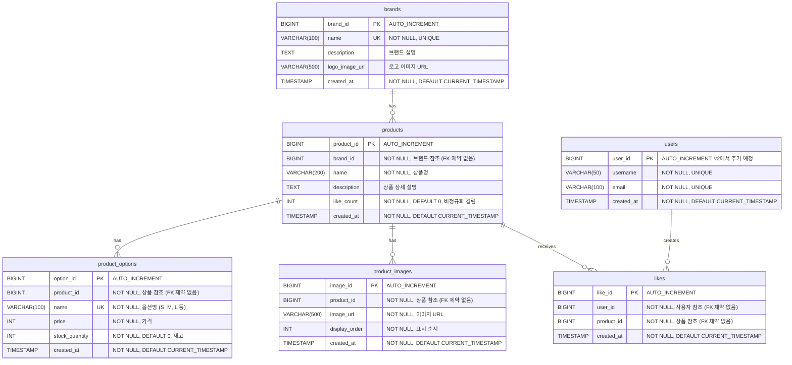

brands - 브랜드 테이블
sqlCREATE TABLE brands (
brand_id BIGINT AUTO_INCREMENT PRIMARY KEY,
name VARCHAR(100) NOT NULL UNIQUE,
description TEXT,
logo_image_url VARCHAR(500),
created_at TIMESTAMP NOT NULL DEFAULT CURRENT_TIMESTAMP,
INDEX idx_name (name)
) ENGINE=InnoDB DEFAULT CHARSET=utf8mb4 COLLATE=utf8mb4_unicode_ci;
product_options - 상품 옵션 (가격/재고 관리 단위)
sqlCREATE TABLE product_options (
option_id BIGINT AUTO_INCREMENT PRIMARY KEY,
product_id BIGINT NOT NULL,
name VARCHAR(100) NOT NULL,
price INT NOT NULL,
stock_quantity INT NOT NULL DEFAULT 0,
created_at TIMESTAMP NOT NULL DEFAULT CURRENT_TIMESTAMP,
CONSTRAINT uk_product_option_name UNIQUE (product_id, name),
INDEX idx_product_id (product_id),
INDEX idx_product_price (product_id, price)  -- 최저가 계산용
) ENGINE=InnoDB DEFAULT CHARSET=utf8mb4 COLLATE=utf8mb4_unicode_ci;
product_images - 상품 이미지 (여러 장 가능)
sqlCREATE TABLE product_images (
image_id BIGINT AUTO_INCREMENT PRIMARY KEY,
product_id BIGINT NOT NULL,
image_url VARCHAR(500) NOT NULL,
display_order INT NOT NULL,
created_at TIMESTAMP NOT NULL DEFAULT CURRENT_TIMESTAMP,
INDEX idx_product_display_order (product_id, display_order)
) ENGINE=InnoDB DEFAULT CHARSET=utf8mb4 COLLATE=utf8mb4_unicode_ci;

2. 수정해야 할 테이블
   products - brand_id 추가, price 제거
   sqlALTER TABLE products
   ADD COLUMN brand_id BIGINT NOT NULL AFTER id,
   DROP COLUMN price,
   ADD INDEX idx_brand_id (brand_id),
   ADD INDEX idx_brand_created (brand_id, created_at DESC);  -- 브랜드별 최신순 조회
   이유:

price는 이제 product_options에서 관리
brand_id 추가 (어느 브랜드 상품인지)
브랜드별 상품 조회를 위한 복합 인덱스

likes - user_id 인덱스 추가
sqlALTER TABLE likes
ADD INDEX idx_user_id (user_id);  -- 내 좋아요 목록 조회용
이유:

"내 좋아요 목록 조회" 기능을 위해 user_id 인덱스 필요


3. 좋아요 카운트 관리
   현재는 products 테이블에 like_count 컬럼이 없는데, 두 가지 선택지가 있어요:
   A. 추가하지 않음 (실시간 COUNT)

매번 SELECT COUNT(*) FROM likes WHERE product_id = ?
정확하지만 느림

B. 추가함 (비정규화)
sqlALTER TABLE products
ADD COLUMN like_count INT NOT NULL DEFAULT 0;

좋아요 등록/취소 시 비동기로 업데이트
Eventual Consistency (좋아요 명세 문서에서 언급)


# ERD (Entity Relationship Diagram)

## 1️⃣ 전체 ERD 개요

### 테이블 구조
```
brands (브랜드)
  ├── brand_id (PK)
  └── [1:N] products

products (상품)
  ├── product_id (PK)
  ├── brand_id (참조, FK 제약 없음)
  ├── [1:N] product_options
  ├── [1:N] product_images
  └── [1:N] likes

product_options (상품 옵션)
  ├── option_id (PK)
  └── product_id (참조, FK 제약 없음)

product_images (상품 이미지)
  ├── image_id (PK)
  └── product_id (참조, FK 제약 없음)

likes (좋아요)
  ├── like_id (PK)
  ├── user_id (참조, FK 제약 없음)
  └── product_id (참조, FK 제약 없음)

users (사용자) - v2에서 추가 예정
  └── user_id (PK)
```

---

## 2️⃣ ERD 다이어그램



---

## 3️⃣ 테이블 상세 정의

### brands (브랜드)

```sql
CREATE TABLE brands (
    brand_id BIGINT AUTO_INCREMENT PRIMARY KEY COMMENT '브랜드 ID',
    name VARCHAR(100) NOT NULL UNIQUE COMMENT '브랜드명',
    description TEXT COMMENT '브랜드 설명',
    logo_image_url VARCHAR(500) COMMENT '로고 이미지 URL',
    created_at TIMESTAMP NOT NULL DEFAULT CURRENT_TIMESTAMP COMMENT '생성일시',
    
    -- 인덱스
    INDEX idx_name (name)
) ENGINE=InnoDB DEFAULT CHARSET=utf8mb4 COLLATE=utf8mb4_unicode_ci COMMENT='브랜드';
```

**컬럼 설명:**
| 컬럼명 | 타입 | 제약 | 설명 |
|--------|------|------|------|
| brand_id | BIGINT | PK, AUTO_INCREMENT | 브랜드 고유 ID |
| name | VARCHAR(100) | NOT NULL, UNIQUE | 브랜드명 (중복 불가) |
| description | TEXT | NULL | 브랜드 설명 |
| logo_image_url | VARCHAR(500) | NULL | 로고 이미지 URL (S3/CDN) |
| created_at | TIMESTAMP | NOT NULL | 생성일시 |

**인덱스 전략:**
| 인덱스명 | 컬럼 | 용도 |
|----------|------|------|
| PRIMARY | brand_id | PK |
| idx_name | name | 브랜드명 검색 (UNIQUE 제약) |

**샘플 데이터:**
```sql
INSERT INTO brands (brand_id, name, description, logo_image_url, created_at) VALUES
(1, 'Nike', '글로벌 스포츠 브랜드', 'https://cdn.example.com/brands/nike-logo.png', '2025-01-01 00:00:00'),
(2, 'Adidas', '독일 스포츠 브랜드', 'https://cdn.example.com/brands/adidas-logo.png', '2025-01-01 00:00:00'),
(3, 'Apple', '프리미엄 전자기기 브랜드', 'https://cdn.example.com/brands/apple-logo.png', '2025-01-02 00:00:00');
```

---

### products (상품)

```sql
CREATE TABLE products (
    product_id BIGINT AUTO_INCREMENT PRIMARY KEY COMMENT '상품 ID',
    brand_id BIGINT NOT NULL COMMENT '브랜드 ID (FK 제약 없음)',
    name VARCHAR(200) NOT NULL COMMENT '상품명',
    description TEXT COMMENT '상품 상세 설명',
    like_count INT NOT NULL DEFAULT 0 COMMENT '좋아요 수 (비정규화)',
    created_at TIMESTAMP NOT NULL DEFAULT CURRENT_TIMESTAMP COMMENT '생성일시',
    
    -- 인덱스
    INDEX idx_brand_id (brand_id),
    INDEX idx_created_at (created_at DESC),
    INDEX idx_brand_created (brand_id, created_at DESC),
    INDEX idx_like_count (like_count DESC)
) ENGINE=InnoDB DEFAULT CHARSET=utf8mb4 COLLATE=utf8mb4_unicode_ci COMMENT='상품';
```

**컬럼 설명:**
| 컬럼명 | 타입 | 제약 | 설명 |
|--------|------|------|------|
| product_id | BIGINT | PK, AUTO_INCREMENT | 상품 고유 ID |
| brand_id | BIGINT | NOT NULL | 브랜드 ID (애플리케이션 레벨에서 참조 관리) |
| name | VARCHAR(200) | NOT NULL | 상품명 |
| description | TEXT | NULL | 상품 상세 설명 |
| like_count | INT | NOT NULL, DEFAULT 0 | 좋아요 수 (비동기 업데이트, Eventual Consistency) |
| created_at | TIMESTAMP | NOT NULL | 생성일시 |

**인덱스 전략:**
| 인덱스명 | 컬럼 | 용도 |
|----------|------|------|
| PRIMARY | product_id | PK |
| idx_brand_id | brand_id | 브랜드별 상품 조회 (`WHERE brand_id = ?`) |
| idx_created_at | created_at DESC | 최신순 정렬 (`ORDER BY created_at DESC`) |
| idx_brand_created | brand_id, created_at DESC | 브랜드별 최신순 조회 (복합 인덱스) |
| idx_like_count | like_count DESC | 인기순 정렬 (`ORDER BY like_count DESC`) |

**설계 노트:**
- **like_count 비정규화**: 좋아요 수를 매번 COUNT 하지 않고 컬럼에 저장
- **FK 제약 없음**: brand_id는 애플리케이션 레벨에서 검증
- **복합 인덱스**: 브랜드별 + 최신순 조회 최적화

**샘플 데이터:**
```sql
INSERT INTO products (product_id, brand_id, name, description, like_count, created_at) VALUES
(1, 1, 'Nike Air Max 90', '나이키 에어맥스 90 운동화', 150, '2025-01-10 10:00:00'),
(2, 1, 'Nike Dri-FIT T-Shirt', '나이키 드라이핏 티셔츠', 80, '2025-01-11 10:00:00'),
(3, 2, 'Adidas Ultraboost', '아디다스 울트라부스트 러닝화', 200, '2025-01-12 10:00:00'),
(4, 3, 'iPhone 15 Pro', '애플 아이폰 15 프로', 500, '2025-01-13 10:00:00');
```

---

### product_options (상품 옵션)

```sql
CREATE TABLE product_options (
    option_id BIGINT AUTO_INCREMENT PRIMARY KEY COMMENT '옵션 ID',
    product_id BIGINT NOT NULL COMMENT '상품 ID (FK 제약 없음)',
    name VARCHAR(100) NOT NULL COMMENT '옵션명 (예: S, M, L)',
    price INT NOT NULL COMMENT '가격',
    stock_quantity INT NOT NULL DEFAULT 0 COMMENT '재고 수량',
    created_at TIMESTAMP NOT NULL DEFAULT CURRENT_TIMESTAMP COMMENT '생성일시',
    
    -- 제약
    CONSTRAINT uk_product_option_name UNIQUE (product_id, name),
    CONSTRAINT chk_price CHECK (price >= 0),
    CONSTRAINT chk_stock CHECK (stock_quantity >= 0),
    
    -- 인덱스
    INDEX idx_product_id (product_id),
    INDEX idx_product_price (product_id, price)
) ENGINE=InnoDB DEFAULT CHARSET=utf8mb4 COLLATE=utf8mb4_unicode_ci COMMENT='상품 옵션';
```

**컬럼 설명:**
| 컬럼명 | 타입 | 제약 | 설명 |
|--------|------|------|------|
| option_id | BIGINT | PK, AUTO_INCREMENT | 옵션 고유 ID |
| product_id | BIGINT | NOT NULL | 상품 ID (애플리케이션 레벨에서 참조 관리) |
| name | VARCHAR(100) | NOT NULL | 옵션명 (S, M, L, 빨강, 파랑 등) |
| price | INT | NOT NULL, >= 0 | 옵션별 가격 |
| stock_quantity | INT | NOT NULL, >= 0 | 옵션별 재고 수량 |
| created_at | TIMESTAMP | NOT NULL | 생성일시 |

**인덱스 전략:**
| 인덱스명 | 컬럼 | 용도 |
|----------|------|------|
| PRIMARY | option_id | PK |
| uk_product_option_name | product_id, name | 같은 상품 내 옵션명 중복 방지 (UNIQUE) |
| idx_product_id | product_id | 상품별 옵션 조회 (`WHERE product_id = ?`) |
| idx_product_price | product_id, price | 최저가 계산 (`MIN(price) WHERE product_id IN (...)`) |

**설계 노트:**
- **UNIQUE 제약**: 같은 상품 내에서 옵션명 중복 불가 (예: Nike Air Max 90에 "M" 사이즈는 1개만)
- **CHECK 제약**: 가격과 재고는 음수 불가
- **복합 인덱스**: 최저가 계산 최적화

**샘플 데이터:**
```sql
INSERT INTO product_options (option_id, product_id, name, price, stock_quantity, created_at) VALUES
-- Nike Air Max 90 (product_id=1)
(1, 1, '250mm', 120000, 10, '2025-01-10 10:00:00'),
(2, 1, '260mm', 120000, 5, '2025-01-10 10:00:00'),
(3, 1, '270mm', 125000, 0, '2025-01-10 10:00:00'),

-- Nike Dri-FIT T-Shirt (product_id=2)
(4, 2, 'S', 35000, 20, '2025-01-11 10:00:00'),
(5, 2, 'M', 35000, 15, '2025-01-11 10:00:00'),
(6, 2, 'L', 38000, 10, '2025-01-11 10:00:00'),

-- Adidas Ultraboost (product_id=3)
(7, 3, '250mm', 180000, 8, '2025-01-12 10:00:00'),
(8, 3, '260mm', 180000, 12, '2025-01-12 10:00:00'),

-- iPhone 15 Pro (product_id=4)
(9, 4, '128GB', 1350000, 50, '2025-01-13 10:00:00'),
(10, 4, '256GB', 1550000, 30, '2025-01-13 10:00:00'),
(11, 4, '512GB', 1850000, 20, '2025-01-13 10:00:00');
```

**최저가 계산 예시:**
```sql
-- product_id=1 (Nike Air Max 90)의 최저가는 120000원 (옵션 1, 2)
-- product_id=4 (iPhone 15 Pro)의 최저가는 1350000원 (옵션 9)
```

---

### product_images (상품 이미지)

```sql
CREATE TABLE product_images (
    image_id BIGINT AUTO_INCREMENT PRIMARY KEY COMMENT '이미지 ID',
    product_id BIGINT NOT NULL COMMENT '상품 ID (FK 제약 없음)',
    image_url VARCHAR(500) NOT NULL COMMENT '이미지 URL',
    display_order INT NOT NULL COMMENT '표시 순서',
    created_at TIMESTAMP NOT NULL DEFAULT CURRENT_TIMESTAMP COMMENT '생성일시',
    
    -- 인덱스
    INDEX idx_product_display_order (product_id, display_order)
) ENGINE=InnoDB DEFAULT CHARSET=utf8mb4 COLLATE=utf8mb4_unicode_ci COMMENT='상품 이미지';
```

**컬럼 설명:**
| 컬럼명 | 타입 | 제약 | 설명 |
|--------|------|------|------|
| image_id | BIGINT | PK, AUTO_INCREMENT | 이미지 고유 ID |
| product_id | BIGINT | NOT NULL | 상품 ID (애플리케이션 레벨에서 참조 관리) |
| image_url | VARCHAR(500) | NOT NULL | 이미지 URL (S3/CDN) |
| display_order | INT | NOT NULL | 표시 순서 (1, 2, 3...) |
| created_at | TIMESTAMP | NOT NULL | 생성일시 |

**인덱스 전략:**
| 인덱스명 | 컬럼 | 용도 |
|----------|------|------|
| PRIMARY | image_id | PK |
| idx_product_display_order | product_id, display_order | 상품별 이미지 순서대로 조회 |

**설계 노트:**
- **display_order**: 이미지 표시 순서 (첫 번째 이미지가 썸네일)
- **복합 인덱스**: 상품별 + 순서대로 정렬하여 조회 최적화

**샘플 데이터:**
```sql
INSERT INTO product_images (image_id, product_id, image_url, display_order, created_at) VALUES
-- Nike Air Max 90 (product_id=1)
(1, 1, 'https://cdn.example.com/products/nike-air-max-90-1.jpg', 1, '2025-01-10 10:00:00'),
(2, 1, 'https://cdn.example.com/products/nike-air-max-90-2.jpg', 2, '2025-01-10 10:00:00'),
(3, 1, 'https://cdn.example.com/products/nike-air-max-90-3.jpg', 3, '2025-01-10 10:00:00'),

-- Nike Dri-FIT T-Shirt (product_id=2)
(4, 2, 'https://cdn.example.com/products/nike-tshirt-1.jpg', 1, '2025-01-11 10:00:00'),

-- iPhone 15 Pro (product_id=4)
(5, 4, 'https://cdn.example.com/products/iphone-15-pro-1.jpg', 1, '2025-01-13 10:00:00'),
(6, 4, 'https://cdn.example.com/products/iphone-15-pro-2.jpg', 2, '2025-01-13 10:00:00');
```

---

### likes (좋아요)

```sql
CREATE TABLE likes (
    like_id BIGINT AUTO_INCREMENT PRIMARY KEY COMMENT '좋아요 ID',
    user_id BIGINT NOT NULL COMMENT '사용자 ID (FK 제약 없음)',
    product_id BIGINT NOT NULL COMMENT '상품 ID (FK 제약 없음)',
    created_at TIMESTAMP NOT NULL DEFAULT CURRENT_TIMESTAMP COMMENT '생성일시',
    
    -- 제약
    CONSTRAINT uk_likes_user_product UNIQUE (user_id, product_id),
    
    -- 인덱스
    INDEX idx_product_id (product_id),
    INDEX idx_user_id (user_id),
    INDEX idx_created_at (created_at DESC)
) ENGINE=InnoDB DEFAULT CHARSET=utf8mb4 COLLATE=utf8mb4_unicode_ci COMMENT='좋아요';
```

**컬럼 설명:**
| 컬럼명 | 타입 | 제약 | 설명 |
|--------|------|------|------|
| like_id | BIGINT | PK, AUTO_INCREMENT | 좋아요 고유 ID |
| user_id | BIGINT | NOT NULL | 사용자 ID (v1: 임시 식별자, v2: users 테이블 참조) |
| product_id | BIGINT | NOT NULL | 상품 ID (애플리케이션 레벨에서 참조 관리) |
| created_at | TIMESTAMP | NOT NULL | 좋아요 생성일시 |

**인덱스 전략:**
| 인덱스명 | 컬럼 | 용도 |
|----------|------|------|
| PRIMARY | like_id | PK |
| uk_likes_user_product | user_id, product_id | 중복 좋아요 방지 (UNIQUE) |
| idx_product_id | product_id | 상품별 좋아요 수 집계 (`COUNT(*) WHERE product_id = ?`) |
| idx_user_id | user_id | 사용자의 좋아요 목록 조회 (`WHERE user_id = ?`) |
| idx_created_at | created_at DESC | 최근 좋아요 조회 (분석용) |

**설계 노트:**
- **UNIQUE 제약**: 사용자는 상품 1개당 좋아요 1개만 가능
- **중복 방지**: DB 레벨에서 중복 좋아요 차단
- **인덱스 중복**: uk_likes_user_product (UNIQUE)가 user_id로 시작하므로 idx_user_id는 선택적

**샘플 데이터:**
```sql
INSERT INTO likes (like_id, user_id, product_id, created_at) VALUES
-- user_id=1
(1, 1, 1, '2025-01-15 10:00:00'),  -- Nike Air Max 90
(2, 1, 3, '2025-01-15 10:05:00'),  -- Adidas Ultraboost
(3, 1, 4, '2025-01-15 10:10:00'),  -- iPhone 15 Pro

-- user_id=2
(4, 2, 1, '2025-01-15 11:00:00'),  -- Nike Air Max 90
(5, 2, 2, '2025-01-15 11:05:00'),  -- Nike T-Shirt

-- user_id=3
(6, 3, 4, '2025-01-15 12:00:00');  -- iPhone 15 Pro
```

**좋아요 수 계산 예시:**
```sql
-- product_id=1 (Nike Air Max 90): 2개 (user_id 1, 2)
-- product_id=3 (Adidas Ultraboost): 1개 (user_id 1)
-- product_id=4 (iPhone 15 Pro): 2개 (user_id 1, 3)
```

---

### users (사용자) - v2에서 추가 예정

```sql
-- v2에서 추가 예정
CREATE TABLE users (
    user_id BIGINT AUTO_INCREMENT PRIMARY KEY COMMENT '사용자 ID',
    username VARCHAR(50) NOT NULL UNIQUE COMMENT '사용자명',
    email VARCHAR(100) NOT NULL UNIQUE COMMENT '이메일',
    created_at TIMESTAMP NOT NULL DEFAULT CURRENT_TIMESTAMP COMMENT '생성일시',
    
    -- 인덱스
    INDEX idx_username (username),
    INDEX idx_email (email)
) ENGINE=InnoDB DEFAULT CHARSET=utf8mb4 COLLATE=utf8mb4_unicode_ci COMMENT='사용자';
```

**설계 노트:**
- v1에서는 user_id를 임시 식별자로 사용 (헤더의 LoginId)
- v2에서 정식 회원 테이블로 전환 예정

---

## 4️⃣ 인덱스 전략 상세

### 인덱스 설계 원칙

#### 1. 조회 패턴 기반 인덱스
| 조회 패턴 | 인덱스 | 이유 |
|----------|--------|------|
| 브랜드별 상품 목록 | products(brand_id, created_at DESC) | 복합 인덱스로 정렬까지 최적화 |
| 최신순 상품 목록 | products(created_at DESC) | 전체 상품 최신순 조회 |
| 인기순 상품 목록 | products(like_count DESC) | 좋아요 많은 순 정렬 |
| 상품별 최저가 계산 | product_options(product_id, price) | MIN(price) 집계 최적화 |
| 상품별 옵션 조회 | product_options(product_id) | WHERE product_id = ? |
| 상품별 이미지 조회 | product_images(product_id, display_order) | 순서대로 정렬 |
| 좋아요 수 집계 | likes(product_id) | COUNT(*) WHERE product_id = ? |
| 내 좋아요 목록 | likes(user_id) | WHERE user_id = ? |
| 좋아요 여부 확인 | likes(user_id, product_id) | UNIQUE 제약이 인덱스 역할 |

---

#### 2. 복합 인덱스 우선순위

**products(brand_id, created_at DESC)**
- 단일 쿼리: `WHERE brand_id = ? ORDER BY created_at DESC`
- 커버: brand_id만 조회하는 경우도 활용 가능
- 선택도: brand_id 먼저 → created_at 순

**product_options(product_id, price)**
- 단일 쿼리: `SELECT MIN(price) WHERE product_id IN (...) GROUP BY product_id`
- 집계 최적화: 인덱스만으로 MIN 계산 가능

**product_images(product_id, display_order)**
- 단일 쿼리: `WHERE product_id = ? ORDER BY display_order`
- 순서 보장: display_order로 정렬

---

#### 3. UNIQUE 인덱스 활용

| 테이블 | UNIQUE 인덱스 | 목적 |
|--------|--------------|------|
| brands | name | 브랜드명 중복 방지 + 빠른 검색 |
| product_options | (product_id, name) | 같은 상품 내 옵션명 중복 방지 |
| likes | (user_id, product_id) | 중복 좋아요 방지 + 조회 최적화 |

**UNIQUE 인덱스의 이중 역할:**
- 데이터 무결성 보장
- 조회 성능 최적화 (일반 인덱스로도 활용)

---

#### 4. 커버링 인덱스 고려

**좋아요 수 집계:**
```sql
-- 인덱스: likes(product_id)
-- 커버링: product_id만 있어도 COUNT 가능
SELECT COUNT(*) FROM likes WHERE product_id = ?;
```

**최저가 계산:**
```sql
-- 인덱스: product_options(product_id, price)
-- 커버링: 테이블 접근 없이 인덱스만으로 MIN 계산
SELECT product_id, MIN(price) 
FROM product_options 
WHERE product_id IN (1, 2, 3) 
GROUP BY product_id;
```

---

## 5️⃣ 데이터 정합성 전략

### 1. FK 제약 없는 설계

**이유:**
- 애플리케이션 레벨에서 참조 무결성 관리
- DB 레벨 제약으로 인한 성능 오버헤드 제거
- 향후 샤딩, 마이크로서비스 전환 시 유연성

**트레이드오프:**
- 고아 레코드(orphan records) 발생 가능
- 정기적인 데이터 정합성 체크 필요

**보완 전략:**
```sql
-- 고아 레코드 체크 (배치 작업)
-- 1. 존재하지 않는 brand_id를 가진 products 찾기
SELECT p.product_id, p.brand_id 
FROM products p
LEFT JOIN brands b ON p.brand_id = b.brand_id
WHERE b.brand_id IS NULL;

-- 2. 존재하지 않는 product_id를 가진 product_options 찾기
SELECT po.option_id, po.product_id
FROM product_options po
LEFT JOIN products p ON po.product_id = p.product_id
WHERE p.product_id IS NULL;

-- 3. 존재하지 않는 product_id를 가진 likes 찾기
SELECT l.like_id, l.product_id
FROM likes l
LEFT JOIN products p ON l.product_id = p.product_id
WHERE p.product_id IS NULL;
```

---

### 2. 비정규화 - like_count

**설계:**
- products 테이블에 like_count 컬럼 추가
- 좋아요 등록/취소 시 비동기로 업데이트
- Eventual Consistency 허용

**동기화 전략:**
```sql
-- 정합성 체크 (배치 작업)
SELECT 
    p.product_id,
    p.like_count AS stored_count,
    COALESCE(l.actual_count, 0) AS actual_count,
    (p.like_count - COALESCE(l.actual_count, 0)) AS diff
FROM products p
LEFT JOIN (
    SELECT product_id, COUNT(*) AS actual_count
    FROM likes
    GROUP BY product_id
) l ON p.product_id = l.product_id
WHERE p.like_count != COALESCE(l.actual_count, 0);

-- 불일치 수정
UPDATE products p
INNER JOIN (
    SELECT product_id, COUNT(*) AS actual_count
    FROM likes
    GROUP BY product_id
) l ON p.product_id = l.product_id
SET p.like_count = l.actual_count
WHERE p.like_count != l.actual_count;

-- 좋아요가 0개인 상품도 0으로 업데이트
UPDATE products p
LEFT JOIN (
    SELECT product_id, COUNT(*) AS actual_count
    FROM likes
    GROUP BY product_id
) l ON p.product_id = l.product_id
SET p.like_count = COALESCE(l.actual_count, 0)
WHERE l.product_id IS NULL AND p.like_count != 0;
```

---

### 3. 데이터 무결성 체크

**필수 비즈니스 규칙:**
| 규칙 | 체크 방법 |
|------|----------|
| 상품은 최소 1개 이상의 옵션 필요 | `LEFT JOIN` + `IS NULL` 체크 |
| 가격/재고는 0 이상 | `CHECK` 제약 (MySQL 8.0.16+) |
| 같은 상품 내 옵션명 중복 불가 | `UNIQUE` 제약 |
| 사용자당 상품 좋아요 1개 | `UNIQUE` 제약 |

**정합성 체크 쿼리:**
```sql
-- 옵션이 없는 상품 찾기 (치명적 오류)
SELECT p.product_id, p.name
FROM products p
LEFT JOIN product_options po ON p.product_id = po.product_id
WHERE po.option_id IS NULL;

-- 가격이 음수인 옵션 찾기
SELECT option_id, product_id, name, price
FROM product_options
WHERE price < 0;

-- 재고가 음수인 옵션 찾기
SELECT option_id, product_id, name, stock_quantity
FROM product_options
WHERE stock_quantity < 0;
```

---

## 6️⃣ 성능 최적화 전략

### 1. 쿼리 패턴별 최적화

**상품 목록 조회 (브랜드별 최신순)**
```sql
-- 인덱스 활용: idx_brand_created (brand_id, created_at DESC)
SELECT * FROM products
WHERE brand_id = 1
ORDER BY created_at DESC
LIMIT 20 OFFSET 0;

-- 실행 계획: Using index condition
```

**최저가 계산 (배치)**
```sql
-- 인덱스 활용: idx_product_price (product_id, price)
SELECT product_id, MIN(price) AS min_price
FROM product_options
WHERE product_id IN (1, 2, 3, 4, 5)
GROUP BY product_id;

-- 실행 계획: Using index for group-by
```

**좋아요 수 집계 (배치)**
```sql
-- 인덱스 활용: idx_product_id
SELECT product_id, COUNT(*) AS like_count
FROM likes
WHERE product_id IN (1, 2, 3, 4, 5)
GROUP BY product_id;

-- 실행 계획: Using index
```

---

### 2. 캐싱 전략

**Redis 캐싱 대상:**
| 데이터 | 캐시 키 | TTL | 이유 |
|--------|---------|-----|------|
| 브랜드 정보 | `brand:{brandId}` | 1시간 | 변경 빈도 낮음 |
| 상품 최저가 | `product:minPrice:{productId}` | 10분 | 집계 비용 높음 |
| 좋아요 수 | `product:likeCount:{productId}` | 5분 | 비정규화 컬럼과 이중화 |

**캐시 무효화:**
- 상품 옵션 변경 시 → 최저가 캐시 삭제
- 좋아요 등록/취소 시 → 좋아요 수 캐시 삭제

---

### 3. 페이지네이션 최적화

**Offset 방식 (현재)**
```sql
-- 문제: 깊은 페이지일수록 느림 (OFFSET 10000)
SELECT * FROM products
ORDER BY created_at DESC
LIMIT 20 OFFSET 10000;
```

**Cursor 방식 (향후 개선)**
```sql
-- 개선: 마지막 조회 시점 기준으로 다음 페이지
SELECT * FROM products
WHERE created_at < '2025-01-10 10:00:00'  -- 이전 페이지 마지막 시각
ORDER BY created_at DESC
LIMIT 20;
```

---

## 7️⃣ 확장 고려사항

### 1. 샤딩 전략 (향후)

**샤딩 키 후보:**
- `brand_id`: 브랜드별 샤딩 (브랜드 독립성 높음)
- `product_id % N`: 상품 ID 기반 해시 샤딩

**샤딩 시 고려사항:**
- FK 제약 없음 → 샤드 간 참조 가능
- 좋아요 집계는 각 샤드에서 수행 후 병합

---

### 2. 읽기/쓰기 분리

**Read Replica 활용:**
- 모든 조회 쿼리 → Read Replica
- 좋아요 등록/취소, 카운트 업데이트 → Master
- Eventual Consistency 허용

---

### 3. 파티셔닝 (대용량 데이터)

**likes 테이블 파티셔닝:**
```sql
-- created_at 기준 월별 파티셔닝
ALTER TABLE likes PARTITION BY RANGE (YEAR(created_at) * 100 + MONTH(created_at)) (
    PARTITION p202501 VALUES LESS THAN (202502),
    PARTITION p202502 VALUES LESS THAN (202503),
    PARTITION p202503 VALUES LESS THAN (202504),
    ...
);
```

**이유:**
- 오래된 좋아요 데이터는 분석용으로만 사용
- 최근 데이터만 활발히 조회

---

## 📊 전체 테이블 요약

| 테이블 | 행 수 (예상) | 주요 인덱스 | 특이사항 |
|--------|-------------|------------|----------|
| brands | 수백 ~ 수천 | name(UNIQUE), brand_id | 변경 빈도 낮음, 캐싱 적합 |
| products | 수만 ~ 수십만 | brand_id, created_at, like_count | 복합 인덱스 중요 |
| product_options | products × 5~10 | product_id, (product_id, price) | 최저가 계산 최적화 필요 |
| product_images | products × 3~5 | (product_id, display_order) | CDN 활용 필수 |
| likes | 수백만 ~ 수천만 | (user_id, product_id)(UNIQUE), product_id, user_id | 파티셔닝 고려, 비정규화 |
| users | 수만 ~ 수백만 | username(UNIQUE), email(UNIQUE) | v2에서 추가 |

---

**문서 끝**