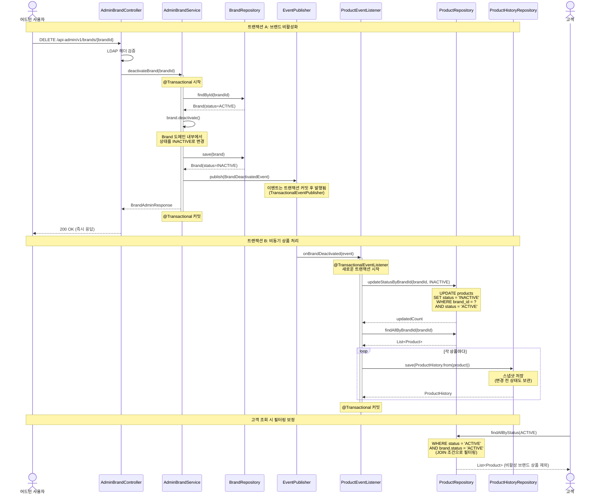
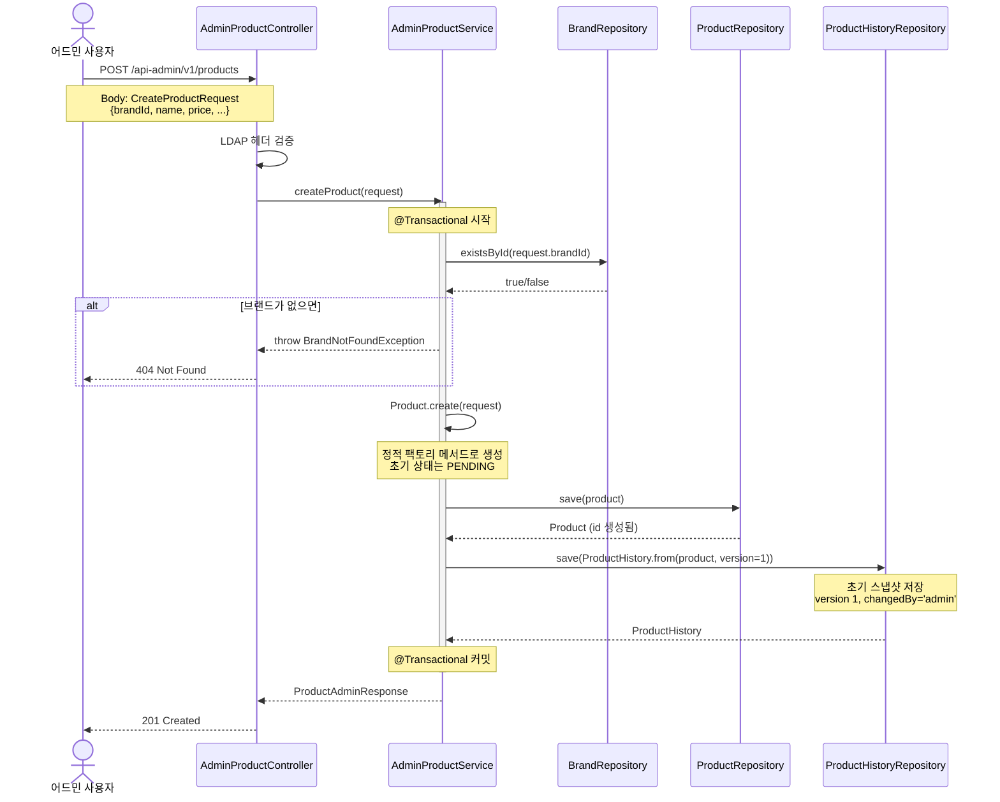
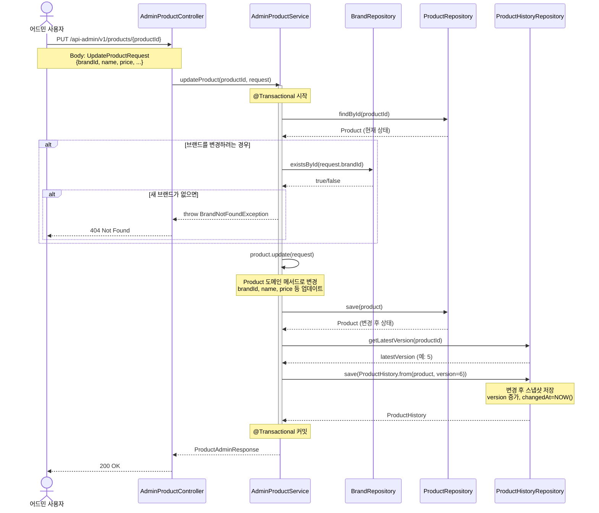
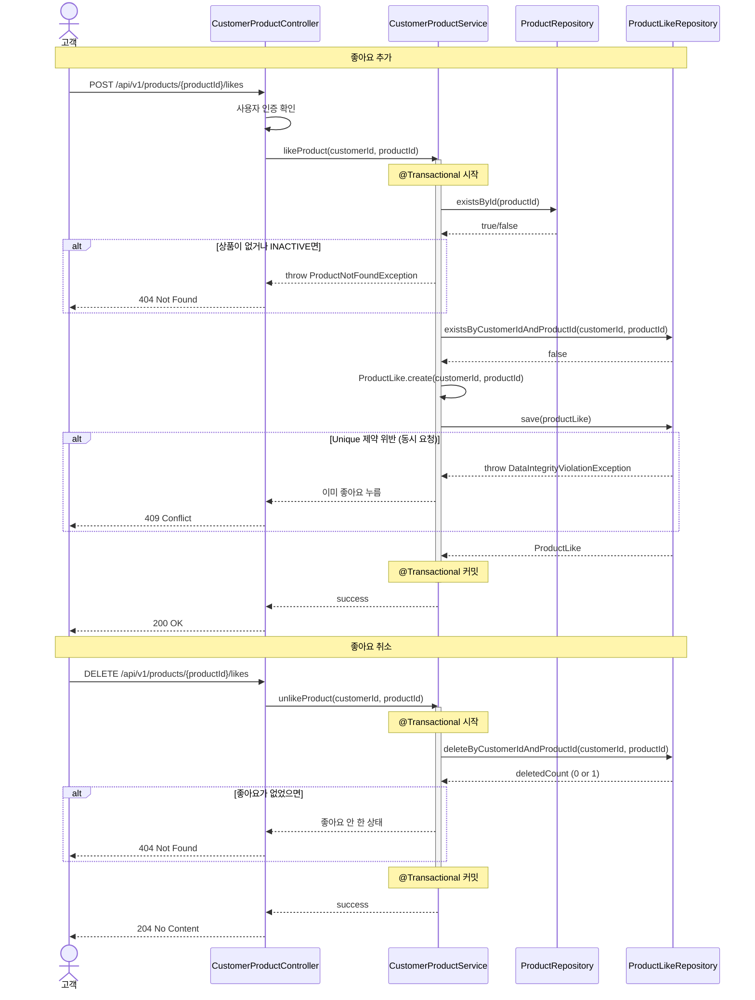
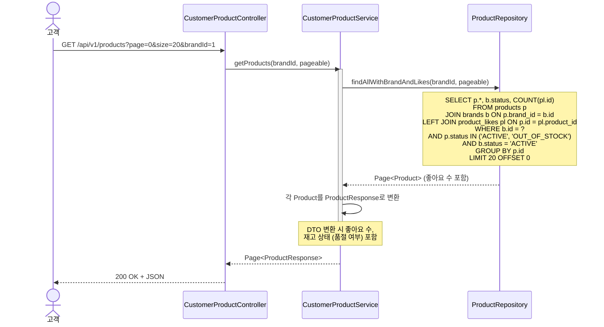

# 시퀀스 다이어그램

## 1. 브랜드 비활성화 시 상품 연쇄 비활성화

### 설계 의도
- **트랜잭션 분리**: 브랜드 상태 변경은 즉시 완료하고 응답, 상품 처리는 비동기로 수행
- **일시적 불일치 허용**: 브랜드 비활성화 후 수 초간 상품은 아직 활성 상태일 수 있음
- **보상 로직**: 이벤트 처리 실패 시 재시도 가능 (EventListener의 책임)

### 특히 봐야 할 포인트
1. `@Transactional` 경계가 AdminBrandService.deactivateBrand()에만 있음
2. 이벤트 발행은 트랜잭션 커밋 후 발생 (`@TransactionalEventListener`)
3. ProductEventListener는 별도 트랜잭션으로 상품을 처리
4. 각 상품 변경 시 스냅샷이 ProductHistoryRepository에 저장됨

### 이 설계의 장단점

**장점**:
- 어드민 응답 속도 빠름 (2초 이내)
- 대량 상품 처리 시 브랜드 락이 오래 유지되지 않음
- 이벤트 실패 시 재시도 가능 (이벤트 소싱/메시지 큐 도입 가능)

**단점**:
- 일시적 불일치 (수 초간 브랜드는 비활성인데 상품은 활성)
- 고객 조회 쿼리에 브랜드 상태 조인 필요 (약간의 성능 오버헤드)

**위험 시나리오**:
- 이벤트 리스너 실패 시 상품이 영구히 활성 상태로 남을 수 있음
- 완화: 데드레터 큐 + 모니터링 + 재처리 배치

---

## 2. 상품 등록 (브랜드 검증 포함)

### 설계 의도
- **브랜드 존재 검증**: Application Layer(Service)에서 수행
- **초기 스냅샷 저장**: 상품 등록과 동일 트랜잭션에서 처리
- **도메인 순수성**: Product는 Brand 존재 여부를 몰라도 됨

### 특히 봐야 할 포인트
1. 브랜드 검증이 ProductService에서 일어남 (Product 도메인은 관여 안 함)
2. 스냅샷 저장이 동일 트랜잭션 내에서 원자적으로 처리됨
3. 브랜드가 없으면 예외 발생 → 트랜잭션 롤백

---

## 3. 상품 브랜드 변경 (이력 추적)

### 설계 의도
- **브랜드 변경 허용**: 요구사항에 따라 가능하도록 설계
- **전체 스냅샷 저장**: 브랜드만이 아니라 상품의 모든 상태를 저장
- **버전 관리**: ProductHistory의 version을 자동 증가

### 특히 봐야 할 포인트
1. 변경 전 상태를 스냅샷으로 저장하는가, 변경 후 상태를 저장하는가?
    - → **변경 후 상태**를 저장 (최신 상태가 ProductHistory에 누적)
2. 트랜잭션 실패 시 스냅샷도 저장 안 됨 (원자성 보장)

---

## 4. 고객의 상품 좋아요

### 설계 의도
- **토글 방식**: 좋아요 누르면 추가, 다시 누르면 취소
- **동시성 제어**: Unique 제약으로 중복 방지
- **좋아요 수 집계**: 실시간 COUNT 쿼리 또는 캐시 활용

### 특히 봐야 할 포인트
1. 좋아요 수는 Product 엔티티에 비정규화할 것인가, 매번 COUNT 할 것인가?
    - → 현재는 **매번 COUNT** (나중에 캐시로 최적화 가능)
2. 중복 좋아요 시도 시 예외 처리

---

## 5. 고객의 상품 목록 조회 (필터링 포함)

### 설계 의도
- **상태 기반 필터링**: ACTIVE, OUT_OF_STOCK만 조회 (INACTIVE 제외)
- **브랜드 상태 조인**: 브랜드가 비활성이면 상품도 제외
- **좋아요 수 포함**: LEFT JOIN으로 집계

### 특히 봐야 할 포인트
1. 브랜드 비활성화 후 상품 비활성화 전 일시적 불일치 보정
2. N+1 문제 방지 (fetch join 또는 batch size 설정)

---

## 시퀀스 다이어그램 해석 가이드

### 핵심 설계 원칙
1. **트랜잭션 분리**: 브랜드 비활성화(빠른 응답) vs 상품 비활성화(비동기)
2. **Application Layer 검증**: 브랜드 존재 여부는 Service에서 확인, Domain은 순수 유지
3. **스냅샷 원자성**: 상품 변경과 이력 저장을 동일 트랜잭션으로 묶어 일관성 보장
4. **조회 최적화**: JOIN + 집계 쿼리로 N+1 방지

### 이 구조에서 특히 봐야 할 포인트
- **이벤트 발행 시점**: 트랜잭션 커밋 후 (`@TransactionalEventListener`)
- **비동기 처리의 일관성**: 고객 조회 시 브랜드 상태로 보정
- **스냅샷 저장 전략**: 변경 후 상태를 저장하여 이력 추적

### 잠재 리스크
- 이벤트 리스너 실패 시 상품이 활성 상태로 남음 → **모니터링 + 재처리 필요**
- 대량 상품 스냅샷 저장 시 DB 부하 → **배치 insert 최적화**
- 좋아요 수 COUNT 쿼리 비용 → **Redis 캐시 도입 검토**