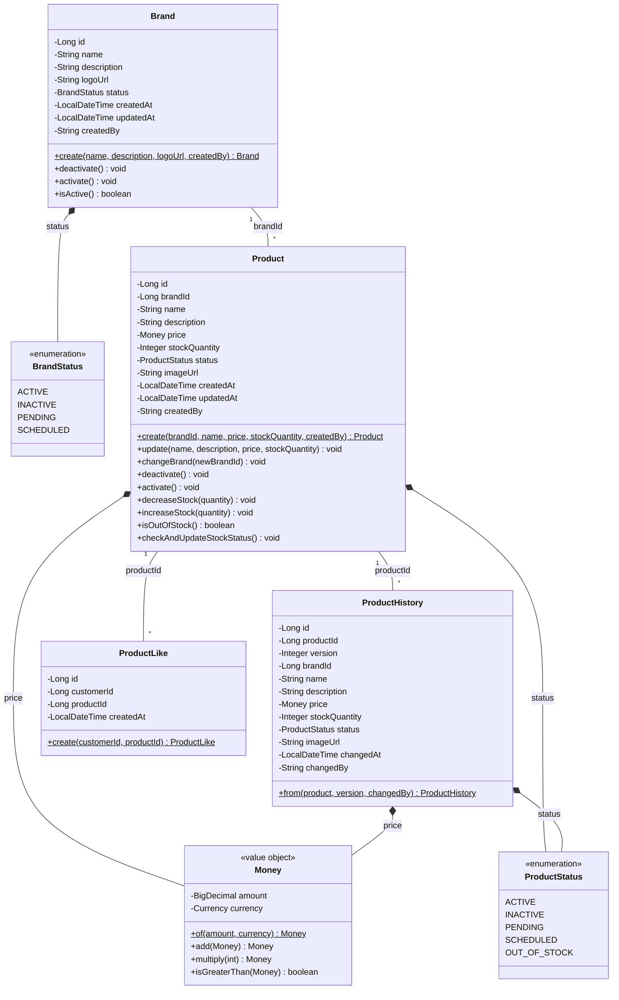
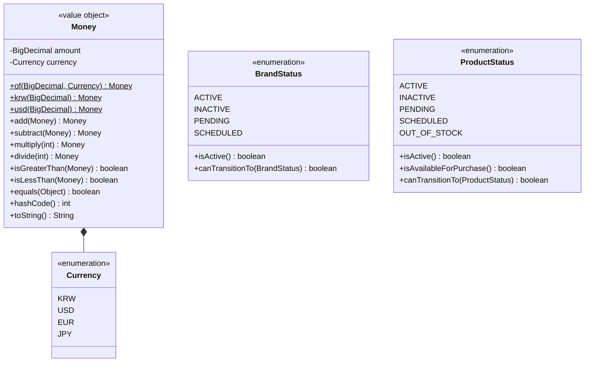

# 클래스 다이어그램

## 1. 도메인 모델 전체 구조

### 설계 의도
- **도메인 중심 설계**: Entity는 비즈니스 로직을 포함하고, Repository는 영속성만 담당
- **VO(Value Object) 활용**: Money, ProductStatus, BrandStatus 등 개념을 타입으로 표현
- **정적 팩토리 메서드**: 생성 로직을 명확히 하고 불변성 유지

### 특히 봐야 할 포인트
1. Brand와 Product는 양방향 연관관계를 맺지 않음 (Product → Brand 단방향)
2. ProductHistory는 Product의 스냅샷이지만, Product와 직접 연관관계 없음 (느슨한 결합)
3. ProductLike는 Customer-Product 다대다 관계를 풀어낸 중간 엔티티



---

## 2. 레이어별 클래스 구조

### 설계 의도
- **Layered Architecture**: Presentation → Application → Domain → Infrastructure
- **의존성 역전**: Repository는 인터페이스(Domain)에 의존, 구현은 Infrastructure
- **DTO 분리**: Admin용, Customer용 DTO를 명확히 구분

### 특히 봐야 할 포인트
1. Service는 Repository 인터페이스에만 의존 (구현체 모름)
2. Domain 레이어는 다른 레이어에 의존하지 않음 (순수 자바)
3. Controller는 DTO만 다루고, Domain은 Service 레이어에서만 다룸

```mermaid
classDiagram
    %% Presentation Layer - Admin API
    class AdminBrandController {
        -AdminBrandService adminBrandService
        +createBrand(CreateBrandRequest) ResponseEntity~BrandAdminResponse~
        +updateBrand(Long, UpdateBrandRequest) ResponseEntity~BrandAdminResponse~
        +getBrand(Long) ResponseEntity~BrandAdminResponse~
        +getBrands(Pageable) ResponseEntity~Page~BrandAdminResponse~~
        +deactivateBrand(Long) ResponseEntity~Void~
    }
    
    class AdminProductController {
        -AdminProductService adminProductService
        +createProduct(CreateProductRequest) ResponseEntity~ProductAdminResponse~
        +updateProduct(Long, UpdateProductRequest) ResponseEntity~ProductAdminResponse~
        +getProduct(Long) ResponseEntity~ProductAdminResponse~
        +getProducts(Long, Pageable) ResponseEntity~Page~ProductAdminResponse~~
        +deactivateProduct(Long) ResponseEntity~Void~
        +getProductHistory(Long, Pageable) ResponseEntity~Page~ProductHistoryResponse~~
    }
    
    %% Presentation Layer - Customer API
    class CustomerBrandController {
        -CustomerBrandService customerBrandService
        +getBrand(Long) ResponseEntity~BrandResponse~
        +getBrands(Pageable) ResponseEntity~Page~BrandResponse~~
    }
    
    class CustomerProductController {
        -CustomerProductService customerProductService
        +getProduct(Long) ResponseEntity~ProductResponse~
        +getProducts(Long, Pageable) ResponseEntity~Page~ProductResponse~~
        +likeProduct(Long) ResponseEntity~Void~
        +unlikeProduct(Long) ResponseEntity~Void~
    }
    
    %% Application Layer - Admin
    class AdminBrandService {
        -BrandRepository brandRepository
        -EventPublisher eventPublisher
        +createBrand(CreateBrandRequest) BrandAdminResponse
        +updateBrand(Long, UpdateBrandRequest) BrandAdminResponse
        +getBrand(Long) BrandAdminResponse
        +getBrands(Pageable) Page~BrandAdminResponse~
        +deactivateBrand(Long) void
    }
    
    class AdminProductService {
        -ProductRepository productRepository
        -BrandRepository brandRepository
        -ProductHistoryRepository productHistoryRepository
        +createProduct(CreateProductRequest) ProductAdminResponse
        +updateProduct(Long, UpdateProductRequest) ProductAdminResponse
        +getProduct(Long) ProductAdminResponse
        +getProducts(Long, Pageable) Page~ProductAdminResponse~
        +deactivateProduct(Long) void
        +getProductHistory(Long, Pageable) Page~ProductHistoryResponse~
    }
    
    %% Application Layer - Customer
    class CustomerBrandService {
        -BrandRepository brandRepository
        +getBrand(Long) BrandResponse
        +getBrands(Pageable) Page~BrandResponse~
    }
    
    class CustomerProductService {
        -ProductRepository productRepository
        -ProductLikeRepository productLikeRepository
        +getProduct(Long) ProductResponse
        +getProducts(Long, Pageable) Page~ProductResponse~
        +likeProduct(Long, Long) void
        +unlikeProduct(Long, Long) void
    }
    
    %% Event Handling
    class ProductEventListener {
        -ProductRepository productRepository
        -ProductHistoryRepository productHistoryRepository
        +onBrandDeactivated(BrandDeactivatedEvent) void
    }
    
    class BrandDeactivatedEvent {
        -Long brandId
        -LocalDateTime occurredAt
    }
    
    %% Domain Layer - Repository Interfaces
    class BrandRepository {
        <<interface>>
        +findById(Long) Optional~Brand~
        +save(Brand) Brand
        +existsById(Long) boolean
        +findAllByStatus(BrandStatus, Pageable) Page~Brand~
        +updateStatus(Long, BrandStatus) void
    }
    
    class ProductRepository {
        <<interface>>
        +findById(Long) Optional~Product~
        +save(Product) Product
        +existsById(Long) boolean
        +findAllByBrandIdAndStatusIn(Long, List~ProductStatus~, Pageable) Page~Product~
        +updateStatusByBrandId(Long, ProductStatus) int
        +findAllByBrandId(Long) List~Product~
    }
    
    class ProductHistoryRepository {
        <<interface>>
        +save(ProductHistory) ProductHistory
        +findAllByProductId(Long, Pageable) Page~ProductHistory~
        +getLatestVersion(Long) Integer
    }
    
    class ProductLikeRepository {
        <<interface>>
        +save(ProductLike) ProductLike
        +existsByCustomerIdAndProductId(Long, Long) boolean
        +deleteByCustomerIdAndProductId(Long, Long) int
        +countByProductId(Long) long
    }
    
    %% Domain Layer - Entities (이미 위에서 정의됨)
    
    %% Relationships
    AdminBrandController --> AdminBrandService
    AdminProductController --> AdminProductService
    CustomerBrandController --> CustomerBrandService
    CustomerProductController --> CustomerProductService
    
    AdminBrandService --> BrandRepository
    AdminBrandService --> EventPublisher
    AdminProductService --> ProductRepository
    AdminProductService --> BrandRepository
    AdminProductService --> ProductHistoryRepository
    
    CustomerBrandService --> BrandRepository
    CustomerProductService --> ProductRepository
    CustomerProductService --> ProductLikeRepository
    
    ProductEventListener --> ProductRepository
    ProductEventListener --> ProductHistoryRepository
    ProductEventListener ..> BrandDeactivatedEvent : listens
    
    AdminBrandService ..> Brand : uses
    AdminProductService ..> Product : uses
    AdminProductService ..> ProductHistory : uses
    CustomerProductService ..> ProductLike : uses
```



---

## 3. DTO 클래스 구조

### 설계 의도
- **역할별 분리**: Admin과 Customer가 보는 정보가 다름
- **불변성**: 모든 DTO는 record로 정의하여 불변 유지
- **변환 책임**: DTO ↔ Entity 변환은 DTO 자신이 담당 (정적 팩토리 메서드)

### 특히 봐야 할 포인트
1. Admin DTO는 관리 정보 포함 (생성일, 상태, 이력 링크)
2. Customer DTO는 고객 필요 정보만 (가격, 좋아요 수, 품절 여부)
3. Request DTO는 검증 로직 포함 (Bean Validation)

```mermaid
classDiagram
    %% Admin DTOs
    class CreateBrandRequest {
        <<record>>
        +String name
        +String description
        +String logoUrl
        +validate() void
    }
    
    class UpdateBrandRequest {
        <<record>>
        +String name
        +String description
        +String logoUrl
        +validate() void
    }
    
    class BrandAdminResponse {
        <<record>>
        +Long id
        +String name
        +String description
        +String logoUrl
        +BrandStatus status
        +LocalDateTime createdAt
        +LocalDateTime updatedAt
        +String createdBy
        
        +from(Brand) BrandAdminResponse$
    }
    
    class CreateProductRequest {
        <<record>>
        +Long brandId
        +String name
        +String description
        +BigDecimal price
        +String currency
        +Integer stockQuantity
        +String imageUrl
        +validate() void
    }
    
    class UpdateProductRequest {
        <<record>>
        +Long brandId
        +String name
        +String description
        +BigDecimal price
        +Integer stockQuantity
        +String imageUrl
        +validate() void
    }
    
    class ProductAdminResponse {
        <<record>>
        +Long id
        +Long brandId
        +String brandName
        +String name
        +String description
        +BigDecimal price
        +String currency
        +Integer stockQuantity
        +ProductStatus status
        +String imageUrl
        +LocalDateTime createdAt
        +LocalDateTime updatedAt
        +String createdBy
        +String historyUrl
        
        +from(Product, Brand) ProductAdminResponse$
    }
    
    class ProductHistoryResponse {
        <<record>>
        +Long id
        +Integer version
        +Long brandId
        +String name
        +BigDecimal price
        +ProductStatus status
        +LocalDateTime changedAt
        +String changedBy
        
        +from(ProductHistory) ProductHistoryResponse$
    }
    
    %% Customer DTOs
    class BrandResponse {
        <<record>>
        +Long id
        +String name
        +String description
        +String logoUrl
        
        +from(Brand) BrandResponse$
    }
    
    class ProductResponse {
        <<record>>
        +Long id
        +Long brandId
        +String brandName
        +String name
        +String description
        +BigDecimal price
        +String currency
        +boolean outOfStock
        +String imageUrl
        +long likeCount
        +boolean likedByMe
        
        +from(Product, Brand, long, boolean) ProductResponse$
    }
    
    AdminBrandController ..> CreateBrandRequest : uses
    AdminBrandController ..> UpdateBrandRequest : uses
    AdminBrandController ..> BrandAdminResponse : uses
    
    AdminProductController ..> CreateProductRequest : uses
    AdminProductController ..> UpdateProductRequest : uses
    AdminProductController ..> ProductAdminResponse : uses
    AdminProductController ..> ProductHistoryResponse : uses
    
    CustomerBrandController ..> BrandResponse : uses
    CustomerProductController ..> ProductResponse : uses
```



---

## 4. Value Object 상세 설계

### 설계 의도
- **도메인 개념 표현**: 금액, 상태 같은 개념을 타입으로 명확히
- **불변성**: VO는 생성 후 변경 불가
- **비즈니스 로직 응집**: Money는 금액 계산 로직을 포함

### 특히 봐야 할 포인트
1. Money는 `BigDecimal`을 감싸서 통화 단위 강제
2. Status는 enum으로 허용된 상태만 표현
3. VO는 Entity가 아니므로 식별자(id) 없음



---

## 5. 파사드 레이어 적용 여부 검토

### 파사드 패턴이 필요한 경우
- 여러 Service를 조합하는 복잡한 비즈니스 로직이 있을 때
- Controller가 여러 Service를 직접 호출하면 복잡도가 높아질 때

### 현재 시스템에서의 판단
**불필요함**. 이유:
1. 각 Controller는 단일 Service만 사용 (AdminBrandController → AdminBrandService)
2. 복잡한 오케스트레이션 없음 (브랜드 비활성화 → 이벤트 발행만)
3. 파사드 도입 시 불필요한 레이어 추가

**예외 케이스**: 나중에 "주문" 기능 추가 시
- OrderFacade: ProductService + InventoryService + PaymentService 조합
- 이때는 파사드 도입 고려

---

## 6. 정적 팩토리 메서드 사용 전략

### 왜 사용하는가?
1. **생성 의도 명확화**: `Brand.create()` vs `new Brand()`
2. **검증 로직 캡슐화**: 생성자는 단순히 값만 할당, 팩토리는 검증 후 생성
3. **불변성 강제**: VO는 정적 팩토리로만 생성 가능

### 적용 예시
```java
// Brand.java
public class Brand {
    private Brand(String name, String description, BrandStatus status, String createdBy) {
        this.name = name;
        this.description = description;
        this.status = status;
        this.createdBy = createdBy;
        this.createdAt = LocalDateTime.now();
    }
    
    public static Brand create(String name, String description, String logoUrl, String createdBy) {
        validateName(name);
        validateCreatedBy(createdBy);
        return new Brand(name, description, BrandStatus.PENDING, createdBy);
    }
}

// Money.java
public record Money(BigDecimal amount, Currency currency) {
    public static Money of(BigDecimal amount, Currency currency) {
        if (amount.compareTo(BigDecimal.ZERO) < 0) {
            throw new IllegalArgumentException("Amount cannot be negative");
        }
        return new Money(amount, currency);
    }
    
    public static Money krw(long amount) {
        return of(BigDecimal.valueOf(amount), Currency.KRW);
    }
}
```

---

## 7. VO 사용 권장 사항

### 어디에 사용하는가?
| 개념 | VO 사용 여부 | 이유 |
|------|-------------|------|
| 금액 (price) | ✅ Money | 통화 단위 강제, 계산 로직 응집 |
| 상태 (status) | ✅ Enum | 허용된 값만 표현, 전이 규칙 포함 |
| 이메일 | ✅ Email | 형식 검증 로직 캡슐화 |
| 이름 (name) | ❌ String | 단순 문자열, VO 과잉 설계 |
| ID | ❌ Long | JPA 식별자, 원시 타입 유지 |

### 현재 설계에 적용
- ✅ **Money**: 가격은 금액+통화 조합
- ✅ **BrandStatus, ProductStatus**: 상태는 enum
- ❌ **ProductName**: 과잉 설계 (검증만 필요하면 Bean Validation)
- ❌ **BrandId, ProductId**: JPA 식별자는 Long 유지

---

## 클래스 다이어그램 해석 가이드

### 핵심 설계 원칙
1. **단일 책임**: 각 클래스는 하나의 책임만 (Brand는 브랜드 정보, Product는 상품 정보)
2. **의존성 역전**: Service → Repository Interface ← JPA Implementation
3. **도메인 순수성**: Entity는 JPA 어노테이션만, 비즈니스 로직은 메서드로

### 이 구조에서 특히 봐야 할 포인트
- **Product는 Brand를 참조하지만, Brand는 Product를 모름** (단방향)
- **ProductHistory는 Product와 별도 테이블** (느슨한 결합, 스냅샷)
- **VO는 Entity가 아님** (식별자 없음, 값으로만 비교)

### 잠재 리스크
- Product가 Brand 정보를 필요로 할 때마다 조인 발생 → **N+1 문제 가능성**
    - 완화: `@EntityGraph`, `fetch join` 사용
- ProductHistory 증가 시 테이블 크기 급증 → **파티셔닝 필요**
- Money 계산 시 통화 불일치 → **예외 처리 필수**