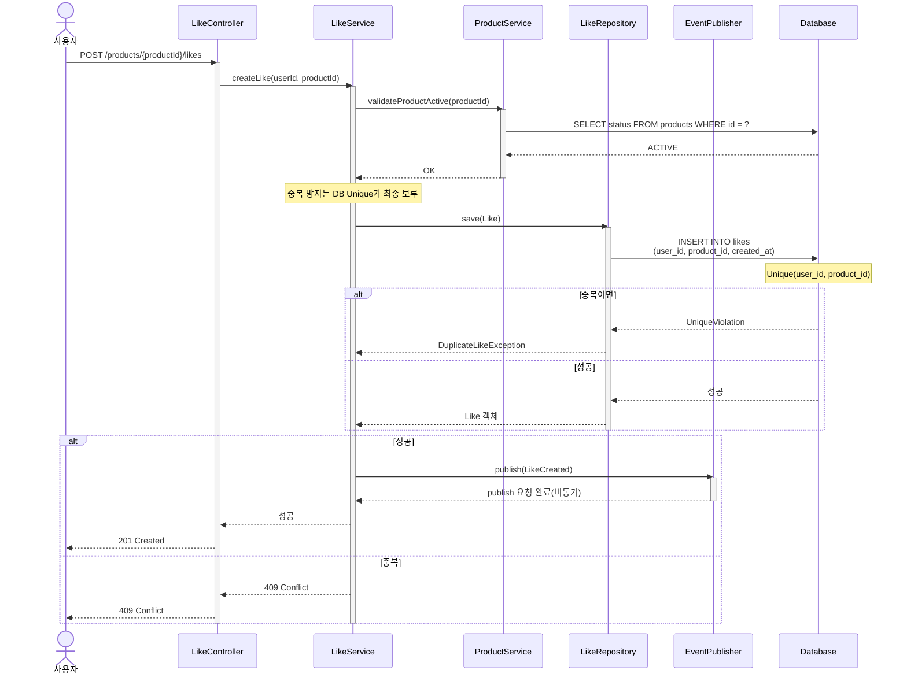
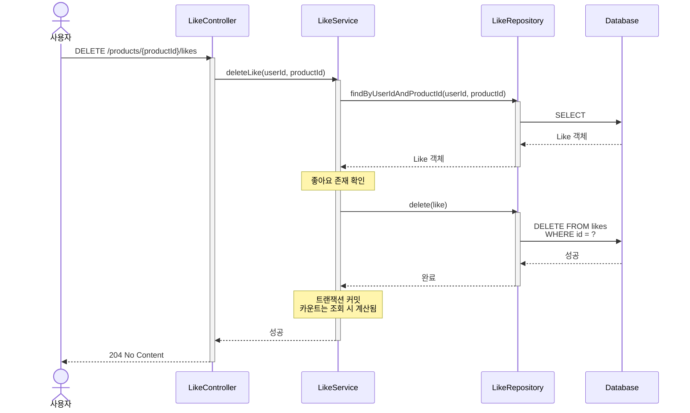
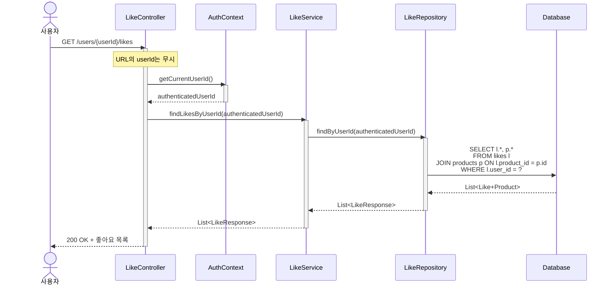
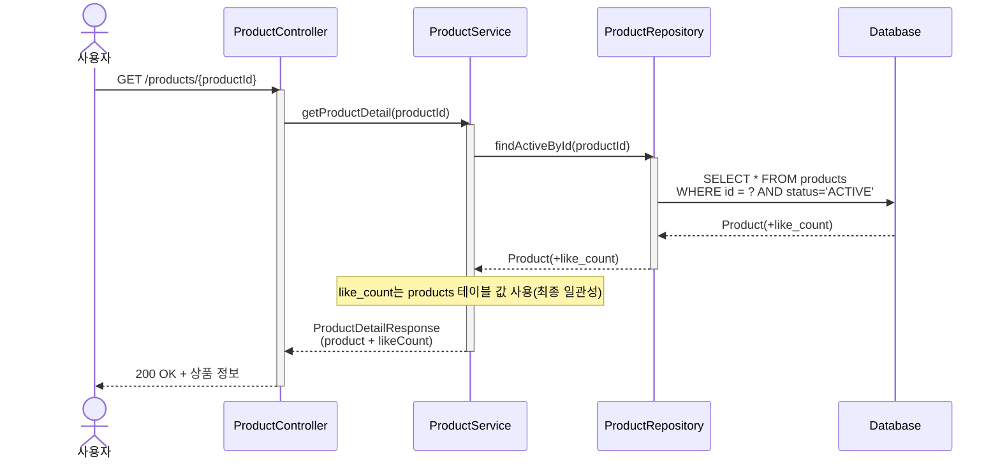
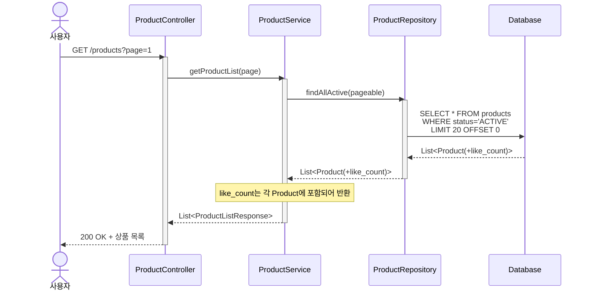

# 시퀀스 다이어그램

## 다이어그램을 그리기 전에

이 문서에서는 **4개의 시퀀스 다이어그램**을 작성합니다:

1. **좋아요 등록** - 단순 INSERT, 카운트는 비동기 반영(products.like_count)
2. **좋아요 취소** - 멱등성 보장
3. **좋아요 목록 조회** - 본인 것만 조회
4. **상품 조회 (좋아요 수 포함)** - products.like_count 조회

각 다이어그램에서 주목할 점:
- **트랜잭션 경계**: 어디까지가 하나의 원자적 작업인가?
- **책임 분리**: 각 객체는 무엇을 책임지는가?
- **확장 포인트**: 나중에 Redis로 전환할 때 어디를 바꾸면 되는가?

---

## 1. 좋아요 등록

### 왜 이 다이어그램이 필요한가?
좋아요 등록은 **단순 INSERT**만 수행합니다.  
이 다이어그램을 통해 다음을 검증합니다:
- 중복 좋아요는 어떻게 방지하는가?
- 트랜잭션 경계가 어디까지인가?
- 카운트는 어디서 계산되는가?



### 이 다이어그램에서 봐야 할 포인트

1. **트랜잭션 경계**
    - `LikeService`의 `save(like)` 만 수행
    - 카운트 업데이트 없음 (실시간 계산)

2. **중복 방지**
    - 애플리케이션 레벨: `existsByUserIdAndProductId()` 체크
    - DB 레벨: Unique 제약으로 이중 안전장치

3. **응답 시점**
    - `likes` 테이블 INSERT 성공 즉시 응답
    - 매우 빠른 응답 속도 (추가 작업 없음)

4. **확장 포인트**
    - 나중에 Redis 캐시를 추가할 때도 이 플로우는 변경 없음
    - 상품 조회 시 카운트 계산 로직만 수정하면 됨

---

## 2. 좋아요 취소 (멱등성 보장)

### 왜 이 다이어그램이 필요한가?
우리는 **멱등성을 보장**하기로 했습니다.  
존재하지 않는 좋아요를 취소해도 성공 응답을 주기 때문에, 이 플로우를 명확히 해야 합니다.

```mermaid
ssequenceDiagram
    actor User as 사용자
    participant API as LikeController
    participant Service as LikeService
    participant Repo as LikeRepository
    participant Pub as EventPublisher
    participant DB as Database
    participant Logger as ErrorLogger

    User->>API: DELETE /products/{productId}/likes
    activate API
    
    API->>Service: deleteLike(userId, productId)
    activate Service
    
    Service->>Repo: findByUserIdAndProductId(userId, productId)
    activate Repo
    Repo->>DB: SELECT id FROM likes WHERE user_id=? AND product_id=?
    DB-->>Repo: null or likeId
    Repo-->>Service: null or likeId
    deactivate Repo
    
    alt 좋아요 없음
        Service->>Logger: warn("이미 삭제된 좋아요", userId, productId)
        activate Logger
        Logger-->>Service: logged
        deactivate Logger
        
        Service-->>API: 성공(멱등)
        API-->>User: 204 No Content
    else 좋아요 존재
        Service->>Repo: deleteById(likeId)
        activate Repo
        Repo->>DB: DELETE FROM likes WHERE id=?
        DB-->>Repo: 성공
        Repo-->>Service: 완료
        deactivate Repo
        
        Service->>Pub: publish(LikeDeleted)
        activate Pub
        Pub-->>Service: publish 요청 완료(비동기)
        deactivate Pub
        
        Service-->>API: 성공
        API-->>User: 204 No Content
    end
    
    deactivate Service
    deactivate API
```

### 정상 삭제 플로우 (참고)

존재하는 좋아요를 취소하는 경우:



### 이 다이어그램에서 봐야 할 포인트

1. **멱등성 보장**
    - 없는 좋아요를 취소해도 `204 No Content` 응답
    - 클라이언트 입장에서는 여러 번 호출해도 결과 동일

2. **로깅 전략**
    - 비정상적인 접근을 추적하기 위해 로그는 남김
    - 하지만 에러로 처리하지는 않음

3. **카운트 처리**
    - 좋아요 취소 시 별도의 카운트 감소 작업 없음
    - 상품 조회 시 실시간으로 COUNT 쿼리 실행

4. **트랜잭션 단순화**
    - DELETE 한 번만 수행
    - 추가 업데이트 없어서 트랜잭션 짧고 명확함

---

## 3. 좋아요 목록 조회

### 왜 이 다이어그램이 필요한가?
읽기 플로우는 단순하지만, **URL의 userId를 무시하고 항상 로그인 사용자 것만 조회**하는 정책을 명확히 해야 합니다.



### 이 다이어그램에서 봐야 할 포인트

1. **URL 파라미터 무시**
    - `GET /users/{userId}/likes` 의 `{userId}` 는 받지만 사용하지 않음
    - 항상 `AuthContext.getCurrentUserId()`로 로그인 사용자 확인

2. **책임 분리**
    - `AuthContext`: 현재 로그인 사용자 식별 책임
    - `LikeService`: 비즈니스 로직 없이 Repository 호출만
    - `LikeRepository`: DB 조회 책임

3. **확장 가능성**
    - 나중에 "친구 좋아요 조회" 기능이 추가되면?
    - `API` 레이어에서 권한 체크만 추가하면 됨
    - Service, Repository는 수정 불필요

4. **조인 처리**
    - `likes` 테이블만 조회하면 상품 정보가 없음
    - `products` 와 조인하여 상품 정보도 함께 반환
    - (페이지네이션은 추후 구체화)

---

## 4. 상품 조회 (좋아요 수 포함)

### 왜 이 다이어그램이 필요한가?
상품 목록/상세 조회 시 **좋아요 수를 어떻게 계산하는지**가 핵심입니다.  
이 다이어그램을 통해 다음을 검증합니다:
- COUNT 쿼리는 어디서 실행되는가?
- 향후 Redis 캐시로 전환할 때 어디를 수정하면 되는가?



### 상품 목록 조회의 경우

목록 조회는 여러 상품의 좋아요 수를 한 번에 계산해야 합니다:



### 이 다이어그램에서 봐야 할 포인트

1. **실시간 계산**

    ~~- 매 조회마다 `COUNT(*)` 쿼리 실행~~

    ~~- 항상 정확한 값 반환~~

    ~~- 비동기 처리나 이벤트 없음~~

2. **성능 고려**
    - 단일 상품: COUNT 쿼리 1번
    - 목록 조회: GROUP BY로 한 번에 계산 (N+1 문제 방지)
    - 인덱스 필요: `likes(product_id)`

3. **확장 포인트 (Redis 도입 시)**
   ```
   현재: Service → LikeRepository.countByProductId() → DB
   향후: Service → LikeCacheService.getLikeCount() → Redis (Cache Miss 시 DB)
   ```
    - `LikeRepository.countByProductId()` 호출 부분만 수정
    - 나머지 플로우는 변경 없음

4. **트레이드오프**
    - 장점: 정합성 100%, 구조 단순
    - 단점: 조회 시 COUNT 쿼리 부하
    - 해결: 트래픽 증가 시 Redis 캐시로 전환

---

## 4. 설계 의도 정리

### 트랜잭션 경계 설정 이유
```
[동기 트랜잭션]
- likes 테이블 INSERT/DELETE만 포함
- 빠른 응답 가능
- DB 락 시간 최소화

[비동기 처리]
- products.like_count 증감
- 이벤트 실패/지연 시 정합성 불일치 가능
- 배치로 정합성 복구
```

### 객체별 책임

| 객체 | 책임 |
|------|------|
| `LikeController` | HTTP 요청/응답, 인증 확인 |
| `LikeService` | 좋아요 등록/취소, 상품 ACTIVE 검증 호출, 이벤트 발행 |
| `LikeRepository` | 데이터 접근, 쿼리 실행 |
| `EventPublisher` | 이벤트 발행(비동기 시작점) |
| `LikeCountConsumer` | like_count 증감 처리 (독립 프로세스) |
| `ProductRepository` | 상품 조회 및 like_count 제공 |
| `BatchJob` | likes와 like_count 불일치 보정 |

### 호출 순서의 의미

**좋아요 등록:**
1. 중복 체크 (비즈니스 규칙)
2. 저장 (트랜잭션 커밋)
3. 이벤트 발행 (비동기 시작점)
4. 응답 반환 (사용자에게)
5. 카운트 업데이트 (백그라운드)

**좋아요 취소:**
1. 존재 여부 확인
2. 없으면 로그만 남기고 성공 응답 (멱등성)
3. 있으면 삭제 → 이벤트 발행 → 카운트 감소

---

## 5. 설계 리스크 및 트레이드오프

### ⚠️ 리스크 1: 이벤트 발행 실패
**상황:**  
`EventPublisher.publish()` 에서 예외 발생

**결과:**
- 좋아요는 DB에 저장됨
- like_count는 갱신되지 않을 수 있음
- 사용자는 성공 응답 받음

**대응:**
- 배치로 정합성 복구
- `배치로 정합성 복구 (likes COUNT vs products.like_count 비교 후 보정)

### ⚠️ 리스크 2: Consumer 처리 실패
**상황:**  
`LikeCountConsumer`에서 DB 업데이트 실패

**결과:**
- 메시지는 큐에서 사라짐 (ack 전에 실패하면 재처리)
- like_count가 실제와 어긋남

**대응:**
- 현재 설계에서는 재시도 없음
- 배치로 정합성 복구

### ✅ 트레이드오프 정리

| 선택 | 얻은 것 | 잃은 것 |
|------|---------|---------|
| 비동기 카운트 업데이트 | 빠른 응답, 락 경합 없음 | 실시간 정합성 |
| 재시도 없음 | 구현 단순 | 실패 시 데이터 불일치 |
| 멱등성 보장 (취소) | 안정적인 API | 비정상 접근 추적 어려움 |
| URL userId 무시 | 확장 가능한 구조 | URL 파라미터 의미 모호 |