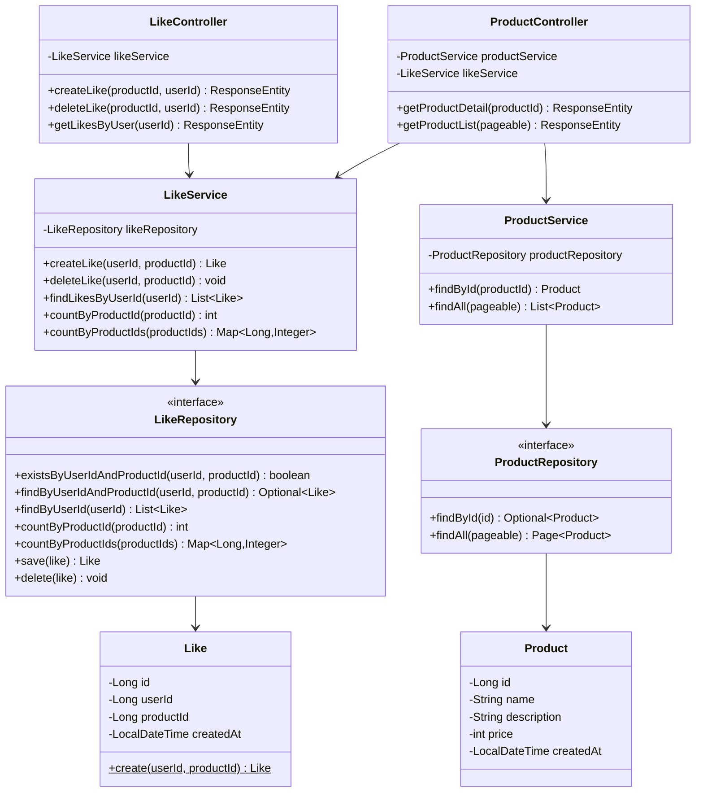
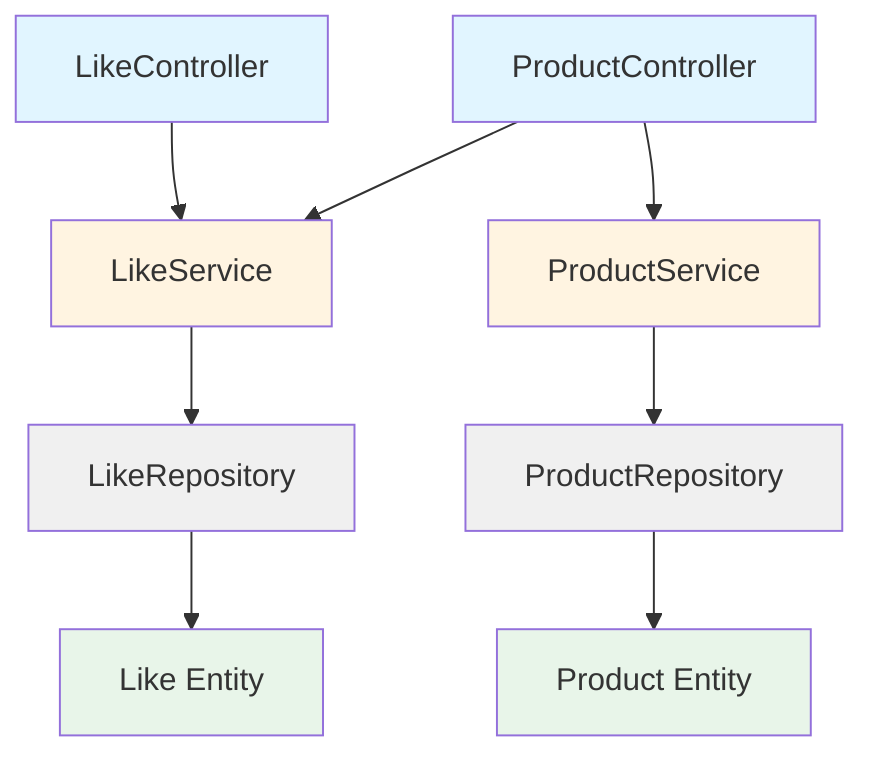

# 클래스 다이어그램

## 다이어그램을 그리기 전에

이 문서에서는 **좋아요 기능의 도메인 객체 설계**를 다룹니다.

### 설계 원칙
1. **단순하게 시작** - Facade, VO, 도메인 서비스 같은 패턴은 필요할 때 추가
2. **책임 분리** - 각 레이어가 자기 역할만 수행
3. **확장 가능** - 나중에 Redis, MessageQueue 추가해도 구조 변경 최소화

### 레이어 구조
```
Controller (API 진입점)
    ↓
Service (비즈니스 로직 조정)
    ↓
Repository (데이터 접근)
    ↓
Entity (도메인 모델)
```

---

## 1. 전체 클래스 다이어그램



---

## 2. 레이어별 책임 정의

### Controller 레이어

#### LikeController
**책임:**
- HTTP 요청/응답 처리
- 인증 정보 추출 (현재 로그인 사용자)
- DTO 변환

**주요 메서드:**
```java
@PostMapping("/api/v1/products/{productId}/likes")
public ResponseEntity<LikeResponse> createLike(
    @PathVariable Long productId,
    @AuthenticationPrincipal Long userId
) {
    Like like = likeService.createLike(userId, productId);
    return ResponseEntity.status(201).body(LikeResponse.from(like));
}

@DeleteMapping("/api/v1/products/{productId}/likes")
public ResponseEntity<Void> deleteLike(
    @PathVariable Long productId,
    @AuthenticationPrincipal Long userId
) {
    likeService.deleteLike(userId, productId);
    return ResponseEntity.noContent().build();
}

@GetMapping("/api/v1/users/{userId}/likes")
public ResponseEntity<List<LikeResponse>> getLikesByUser(
    @PathVariable Long userId,  // 무시됨
    @AuthenticationPrincipal Long authenticatedUserId
) {
    List<Like> likes = likeService.findLikesByUserId(authenticatedUserId);
    return ResponseEntity.ok(LikeResponse.fromList(likes));
}
```

**특이사항:**
- URL의 `{userId}` 파라미터는 받지만 사용하지 않음
- 항상 `@AuthenticationPrincipal`에서 추출한 사용자 ID 사용

---

#### ProductController
**책임:**
- 상품 조회 API 제공
- 좋아요 수 포함 응답 생성

**주요 메서드:**
```java
@GetMapping("/api/v1/products/{productId}")
public ResponseEntity<ProductDetailResponse> getProductDetail(
    @PathVariable Long productId
) {
    Product product = productService.findById(productId);
    int likeCount = likeService.countByProductId(productId);
    
    return ResponseEntity.ok(
        new ProductDetailResponse(product, likeCount)
    );
}

@GetMapping("/api/v1/products")
public ResponseEntity<List<ProductListResponse>> getProductList(
    Pageable pageable
) {
    List<Product> products = productService.findAll(pageable);
    
    // 상품 ID 목록 추출
    List<Long> productIds = products.stream()
        .map(Product::getId)
        .collect(Collectors.toList());
    
    // 한 번에 좋아요 수 조회 (N+1 방지)
    Map<Long, Integer> likeCounts = likeService.countByProductIds(productIds);
    
    List<ProductListResponse> responses = products.stream()
        .map(product -> new ProductListResponse(
            product,
            likeCounts.getOrDefault(product.getId(), 0)
        ))
        .collect(Collectors.toList());
    
    return ResponseEntity.ok(responses);
}
```

**왜 Facade가 없는가?**
- 현재는 2개 Service만 조합 (단순)
- 복잡도가 낮아서 Controller에서 직접 처리
- 나중에 Service 조합이 복잡해지면 Facade 추가 고려

---

### Service 레이어

#### LikeService
**책임:**
- 좋아요 비즈니스 로직 조정
- 중복 체크 (이중 안전장치)
- 트랜잭션 경계 관리

**주요 메서드:**
```java
@Service
@Transactional
public class LikeService {
    private final LikeRepository likeRepository;
    
    public Like createLike(Long userId, Long productId) {
        // 1차 중복 체크 (애플리케이션 레벨)
        if (likeRepository.existsByUserIdAndProductId(userId, productId)) {
            throw new DuplicateLikeException("이미 좋아요를 누르셨습니다");
        }
        
        // Like 생성 (생성자가 검증 책임)
        Like like = new Like(userId, productId);
        
        // 저장 (2차 방어: DB Unique 제약)
        return likeRepository.save(like);
    }
    
    public void deleteLike(Long userId, Long productId) {
        Optional<Like> likeOpt = likeRepository.findByUserIdAndProductId(userId, productId);
        
        if (likeOpt.isEmpty()) {
            // 멱등성 보장: 이미 없으면 로그만 남기고 성공 처리
            log.warn("이미 삭제된 좋아요 - userId: {}, productId: {}", userId, productId);
            return;
        }
        
        likeRepository.delete(likeOpt.get());
    }
    
    @Transactional(readOnly = true)
    public List<Like> findLikesByUserId(Long userId) {
        return likeRepository.findByUserId(userId);
    }
    
    @Transactional(readOnly = true)
    public int countByProductId(Long productId) {
        return likeRepository.countByProductId(productId);
    }
    
    @Transactional(readOnly = true)
    public Map<Long, Integer> countByProductIds(List<Long> productIds) {
        return likeRepository.countByProductIds(productIds);
    }
}
```

**특이사항:**
- `deleteLike`는 존재하지 않아도 예외를 던지지 않음 (멱등성)
- 조회 메서드는 `@Transactional(readOnly = true)`
- **도메인 서비스가 없는 이유**: 복잡한 비즈니스 규칙이 없음

---

#### ProductService
**책임:**
- 상품 조회 로직

**주요 메서드:**
```java
@Service
@Transactional(readOnly = true)
public class ProductService {
    private final ProductRepository productRepository;
    
    public Product findById(Long productId) {
        return productRepository.findById(productId)
            .orElseThrow(() -> new ProductNotFoundException(productId));
    }
    
    public List<Product> findAll(Pageable pageable) {
        return productRepository.findAll(pageable).getContent();
    }
}
```

**왜 LikeService를 의존하지 않는가?**
- Product는 Like를 알 필요가 없음 (도메인 경계)
- 좋아요 수는 Controller에서 조합
- 의존 방향: `Like → Product` (O), `Product → Like` (X)

---

### Repository 레이어

#### LikeRepository
**책임:**
- Like 엔티티의 데이터 접근
- 쿼리 실행 (조회, 저장, 삭제, 집계)

**주요 메서드:**
```java
public interface LikeRepository extends JpaRepository<Like, Long> {
    
    // 존재 여부 확인 (중복 체크)
    boolean existsByUserIdAndProductId(Long userId, Long productId);
    
    // 특정 좋아요 조회
    Optional<Like> findByUserIdAndProductId(Long userId, Long productId);
    
    // 사용자의 좋아요 목록 (상품 정보 포함)
    @Query("SELECT l FROM Like l JOIN FETCH l.product WHERE l.userId = :userId")
    List<Like> findByUserId(@Param("userId") Long userId);
    
    // 상품별 좋아요 수 (단일)
    @Query("SELECT COUNT(l) FROM Like l WHERE l.productId = :productId")
    int countByProductId(@Param("productId") Long productId);
    
    // 상품별 좋아요 수 (다건 - N+1 방지)
    @Query("SELECT l.productId as productId, COUNT(l) as count " +
           "FROM Like l " +
           "WHERE l.productId IN :productIds " +
           "GROUP BY l.productId")
    List<LikeCountProjection> countByProductIdsGrouped(@Param("productIds") List<Long> productIds);
    
    // Map으로 변환하는 default 메서드
    default Map<Long, Integer> countByProductIds(List<Long> productIds) {
        return countByProductIdsGrouped(productIds).stream()
            .collect(Collectors.toMap(
                LikeCountProjection::getProductId,
                LikeCountProjection::getCount
            ));
    }
    
    interface LikeCountProjection {
        Long getProductId();
        Integer getCount();
    }
}
```

**확장 포인트 (Redis 도입 시):**
```java
// 현재: DB에서 직접 COUNT
int countByProductId(Long productId);

// 향후: Cache 레이어 추가
@Cacheable(value = "likeCount", key = "#productId")
int countByProductId(Long productId);
```

---

#### ProductRepository
**책임:**
- Product 엔티티의 데이터 접근

```java
public interface ProductRepository extends JpaRepository<Product, Long> {
    // JpaRepository 기본 메서드 사용
    // findById, findAll, save, delete 등
}
```

---

### Entity 레이어

#### Like (좋아요 엔티티)

```java
@Entity
@Table(
    name = "likes",
    uniqueConstraints = {
        @UniqueConstraint(
            name = "uk_likes_user_product",
            columnNames = {"user_id", "product_id"}
        )
    }
)
@NoArgsConstructor(access = AccessLevel.PROTECTED)
@Getter
public class Like {
    
    @Id
    @GeneratedValue(strategy = GenerationType.IDENTITY)
    private Long id;
    
    @Column(name = "user_id", nullable = false)
    private final Long userId;
    
    @Column(name = "product_id", nullable = false)
    private final Long productId;
    
    @Column(name = "created_at", nullable = false, updatable = false)
    private final LocalDateTime createdAt;
    
    // 생성자가 검증 책임
    public Like(Long userId, Long productId) {
        validateUserId(userId);
        validateProductId(productId);
        
        this.userId = userId;
        this.productId = productId;
        this.createdAt = LocalDateTime.now();
    }
    
    private void validateUserId(Long userId) {
        if (userId == null || userId <= 0) {
            throw new IllegalArgumentException("유효하지 않은 사용자 ID입니다");
        }
    }
    
    private void validateProductId(Long productId) {
        if (productId == null || productId <= 0) {
            throw new IllegalArgumentException("유효하지 않은 상품 ID입니다");
        }
    }
}
```

**설계 포인트:**
1. **생성자에서 검증**
    - `new Like(userId, productId)` 사용
    - 생성자가 검증 로직을 가짐
    - 단순하고 명확함

2. **Unique 제약**
    - DB 레벨에서 중복 방지
    - 애플리케이션 체크 실패 시 최종 방어선

3. **VO를 사용하지 않는 이유**
    - 현재는 단순 primitive 타입으로 충분
    - 나중에 필요하면 `LikeCount` VO 추가 고려

4. **연관관계 매핑 안 함**
    - `@ManyToOne Product product` 같은 거 없음
    - 이유: Like는 productId만 알면 됨 (객체 그래프 탐색 불필요)
    - 조회 시 필요하면 JOIN FETCH 사용

---

#### Product (상품 엔티티)

```java
@Entity
@Table(name = "products")
@NoArgsConstructor(access = AccessLevel.PROTECTED)
@Getter
public class Product {
    
    @Id
    @GeneratedValue(strategy = GenerationType.IDENTITY)
    private Long id;
    
    @Column(nullable = false)
    private final String name;
    
    @Column(columnDefinition = "TEXT")
    private final String description;
    
    @Column(nullable = false)
    private final int price;
    
    @Column(name = "created_at", nullable = false, updatable = false)
    private final LocalDateTime createdAt;
    
    @Builder
    public Product(String name, String description, int price) {
        this.name = name;
        this.description = description;
        this.price = price;
        this.createdAt = LocalDateTime.now();
    }
}
```

**설계 포인트:**
1. **like_count 컬럼 없음**
    - 실시간 COUNT 쿼리로 계산
    - 정합성 문제 없음

2. **Like 엔티티와 연관관계 없음**
    - Product는 Like를 모름
    - 단방향 의존: `Like → Product`

---

## 3. 의존 방향 다이어그램



**의존 방향 원칙:**
- Controller → Service (단방향)
- Service → Repository (단방향)
- Repository → Entity (단방향)
- **Product ↛ Like** (상품은 좋아요를 모름)

---

## 4. 설계 의도 정리

### 왜 이렇게 설계했는가?

#### 1. Facade를 넣지 않은 이유
```
현재: ProductController → ProductService + LikeService
```

**판단 기준:**
- Service 조합이 2개로 단순
- 복잡한 트랜잭션 조율 없음
- 나중에 필요하면 추가 가능 (YAGNI 원칙)

**Facade가 필요한 시점:**
- ReviewService, CommentService 등 3개 이상 조합
- 여러 Controller에서 동일한 조합 반복
- 복잡한 보상 트랜잭션 필요

---

#### 2. VO를 넣지 않은 이유
```
현재: int likeCount
가능: LikeCount likeCount (VO)
```

**판단 기준:**
- 현재는 단순 정수로 충분
- 복잡한 비즈니스 규칙 없음
- 조기 최적화 방지

**VO가 필요한 시점:**
- 음수 방지, 범위 체크 등 검증 로직 필요
- likeCount와 관련된 메서드가 여러 곳에 중복
- 도메인 의미가 강해질 때 (예: "인기 상품 기준")

---

#### 3. 도메인 서비스를 넣지 않은 이유
```
현재: LikeService (Application Service)
가능: LikeDomainService (Domain Service)
```

**판단 기준:**
- 복잡한 도메인 로직 없음
- Like 생성/삭제/조회만 있음
- 엔티티 간 협력 로직 없음

**도메인 서비스가 필요한 시점:**
- 여러 엔티티가 협력하는 로직
- 특정 엔티티에 속하지 않는 비즈니스 규칙
- 예: "스팸 좋아요 감지", "좋아요 제한 정책"

---

#### 4. 중복 체크를 이중으로 하는 이유
```
1차: existsByUserIdAndProductId() - SELECT EXISTS
2차: DB Unique 제약 - INSERT 시 체크
```

**판단 기준:**
- 트래픽 적음 → 쿼리 1번 더 괜찮음
- 명확한 에러 메시지 (사용자 경험)
- DB Unique는 최종 방어선 (Race Condition 방지)

**나중에 변경 가능:**
- 트래픽 증가 시 1차 체크 제거
- `try-catch`로 DB 제약 위반 처리

---

## 5. 확장 시나리오

### 시나리오 1: Redis 캐시 도입

**변경 지점:**
```java
// LikeRepository 또는 LikeService
@Cacheable(value = "likeCount", key = "#productId")
public int countByProductId(Long productId) {
    // 캐시 미스 시에만 DB 조회
    return likeRepository.countByProductId(productId);
}
```

**영향 범위:**
- Repository 또는 Service 한 곳만 수정
- Controller, Entity는 변경 없음

---

### 시나리오 2: 좋아요 알림 기능 추가

**필요한 변경:**
```java
// LikeService
public Like createLike(Long userId, Long productId) {
    // ... 기존 로직
    Like like = likeRepository.save(like);
    
    // 이벤트 발행 추가
    eventPublisher.publish(new LikeCreatedEvent(like));
    
    return like;
}

// 새로 추가
@Component
class LikeEventListener {
    @EventListener
    public void onLikeCreated(LikeCreatedEvent event) {
        // 상품 소유자에게 알림 전송
    }
}
```

**영향 범위:**
- LikeService에 이벤트 발행 추가
- EventListener 새로 생성
- Controller, Repository, Entity는 변경 없음

---

### 시나리오 3: 친구 좋아요 목록 조회 추가

**필요한 변경:**
```java
// LikeController
@GetMapping("/api/v1/users/{userId}/likes")
public ResponseEntity<List<LikeResponse>> getLikesByUser(
    @PathVariable Long userId,
    @AuthenticationPrincipal Long authenticatedUserId
) {
    // 권한 체크 추가
    if (!userId.equals(authenticatedUserId) && !isFriend(userId, authenticatedUserId)) {
        throw new ForbiddenException();
    }
    
    List<Like> likes = likeService.findLikesByUserId(userId);
    return ResponseEntity.ok(LikeResponse.fromList(likes));
}
```

**영향 범위:**
- Controller에 권한 체크만 추가
- Service, Repository는 변경 없음
- URL 구조는 이미 확장 가능하게 설계됨

---

## 6. 설계 리스크 및 트레이드오프

### ⚠️ 리스크 1: COUNT 쿼리 성능
**상황:**  
상품 목록 조회 시 매번 `GROUP BY` 실행

**영향:**
- 좋아요 테이블이 커지면 느려질 수 있음
- 페이지당 20개 상품이면, 20개 상품의 COUNT 한 번에 계산

**대응:**
- 인덱스: `likes(product_id)`
- 나중에 Redis 캐시 도입
- 현재는 문제 없음 (트래픽 적음)

---

### ⚠️ 리스크 2: 중복 체크의 오버헤드
**상황:**  
좋아요 등록 시 `SELECT EXISTS` + `INSERT` 2번 쿼리

**영향:**
- 트래픽 많아지면 불필요한 SELECT
- 대부분 중복 아닐 텐데 매번 체크

**대응:**
- 초기에는 사용자 경험 우선
- 트래픽 증가 시 `try-catch` 방식으로 전환
- 현재는 괜찮음

---

### ✅ 트레이드오프 정리

| 선택 | 얻은 것 | 잃은 것 | 판단 |
|------|---------|---------|------|
| Facade 없음 | 코드 단순, 레이어 적음 | 조합 로직 분산 | 현재 규모에 적합 |
| VO 없음 | 구조 단순 | 검증 로직 분산 가능 | 필요 시 추가 |
| 도메인 서비스 없음 | 레이어 적음 | - | 복잡한 로직 없어서 불필요 |
| COUNT 실시간 계산 | 정합성 100% | 조회 성능 | 트래픽 적을 때 유리 |
| 이중 중복 체크 | 명확한 에러 | 쿼리 1번 더 | 사용자 경험 우선 |

---

## 다음 단계

다음 문서에서는 **ERD(Entity Relationship Diagram)**를 작성하여:
- 테이블 구조 및 컬럼 정의
- 인덱스 전략
- Unique 제약 및 외래키
- 데이터 정합성 보장 방법

을 다룰 예정입니다.