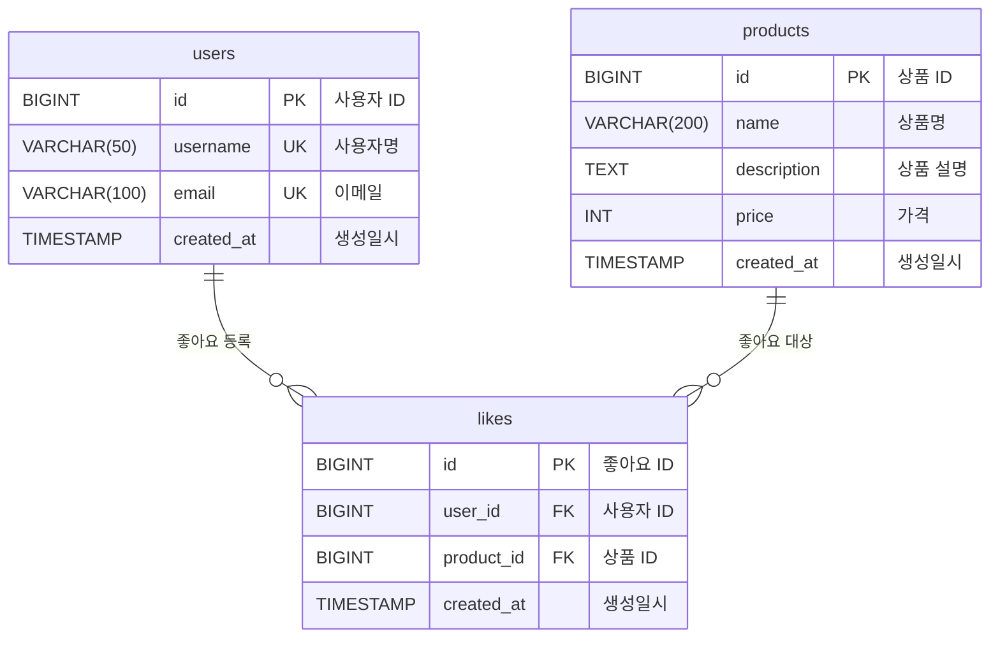

# ERD (Entity Relationship Diagram)

## 다이어그램을 그리기 전에

이 문서에서는 **좋아요 기능의 데이터베이스 설계**를 다룹니다.

### 설계 원칙
1. **정합성 우선** - DB 제약으로 데이터 무결성 보장
2. **성능 고려** - 필수 인덱스만 추가 (과한 인덱스는 쓰기 성능 저하)
3. **단순하게 시작** - 외래키, 트리거 등은 필요할 때 추가

### 주요 결정사항
- **products 테이블에 like_count 컬럼 없음** - 실시간 COUNT 쿼리 사용
- **외래키 제약** - 사용 여부 논의 필요
- **인덱스 전략** - 조회 성능 최적화

---

## 1. 전체 ERD



---

## 2. 테이블 상세 정의

### users 테이블

> **참고:** 이 테이블은 좋아요 기능을 위해 필요하지만, 실제 구현은 인증/인가 시스템에서 제공될 것으로 가정합니다.

```sql
CREATE TABLE users (
    id BIGINT AUTO_INCREMENT PRIMARY KEY COMMENT '사용자 ID',
    username VARCHAR(50) NOT NULL UNIQUE COMMENT '사용자명',
    email VARCHAR(100) NOT NULL UNIQUE COMMENT '이메일',
    created_at TIMESTAMP NOT NULL DEFAULT CURRENT_TIMESTAMP COMMENT '생성일시',
    
    INDEX idx_username (username),
    INDEX idx_email (email)
) ENGINE=InnoDB DEFAULT CHARSET=utf8mb4 COMMENT='사용자';
```

**컬럼 설명:**

| 컬럼 | 타입 | 제약 | 설명 |
|------|------|------|------|
| id | BIGINT | PK, AUTO_INCREMENT | 사용자 고유 ID |
| username | VARCHAR(50) | NOT NULL, UNIQUE | 사용자명 |
| email | VARCHAR(100) | NOT NULL, UNIQUE | 이메일 |
| created_at | TIMESTAMP | NOT NULL, DEFAULT | 가입일시 |

---

### products 테이블

```sql
CREATE TABLE products (
    id BIGINT AUTO_INCREMENT PRIMARY KEY COMMENT '상품 ID',
    name VARCHAR(200) NOT NULL COMMENT '상품명',
    description TEXT COMMENT '상품 설명',
    price INT NOT NULL COMMENT '가격',
    created_at TIMESTAMP NOT NULL DEFAULT CURRENT_TIMESTAMP COMMENT '생성일시',
    
    INDEX idx_created_at (created_at DESC)
) ENGINE=InnoDB DEFAULT CHARSET=utf8mb4 COMMENT='상품';
```

**컬럼 설명:**

| 컬럼 | 타입 | 제약 | 설명 |
|------|------|------|------|
| id | BIGINT | PK, AUTO_INCREMENT | 상품 고유 ID |
| name | VARCHAR(200) | NOT NULL | 상품명 |
| description | TEXT | NULL | 상품 설명 (길이 제한 없음) |
| price | INT | NOT NULL | 가격 (원 단위) |
| created_at | TIMESTAMP | NOT NULL, DEFAULT | 등록일시 |

**중요: like_count 컬럼이 없는 이유**
- 실시간 COUNT 쿼리로 계산
- 정합성 문제 없음
- 나중에 Redis 캐시로 전환 가능

---

### likes 테이블 ⭐

```sql
CREATE TABLE likes (
    id BIGINT AUTO_INCREMENT PRIMARY KEY COMMENT '좋아요 ID',
    user_id BIGINT NOT NULL COMMENT '사용자 ID',
    product_id BIGINT NOT NULL COMMENT '상품 ID',
    created_at TIMESTAMP NOT NULL DEFAULT CURRENT_TIMESTAMP COMMENT '생성일시',
    
    -- 중복 방지 제약 (핵심!)
    CONSTRAINT uk_likes_user_product UNIQUE (user_id, product_id),
    
    -- 인덱스
    INDEX idx_user_id (user_id),
    INDEX idx_product_id (product_id),
    INDEX idx_created_at (created_at DESC)
    
    -- 외래키 (선택적 - 아래에서 논의)
    -- CONSTRAINT fk_likes_user FOREIGN KEY (user_id) REFERENCES users(id) ON DELETE CASCADE,
    -- CONSTRAINT fk_likes_product FOREIGN KEY (product_id) REFERENCES products(id) ON DELETE CASCADE
) ENGINE=InnoDB DEFAULT CHARSET=utf8mb4 COMMENT='좋아요';
```

**컬럼 설명:**

| 컬럼 | 타입 | 제약 | 설명 |
|------|------|------|------|
| id | BIGINT | PK, AUTO_INCREMENT | 좋아요 고유 ID |
| user_id | BIGINT | NOT NULL | 사용자 ID |
| product_id | BIGINT | NOT NULL | 상품 ID |
| created_at | TIMESTAMP | NOT NULL, DEFAULT | 좋아요 등록일시 |

---

## 3. 제약 조건 (Constraints)

### Unique 제약: uk_likes_user_product ⭐⭐⭐

**가장 중요한 제약입니다.**

```sql
CONSTRAINT uk_likes_user_product UNIQUE (user_id, product_id)
```

**역할:**
- 한 사용자가 한 상품에 대해 좋아요는 1개만 가능
- DB 레벨에서 중복 방지 (Race Condition 방지)
- 애플리케이션 체크 실패 시 최종 방어선

**동작:**
```sql
-- 성공
INSERT INTO likes (user_id, product_id) VALUES (1, 100);

-- 실패 (DataIntegrityViolationException)
INSERT INTO likes (user_id, product_id) VALUES (1, 100);
```

**복합 인덱스 효과:**
- Unique 제약은 자동으로 인덱스를 생성
- `(user_id, product_id)` 조합으로 빠른 조회 가능

---

### 외래키 제약 (Foreign Key) - 논의 필요 🤔

**외래키를 사용할까요?**

```sql
-- 외래키 추가 시
CONSTRAINT fk_likes_user 
    FOREIGN KEY (user_id) 
    REFERENCES users(id) 
    ON DELETE CASCADE,

CONSTRAINT fk_likes_product 
    FOREIGN KEY (product_id) 
    REFERENCES products(id) 
    ON DELETE CASCADE
```

#### 외래키를 사용하는 경우

**장점:**
- 참조 무결성 보장 (존재하지 않는 user_id, product_id 막음)
- DB 레벨에서 데이터 정합성 보장
- `ON DELETE CASCADE`: 상품 삭제 시 좋아요도 자동 삭제

**단점:**
- 쓰기 성능 저하 (INSERT/DELETE 시 참조 테이블 확인)
- 락 경합 가능성
- 유연성 감소 (스키마 변경 어려움)

#### 외래키를 사용하지 않는 경우

**장점:**
- 쓰기 성능 우수
- 락 경합 없음
- 스키마 변경 유연

**단점:**
- 애플리케이션에서 참조 무결성 보장해야 함
- 고아 데이터(orphan data) 발생 가능

**어떻게 할까요?**

---

## 4. 인덱스 전략

### likes 테이블 인덱스

```sql
-- 1. Unique 제약 (자동 생성)
UNIQUE INDEX uk_likes_user_product (user_id, product_id)

-- 2. 사용자별 좋아요 조회
INDEX idx_user_id (user_id)

-- 3. 상품별 좋아요 수 계산 (핵심!)
INDEX idx_product_id (product_id)

-- 4. 최근 좋아요 조회 (선택적)
INDEX idx_created_at (created_at DESC)
```

### 각 인덱스의 역할

#### 1. uk_likes_user_product (user_id, product_id)

**사용 쿼리:**
```sql
-- 중복 체크
SELECT COUNT(*) FROM likes WHERE user_id = ? AND product_id = ?;

-- 좋아요 삭제
DELETE FROM likes WHERE user_id = ? AND product_id = ?;
```

**특징:**
- 복합 인덱스 (user_id가 선두 컬럼)
- `user_id`로 시작하는 쿼리에 사용 가능

---

#### 2. idx_user_id (user_id)

**사용 쿼리:**
```sql
-- 사용자의 좋아요 목록 조회
SELECT * FROM likes WHERE user_id = ?;
```

**질문: uk_likes_user_product가 있는데 왜 필요한가?**

복합 인덱스 `(user_id, product_id)`가 있으면 `user_id` 단독 조회도 가능합니다.
따라서 **이 인덱스는 사실 불필요할 수 있습니다.**

**선택지:**
- A. `idx_user_id` 제거 (복합 인덱스로 충분)
- B. `idx_user_id` 유지 (명확성)

---

#### 3. idx_product_id (product_id) ⭐

**사용 쿼리:**
```sql
-- 상품별 좋아요 수 (단일)
SELECT COUNT(*) FROM likes WHERE product_id = ?;

-- 상품별 좋아요 수 (다건)
SELECT product_id, COUNT(*) 
FROM likes 
WHERE product_id IN (1, 2, 3, ...)
GROUP BY product_id;
```

**가장 중요한 인덱스입니다.**
- 상품 조회 시 좋아요 수 계산에 사용
- 이 인덱스가 없으면 Full Table Scan 발생
- 필수!

---

#### 4. idx_created_at (created_at DESC)

**사용 쿼리:**
```sql
-- 최근 좋아요 조회 (필요하다면)
SELECT * FROM likes ORDER BY created_at DESC LIMIT 10;
```

**필요 여부:**
- 현재 요구사항에는 없음
- "최근 인기 상품" 같은 기능 추가 시 필요
- 일단 **제거 고려**

---

### 인덱스 정리

**최소한으로 필요한 인덱스:**
```sql
-- 1. 중복 방지 (필수)
UNIQUE INDEX uk_likes_user_product (user_id, product_id)

-- 2. 상품별 좋아요 수 계산 (필수)
INDEX idx_product_id (product_id)
```

**선택적 인덱스:**
```sql
-- 3. 사용자별 조회 (복합 인덱스로 대체 가능)
INDEX idx_user_id (user_id)

-- 4. 최근 좋아요 조회 (현재 불필요)
INDEX idx_created_at (created_at DESC)
```

---

## 5. 쿼리 성능 분석

### 주요 쿼리별 인덱스 활용

#### 쿼리 1: 좋아요 등록 (중복 체크)
```sql
SELECT COUNT(*) FROM likes 
WHERE user_id = 1 AND product_id = 100;
```
**사용 인덱스:** `uk_likes_user_product (user_id, product_id)`
- ✅ Index Scan
- ⚡ 매우 빠름

---

#### 쿼리 2: 상품별 좋아요 수 (단일)
```sql
SELECT COUNT(*) FROM likes WHERE product_id = 100;
```
**사용 인덱스:** `idx_product_id (product_id)`
- ✅ Index Scan
- ⚡ 빠름

---

#### 쿼리 3: 상품별 좋아요 수 (다건)
```sql
SELECT product_id, COUNT(*) as count
FROM likes
WHERE product_id IN (1, 2, 3, ..., 20)
GROUP BY product_id;
```
**사용 인덱스:** `idx_product_id (product_id)`
- ✅ Index Range Scan
- ⚡ 빠름
- N+1 문제 방지

---

#### 쿼리 4: 사용자별 좋아요 목록
```sql
SELECT l.*, p.*
FROM likes l
JOIN products p ON l.product_id = p.id
WHERE l.user_id = 1;
```
**사용 인덱스:** `uk_likes_user_product (user_id, product_id)`
- ✅ Index Scan (user_id로 시작)
- ✅ JOIN은 products.id (PK) 사용
- ⚡ 빠름

---

#### 쿼리 5: 좋아요 삭제
```sql
DELETE FROM likes 
WHERE user_id = 1 AND product_id = 100;
```
**사용 인덱스:** `uk_likes_user_product (user_id, product_id)`
- ✅ Index Scan
- ⚡ 매우 빠름

---

## 6. 데이터 타입 선택 근거

### BIGINT vs INT

**선택: BIGINT 사용**

```sql
id BIGINT AUTO_INCREMENT
user_id BIGINT NOT NULL
product_id BIGINT NOT NULL
```

**이유:**
- INT 범위: -2,147,483,648 ~ 2,147,483,647 (약 21억)
- BIGINT 범위: -9,223,372,036,854,775,808 ~ 9,223,372,036,854,775,807 (매우 큼)
- 사용자/상품/좋아요가 21억 넘을 가능성 고려
- 나중에 INT → BIGINT 변경은 매우 고통스러움
- 저장 공간 차이: 4byte vs 8byte (큰 문제 아님)

---

### TIMESTAMP vs DATETIME

**선택: TIMESTAMP 사용**

```sql
created_at TIMESTAMP NOT NULL DEFAULT CURRENT_TIMESTAMP
```

**비교:**

| 특성 | TIMESTAMP | DATETIME |
|------|-----------|----------|
| 범위 | 1970 ~ 2038 | 1000 ~ 9999 |
| 타임존 | 자동 변환 | 변환 안 함 |
| 저장 공간 | 4 byte | 5~8 byte |

**TIMESTAMP 선택 이유:**
- 타임존 자동 변환 (서버 타임존 기준)
- 범위는 충분 (2038년 문제는 나중에 고민)
- 작은 저장 공간

**주의:**
- 2038년 이후가 중요하다면 DATETIME 사용

---

### VARCHAR vs TEXT

**선택:**
- 상품명: `VARCHAR(200)` - 길이 제한 필요
- 상품 설명: `TEXT` - 길이 제한 없음

**VARCHAR vs TEXT 차이:**

| 특성 | VARCHAR | TEXT |
|------|---------|------|
| 최대 길이 | 65,535 byte | 65,535 byte |
| 인덱스 | 전체 가능 | Prefix만 가능 |
| 기본값 | 가능 | 불가능 (MySQL) |

**상품명은 왜 VARCHAR(200)?**
- 인덱스 가능 (검색 필요 시)
- 너무 긴 상품명 방지
- 200자면 충분

**상품 설명은 왜 TEXT?**
- 길이 제한 없음 (긴 설명 가능)
- 인덱스 불필요 (검색 안 함)

---

## 7. 데이터 정합성 보장 전략

### 계층별 보장 방법

```
┌─────────────────────────────────────┐
│ Application (LikeService)           │
│ - exists() 체크 (1차 방어)          │
└──────────────┬──────────────────────┘
               │
┌──────────────▼──────────────────────┐
│ Database                             │
│ - Unique 제약 (2차 방어, 최종)      │
│ - NOT NULL 제약                      │
│ - (선택) 외래키 제약                 │
└─────────────────────────────────────┘
```

### 1. 중복 좋아요 방지

**계층:**
- 1차: Application - `existsByUserIdAndProductId()`
- 2차: Database - `UNIQUE (user_id, product_id)`

**Race Condition 시나리오:**
```
시간 0초: User1 exists() 체크 → false
시간 0초: User2 exists() 체크 → false
시간 1초: User1 INSERT → 성공
시간 1초: User2 INSERT → Unique 제약 위반 (실패)
```

**결과:** DB 제약이 최종적으로 막음 ✅

---

### 2. NULL 방지

```sql
user_id BIGINT NOT NULL
product_id BIGINT NOT NULL
```

**애플리케이션:**
```java
public Like(Long userId, Long productId) {
    if (userId == null) throw new IllegalArgumentException();
    if (productId == null) throw new IllegalArgumentException();
    // ...
}
```

**2중 보장:**
- 1차: 생성자 검증
- 2차: DB NOT NULL 제약

---

### 3. 참조 무결성 (선택적)

**외래키를 사용한다면:**
```sql
CONSTRAINT fk_likes_user FOREIGN KEY (user_id) REFERENCES users(id)
CONSTRAINT fk_likes_product FOREIGN KEY (product_id) REFERENCES products(id)
```

**외래키를 사용하지 않는다면:**
```java
// Service에서 확인
public Like createLike(Long userId, Long productId) {
    if (!userRepository.existsById(userId)) {
        throw new UserNotFoundException();
    }
    if (!productRepository.existsById(productId)) {
        throw new ProductNotFoundException();
    }
    // ...
}
```

**어느 쪽을 선택할까요?**

---

## 8. 설계 의도 정리

### 왜 이렇게 설계했는가?

#### 1. products.like_count 컬럼을 만들지 않은 이유

**선택: 실시간 COUNT 쿼리**

```sql
-- 매번 계산
SELECT COUNT(*) FROM likes WHERE product_id = ?;
```

**이유:**
- 정합성 100% 보장
- 비동기 처리 복잡도 제거
- 나중에 Redis로 전환 쉬움

**트레이드오프:**
- 장점: 정합성, 단순함
- 단점: 조회 성능 (인덱스로 해결)

---

#### 2. 복합 Unique 제약 사용

**선택: `UNIQUE (user_id, product_id)`**

**이유:**
- 중복 방지를 DB가 보장
- Race Condition 완벽 차단
- 자동으로 복합 인덱스 생성

---

#### 3. 최소한의 인덱스

**선택:**
- `UNIQUE (user_id, product_id)` - 필수
- `INDEX (product_id)` - 필수
- 나머지는 제거 고려

**이유:**
- 인덱스는 쓰기 성능 저하
- 필요할 때 추가하는 게 나음
- 초기에는 단순하게

---

## 9. 확장 시나리오

### 시나리오 1: Redis 캐시 도입

**변경 전:**
```sql
SELECT COUNT(*) FROM likes WHERE product_id = ?;
```

**변경 후:**
```
1. Redis에서 GET like_count:{product_id}
2. Cache Miss 시 DB 조회
3. Redis에 SET like_count:{product_id}
```

**테이블 변경 없음!**

---

### 시나리오 2: 좋아요 취소 시 "취소 사유" 추가

**변경:**
```sql
ALTER TABLE likes ADD COLUMN deleted_at TIMESTAMP NULL;
ALTER TABLE likes ADD COLUMN delete_reason VARCHAR(100) NULL;

-- Unique 제약 수정 (soft delete 고려)
DROP INDEX uk_likes_user_product;
CREATE UNIQUE INDEX uk_likes_user_product 
ON likes (user_id, product_id) 
WHERE deleted_at IS NULL;  -- PostgreSQL
```

---

### 시나리오 3: 샤딩 (Sharding)

**user_id 기준 샤딩:**
```
Shard 1: user_id % 4 = 0
Shard 2: user_id % 4 = 1
Shard 3: user_id % 4 = 2
Shard 4: user_id % 4 = 3
```

**product_id 기준 샤딩:**
```
Shard 1: product_id % 4 = 0
...
```

**고려사항:**
- 어떤 기준으로 샤딩할지 (user_id vs product_id)
- 현재 설계는 양쪽 다 가능

---

## 10. 설계 리스크 및 트레이드오프

### ⚠️ 리스크 1: COUNT 쿼리 성능

**상황:**
좋아요 테이블이 1억 건 이상으로 커지면?

**영향:**
```sql
SELECT COUNT(*) FROM likes WHERE product_id = ?;
```
- 인덱스 스캔이지만 느려질 수 있음

**대응:**
1. Redis 캐시 도입 (우선)
2. products.like_count 컬럼 추가 (차선)
3. 파티셔닝 (최후)

---

### ⚠️ 리스크 2: 외래키 미사용 시 고아 데이터

**상황:**
외래키를 사용하지 않으면, 사용자/상품 삭제 시 좋아요가 남음

**영향:**
```sql
-- 상품 삭제
DELETE FROM products WHERE id = 100;

-- 좋아요는 남아있음
SELECT * FROM likes WHERE product_id = 100;  -- 여전히 있음
```

**대응:**
1. 애플리케이션에서 명시적 삭제
```java
productService.delete(productId) {
    likeRepository.deleteByProductId(productId);  // 먼저 삭제
    productRepository.deleteById(productId);
}
```
2. 배치로 주기적 정리
3. 외래키 사용

---

### ✅ 트레이드오프 정리

| 선택 | 얻은 것 | 잃은 것 | 판단 |
|------|---------|---------|------|
| like_count 컬럼 없음 | 정합성 100% | 조회 성능 | 인덱스+Redis로 해결 |
| 외래키 미사용 | 쓰기 성능, 유연성 | 고아 데이터 가능 | 애플리케이션에서 관리 |
| 최소 인덱스 | 쓰기 성능 | 조회 성능 저하 가능 | 필요 시 추가 |
| BIGINT 사용 | 확장성 | 저장 공간 (미미) | 나중에 바꾸기 어려움 |

---

## 11. 최종 DDL

### 추천 DDL (외래키 없음)

```sql
-- users 테이블
CREATE TABLE users (
    id BIGINT AUTO_INCREMENT PRIMARY KEY,
    username VARCHAR(50) NOT NULL UNIQUE,
    email VARCHAR(100) NOT NULL UNIQUE,
    created_at TIMESTAMP NOT NULL DEFAULT CURRENT_TIMESTAMP,
    INDEX idx_username (username),
    INDEX idx_email (email)
) ENGINE=InnoDB DEFAULT CHARSET=utf8mb4 COLLATE=utf8mb4_unicode_ci;

-- products 테이블
CREATE TABLE products (
    id BIGINT AUTO_INCREMENT PRIMARY KEY,
    name VARCHAR(200) NOT NULL,
    description TEXT,
    price INT NOT NULL,
    created_at TIMESTAMP NOT NULL DEFAULT CURRENT_TIMESTAMP,
    INDEX idx_created_at (created_at DESC)
) ENGINE=InnoDB DEFAULT CHARSET=utf8mb4 COLLATE=utf8mb4_unicode_ci;

-- likes 테이블
CREATE TABLE likes (
    id BIGINT AUTO_INCREMENT PRIMARY KEY,
    user_id BIGINT NOT NULL,
    product_id BIGINT NOT NULL,
    created_at TIMESTAMP NOT NULL DEFAULT CURRENT_TIMESTAMP,
    
    -- 중복 방지 (가장 중요!)
    CONSTRAINT uk_likes_user_product UNIQUE (user_id, product_id),
    
    -- 필수 인덱스
    INDEX idx_product_id (product_id)
) ENGINE=InnoDB DEFAULT CHARSET=utf8mb4 COLLATE=utf8mb4_unicode_ci;
```

### 선택사항 1: 외래키 추가

```sql
ALTER TABLE likes
ADD CONSTRAINT fk_likes_user 
    FOREIGN KEY (user_id) 
    REFERENCES users(id) 
    ON DELETE CASCADE;

ALTER TABLE likes
ADD CONSTRAINT fk_likes_product 
    FOREIGN KEY (product_id) 
    REFERENCES products(id) 
    ON DELETE CASCADE;
```

### 선택사항 2: 추가 인덱스

```sql
-- 사용자별 조회 최적화 (복합 인덱스로 대체 가능하므로 선택적)
ALTER TABLE likes ADD INDEX idx_user_id (user_id);

-- 최근 좋아요 조회 (현재 불필요)
-- ALTER TABLE likes ADD INDEX idx_created_at (created_at DESC);
```
