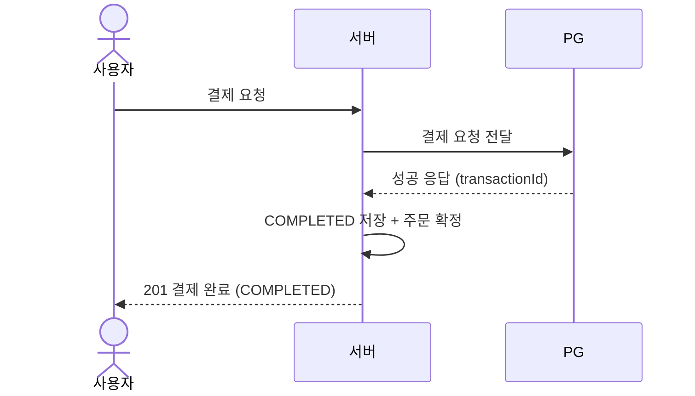
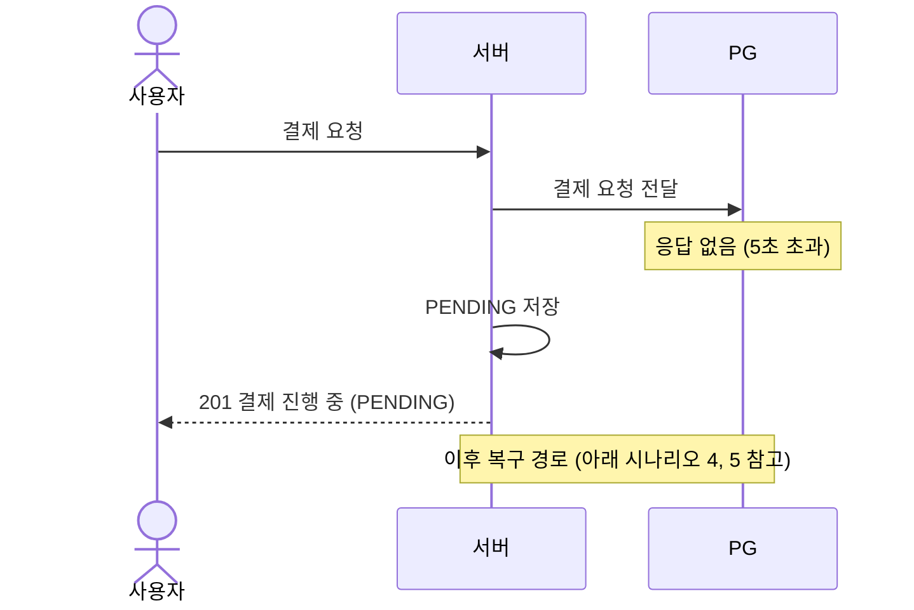
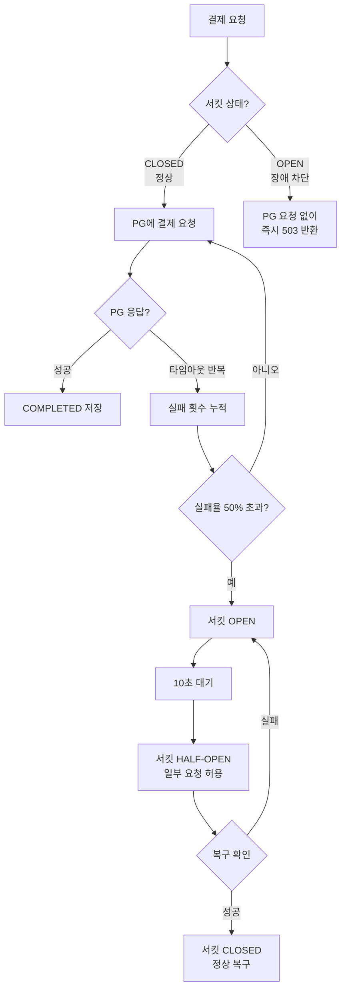
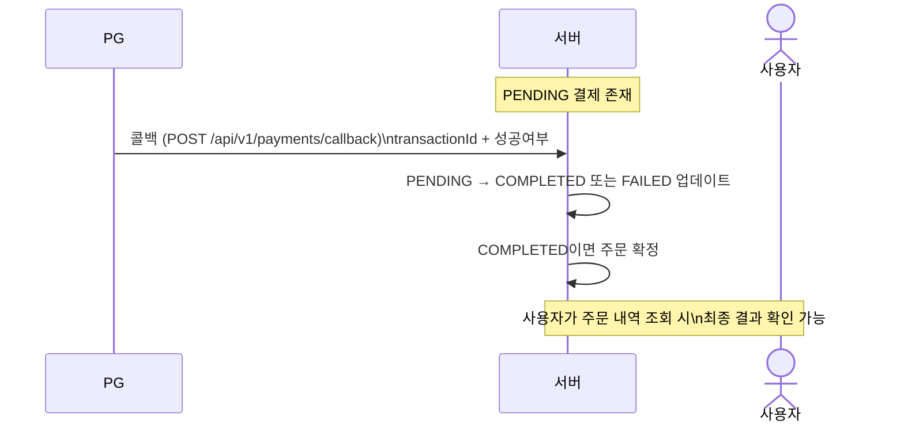
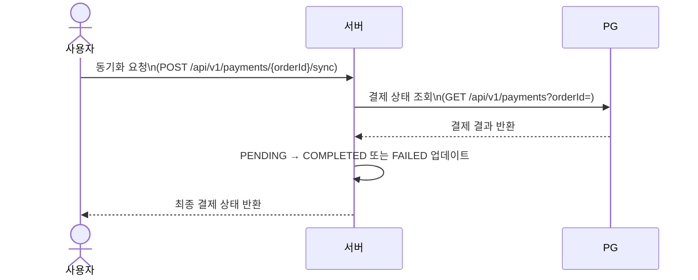

# 결제 시스템 설계 문서

> 개발자가 아닌 분도 이해할 수 있도록 작성된 문서입니다.

---

## 1. 전체 개요

우리 서버는 결제를 직접 처리하지 않습니다. **PG(Payment Gateway, 외부 결제 회사)** 에 결제 요청을 보내고, 결과를 받아서 저장합니다.

```
사용자 → 우리 서버 → PG(외부 결제 회사) → 카드사
```

이 흐름에서 PG가 느리거나, 응답이 없거나, 장애가 발생하는 상황에 대비한 처리를 구현했습니다.

---

## 2. 결제 상태 종류

| 상태 | 의미 |
|------|------|
| `PENDING` | 결제 요청을 보냈지만 결과를 아직 모름 (PG 응답 없음) |
| `COMPLETED` | 결제 성공 |
| `FAILED` | 결제 실패 |

---

## 3. 시나리오별 흐름

### 시나리오 1 — 정상 결제



---

### 시나리오 2 — PG 응답 지연 (타임아웃)

PG가 5초 이상 응답하지 않으면 타임아웃이 발생합니다. 이때 결제가 PG에서 처리됐는지 알 수 없으므로 **PENDING**으로 저장하고 나중에 확인합니다.



---

### 시나리오 3 — PG 반복 장애 (서킷브레이커 동작)

PG가 계속 응답하지 않으면, **서킷브레이커**가 동작해서 더 이상 PG에 요청을 보내지 않습니다. 마치 전기 차단기처럼 장애가 퍼지는 것을 막습니다.



> **서킷브레이커가 하는 일**: PG가 느릴 때 우리 서버 전체가 느려지는 것을 방지합니다. 장애를 감지하면 PG에 요청을 보내지 않고 즉시 실패 처리합니다.

---

### 시나리오 4 — 콜백을 통한 PENDING 자동 복구

PG는 결제 처리가 완료되면 우리 서버에 결과를 알려줍니다(콜백).



---

### 시나리오 5 — 콜백이 오지 않을 때 수동 동기화

콜백이 유실되는 경우, 사용자 또는 운영팀이 직접 동기화를 요청할 수 있습니다.



---

## 4. 재시도 정책

PG 호출이 실패하면 자동으로 재시도합니다.

| 항목 | 값 |
|------|----|
| 최대 재시도 횟수 | 3회 |
| 재시도 간격 | 1초 |

> 재시도 후에도 모두 실패하면 타임아웃으로 처리하여 PENDING 저장합니다.

---

## 5. API 목록

| 메서드 | 경로 | 설명 |
|--------|------|------|
| `POST` | `/api/v1/payments` | 결제 요청 |
| `POST` | `/api/v1/payments/callback` | PG 콜백 수신 (PG → 우리 서버) |
| `POST` | `/api/v1/payments/{orderId}/sync` | PENDING 결제 수동 동기화 |

---

## 6. 에러 응답 안내

| 에러 코드 | HTTP | 의미 |
|-----------|------|------|
| `ORDER_ALREADY_PAID` | 409 | 이미 결제 완료된 주문 |
| `PAYMENT_IN_PROGRESS` | 409 | 결제가 진행 중 (PENDING 상태) |
| `PG_CIRCUIT_OPEN` | 503 | PG 시스템 장애로 결제 일시 불가 |

---

## 7. 향후 추가 예정

- **자동 배치 동기화**: 콜백이 오지 않은 PENDING 결제를 일정 주기로 자동 확인 및 업데이트 (`commerce-batch`)
