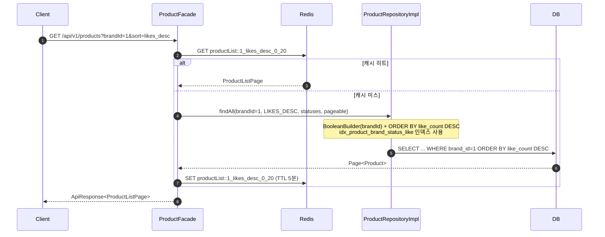
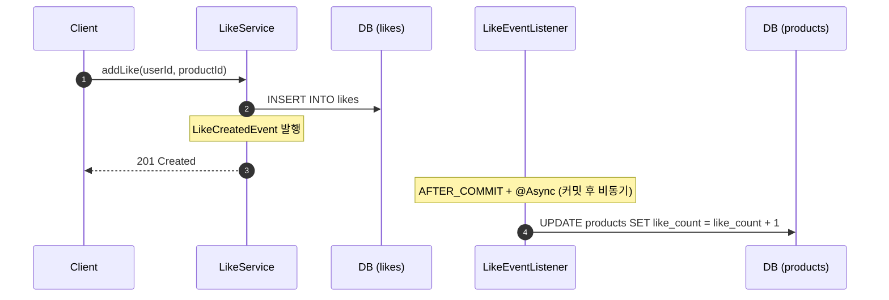
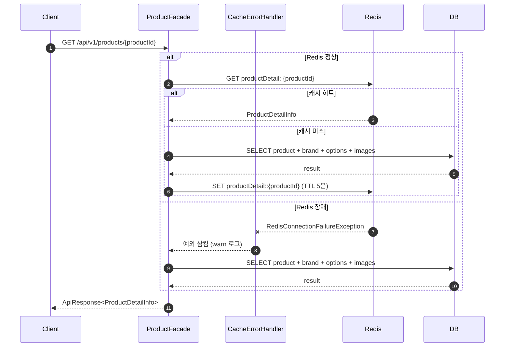

## 📌 Summary

- **배경**: 상품이 10만 건 이상으로 증가하면서 목록 조회 성능 저하, 좋아요 순 정렬 미지원, 반복 조회에 대한 캐시 부재 문제가 있었다.
- **목표**: 인덱스 최적화로 DB 조회 속도를 개선하고, 비정규화(`like_count`) 기반 좋아요 정렬을 구현하며, Redis 캐시로 반복 조회 부하를 줄인다.
- **결과**: EXPLAIN 기준 풀스캔 → 인덱스 레인지 스캔으로 전환, 좋아요 등록/취소 시 이벤트 기반 count 동기화 구현, 상품 목록/상세 API에 TTL 5분 캐시 적용 및 Redis 장애 시 DB 자동 폴백 처리 완료.

---

## 🧭 Context & Decision

### 문제 정의
- **현재 동작/제약**: 상품 목록 조회 시 `brandId` 필터 + 좋아요 순 정렬을 지원해야 하나, 인덱스 없이 풀스캔 발생
- **문제(리스크)**: 10만 건 데이터 기준 p99 응답 시간이 수 초 수준, Redis 캐시 미적용으로 동일 쿼리 반복 실행
- **성공 기준**: EXPLAIN에서 인덱스 사용 확인, 캐시 히트 시 DB 미호출, Redis 장애 시 서비스 정상 응답

### 선택지와 결정

**좋아요 수 관리**
- A. **비정규화(`like_count`)**: Product에 필드 추가, 이벤트로 동기화 → **선택**
- B. MaterializedView: DB 레벨 뷰 사용
- 트레이드오프: 좋아요 이벤트 처리(AFTER_COMMIT) 지연 동안 count가 일시적으로 실제와 다를 수 있음 (Eventual Consistency)

**캐시 무효화**
- A. TTL만 사용: 구현 단순하나 변경 후 최대 5분 stale
- B. **TTL + @CacheEvict**: 상품 수정/비활성화 시 즉시 무효화 → **선택**
- 트레이드오프: `likeCount` 변경(좋아요 등록/취소)은 evict 없이 TTL 소멸에 위임 — 빈번한 evict로 캐시 효과가 없어지는 것을 방지

**Redis 장애 대응**
- A. **CacheErrorHandler**: Spring Cache 레벨에서 예외 삼킴 → DB 폴백 → **선택** (즉시 적용 가능)
- B. Circuit Breaker(Resilience4j): 장애 감지 + 자동 차단, 의존성 추가 필요
- 트레이드오프: EVICT 실패 시 stale 캐시가 TTL까지 잔존할 수 있음

---

## 🏗️ Design Overview

### 변경 범위
- **영향 받는 모듈/도메인**: `domain/product`, `domain/like`, `application/product`, `config`
- **신규 추가**: `ProductSortType`, `LikeEventListener`, `ProductDetailCacheIntegrationTest`

### 주요 컴포넌트 책임
- `Product`: `likeCount` 비정규화 필드 + 5개 복합 인덱스 정의
- `LikeEventListener`: `AFTER_COMMIT` + `REQUIRES_NEW`로 `likeCount` 비동기 동기화
- `ProductFacade`: `@Cacheable("productDetail")` — 상세 캐시 적재
- `AdminProductFacade`: `@Caching` — 수정/비활성화 시 `productList`(allEntries) + `productDetail`(단건) 동시 evict
- `CacheConfig`: 캐시별 독립 serializer + `CacheErrorHandler` 등록 (Redis 장애 → DB 폴백)

---

## 🔁 Flow Diagram

### 🔖 상품 목록 조회 (brandId 필터 + 좋아요 순 정렬)



### ❤️ 좋아요 등록 → likeCount 동기화



### ⚡ 상품 상세 캐시 + Redis 장애 폴백



---

## ✅ Checklist

### 🔖 Index

- [x] 상품 목록 API에서 brandId 기반 검색, 좋아요 순 정렬 등을 처리했다

  ```java
  // ProductRepositoryImpl.java
  BooleanBuilder where = new BooleanBuilder();
  if (brandId != null) where.and(product.brandId.eq(brandId));
  if (statuses != null) where.and(product.status.in(statuses));

  OrderSpecifier<?> order = switch (sortType) {
      case LIKES_DESC -> product.likeCount.desc();
      case PRICE_ASC  -> product.price.value.asc();
      default         -> product.createdAt.desc();
  };
  ```

- [x] 조회 필터, 정렬 조건별 유즈케이스를 분석하여 인덱스를 적용하고 전 후 성능비교를 진행했다

  ```java
  // Product.java — 유즈케이스별 복합 인덱스
  @Table(indexes = {
      @Index(name = "idx_product_status_created",       columnList = "status, created_at DESC"),
      @Index(name = "idx_product_status_like",          columnList = "status, like_count DESC"),
      @Index(name = "idx_product_brand_status_created", columnList = "brand_id, status, created_at DESC"),
      @Index(name = "idx_product_brand_status_like",    columnList = "brand_id, status, like_count DESC"),
      @Index(name = "idx_product_brand_status_price",   columnList = "brand_id, status, price ASC"),
  })
  ```
  → 성능 비교 결과: `docs/performance/index-optimization-plan.md` 참고

### ❤️ Structure

- [x] 상품 목록/상세 조회 시 좋아요 수를 조회 및 좋아요 순 정렬이 가능하도록 구조 개선을 진행했다

  ```java
  // Product.java
  // 비정규화 카운트: 좋아요 등록/취소 시 비동기 이벤트로 갱신 (Eventual Consistency)
  @Column(name = "like_count", nullable = false)
  private long likeCount = 0;
  ```

- [x] 좋아요 적용/해제 진행 시 상품 좋아요 수 또한 정상적으로 동기화되도록 진행하였다

  ```java
  // LikeEventListener.java
  @Async
  @Transactional(propagation = Propagation.REQUIRES_NEW)
  @TransactionalEventListener(phase = TransactionPhase.AFTER_COMMIT)
  public void handleLikeCreated(LikeCreatedEvent event) {
      productRepository.findById(event.productId()).ifPresent(product -> {
          product.incrementLikeCount();
          productRepository.save(product);
      });
  }
  // handleLikeDeleted도 동일 구조로 decrementLikeCount() 호출
  ```

### ⚡ Cache

- [x] Redis 캐시를 적용하고 TTL 또는 무효화 전략을 적용했다

  ```java
  // ProductFacade.java
  @Cacheable(cacheNames = "productDetail", key = "#productId")
  public ProductDetailInfo getProductDetail(Long productId) { ... }

  @Cacheable(cacheNames = "productList", key = "'' + #brandId + '_' + #sort + '_' + #page + '_' + #size")
  public ProductListPage getProductList(...) { ... }

  // AdminProductFacade.java — 수정/비활성화 시 두 캐시 동시 무효화
  @Caching(evict = {
      @CacheEvict(cacheNames = "productList", allEntries = true),
      @CacheEvict(cacheNames = "productDetail", key = "#productId")
  })
  public AdminProductInfo updateProduct(Long productId, ...) { ... }
  ```

- [x] 캐시 미스 상황에서도 서비스가 정상 동작하도록 처리했다

  ```java
  // CacheConfig.java — Redis 장애 시 예외를 삼키고 DB로 자동 폴백
  @Override
  public CacheErrorHandler errorHandler() {
      return new CacheErrorHandler() {
          @Override
          public void handleCacheGetError(RuntimeException e, Cache cache, Object key) {
              log.warn("[Cache] GET 실패 - cache={}, key={}, error={}", cache.getName(), key, e.getMessage());
              // 예외를 삼킴 → 캐시 미스로 처리 → 실제 메서드(DB 조회)로 폴백
          }
          // handleCachePutError, handleCacheEvictError, handleCacheClearError도 동일하게 예외 삼킴
      };
  }
  ```

  ```java
  // ProductDetailCacheIntegrationTest.java — 캐시 동작 검증
  @Test
  void returnsCachedValue_evenWhenDbIsModified() {
      productFacade.getProductDetail(product.getId()); // 캐시 적재

      product.updateInfo(..., "변경된 이름", ...);
      productJpaRepository.save(product);              // DB만 직접 변경

      ProductDetailInfo result = productFacade.getProductDetail(product.getId());
      assertThat(result.name()).isEqualTo("에어맥스 90"); // 캐시된 원래 값 반환 확인
  }
  ```
