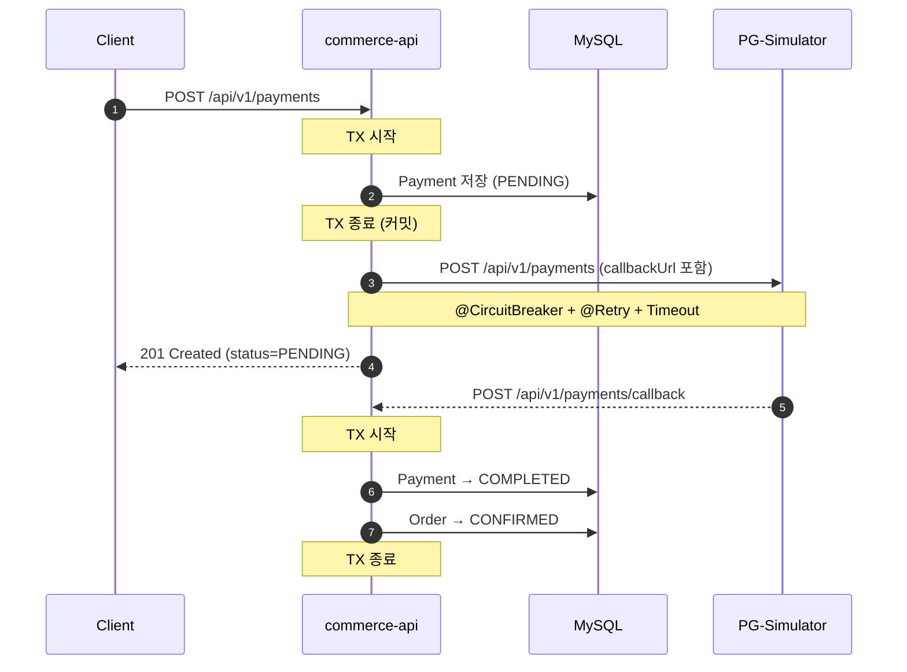
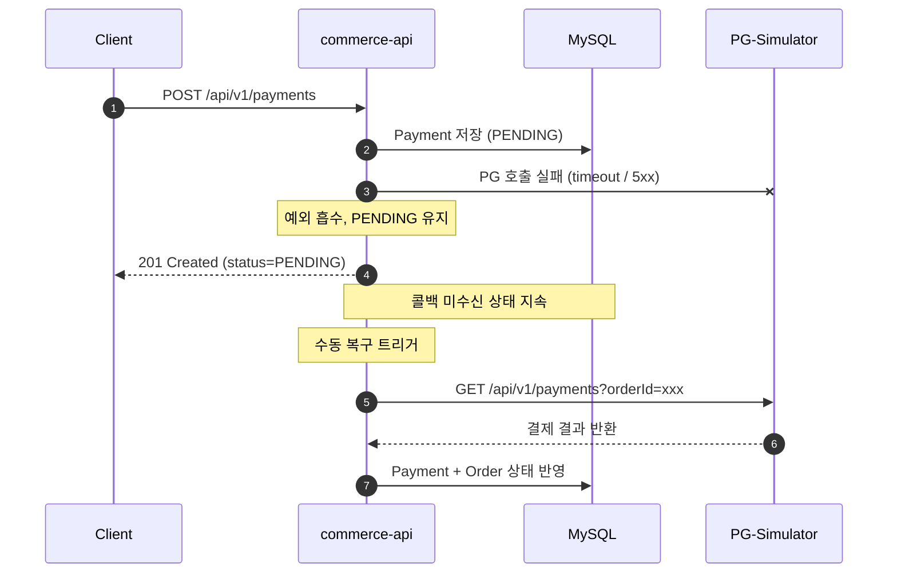

## 📌 Summary

- **배경**: 기존 결제 구조는 `@Transactional` 안에서 PG 외부 호출이 이루어져, PG 응답 지연 시 DB 커넥션이 장기 점유되고 PG 성공 후 내부 실패 시 정합성이 깨지는 리스크가 있었다.
- **목표**: PG 호출을 트랜잭션 밖으로 분리하고, 서킷브레이커/재시도로 외부 장애가 내부 시스템으로 전파되지 않도록 보호한다.
- **결과**: 결제 요청 시 PENDING 상태로 선저장 후 즉시 응답하고, PG 콜백 또는 수동 sync API를 통해 최종 상태를 반영하는 구조로 개선했다.

## 🧭 Context & Decision

### 문제 정의
- **현재 동작/제약**: `PaymentService.pay()` 내부에서 `@Transactional` 범위 안에 `externalPaymentClient.pay()` 호출이 포함되어 있었다.
- **문제(또는 리스크)**:
  - PG 응답이 느릴수록 DB 커넥션 점유 시간이 길어져 커넥션 풀 고갈로 이어질 수 있다.
  - PG 성공 후 `confirmOrder()` 실패 시 트랜잭션 롤백으로 주문 상태는 되돌아가지만 실제 결제는 취소되지 않아 정합성이 깨진다.
- **성공 기준**: PG 장애/지연 상황에서도 내부 API가 정상 응답하고, 결제 상태는 이후에 복구 가능해야 한다.

### 선택지와 결정
- **고려한 대안**:
  - **A: 트랜잭션 내 PG 호출 유지 + 예외 처리 강화**: 기존 방식. 구현 단순하나 커넥션 점유 문제와 정합성 리스크가 근본적으로 해결되지 않는다.
  - **B: PENDING 선저장 → 트랜잭션 밖 PG 호출 → 콜백/sync로 최종 상태 반영**: PG 호출 결과와 무관하게 내부 시스템은 즉시 응답하고, 상태 동기화는 비동기로 처리한다.
- **최종 결정**: B안 채택. DB 커넥션 점유 시간을 최소화하고 서킷브레이커가 의미 있게 동작하려면 PG 호출이 트랜잭션 밖에 있어야 한다.
- **트레이드오프**: 사용자가 결제 완료 여부를 즉시 알 수 없고 PENDING 상태로 응답받는다. 콜백이 유실되면 결제는 됐지만 시스템은 PENDING 상태로 남을 수 있다.
- **추후 개선 여지**: 현재 복구 수단은 수동 sync API(`POST /api-admin/v1/payments/{orderId}/sync`)뿐이다. PENDING 건을 주기적으로 PG에 확인하는 스케줄러(배치)가 있으면 운영 개입 없이 자동 복구가 가능하다.

> 💬 **검토 요청**: PG는 성공했지만 콜백이 유실된 경우, 현재 구조에서 결제 정합성을 보장하기 위한 방법으로 수동 sync API를 구현했습니다. 실무에서 이런 시나리오를 다룰 때 sync API 외에 어떤 보완 수단(배치, 멱등성 키 등)을 함께 사용하는지 조언 부탁드립니다.
>
> 관련 코드:
> - PG 호출 TX 분리 구조: [`PaymentFacade.pay()` L33-44](https://github.com/katiekim17/loop-pack-be-l2-vol3-java/blob/volume-6/apps/commerce-api/src/main/java/com/loopers/application/payment/PaymentFacade.java#L33-L44)
> - 콜백 수신 처리: [`PaymentFacade.handleCallback()` L46-51](https://github.com/katiekim17/loop-pack-be-l2-vol3-java/blob/volume-6/apps/commerce-api/src/main/java/com/loopers/application/payment/PaymentFacade.java#L46-L51)
> - 수동 복구 API: [`PaymentFacade.syncPayment()` L53-59](https://github.com/katiekim17/loop-pack-be-l2-vol3-java/blob/volume-6/apps/commerce-api/src/main/java/com/loopers/application/payment/PaymentFacade.java#L53-L59)

## 🏗️ Design Overview

### 변경 범위
- **영향 받는 모듈/도메인**: `domain/payment`, `application/payment`, `infrastructure/payment`, `interfaces/api/payment`, `interfaces/api/admin`
- **신규 추가**:
  - `PgSimulatorFeignClient` — Resilience4j `@CircuitBreaker` + `@Retry` 적용
  - `PgSimulatorClient` — FeignClient 인터페이스 (HTTP 호출 추상화)
  - `POST /api/v1/payments/callback` — PG 콜백 수신 엔드포인트
  - `POST /api-admin/v1/payments/{orderId}/sync` — 수동 상태 복구 API
  - `PaymentStatus.PENDING` 추가
- **제거/대체**: `StubExternalPaymentClient`를 test 프로파일로 제한, `PgSimulatorFeignClient`가 운영 환경 구현체로 대체

### 주요 컴포넌트 책임
- `PaymentFacade`: PENDING 선저장 → PG 호출(TX 밖) → 콜백/sync 처리 오케스트레이션
- `PgSimulatorFeignClient`: PG HTTP 호출 + 서킷브레이커/재시도 적용, fallback으로 예외 흡수
- `PaymentService`: 결제 도메인 상태 전이 (PENDING → COMPLETED / FAILED)

## 🔁 Flow Diagram

### Main Flow (정상 콜백 수신)

### Fallback Flow (PG 장애 또는 콜백 유실)

